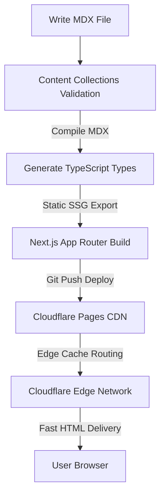

## Intro / TL;DR

Building a developer blog shouldn't involve days of complex CMS configurations and visual editor patches. This post provides an architectural breakdown of the static-export tech stack used to build DailyDevPost, comparing Next.js, Astro, Hugo, and WordPress in 2026. By reading this guide, you will learn the exact technical trade-offs of choosing a git-first markdown workflow, how to select a hosting platform that prevents surprise billing, and how to structure a build pipeline that scales with your content.

---

## 1. Why Most Developer Blogs Fail

Over the last 6 months, I have published 30+ articles, served thousands of page views on DailyDevPost, and tested multiple hosting providers and static site frameworks. I wasted nearly two weekends trying to maintain a custom headless CMS before giving up and moving everything into MDX files. 

Most developer blogs fail not because the author runs out of things to say, but because of authoring friction. When publishing a single [developer log](/blog/what-is-a-developer-log) requires logging into a heavy third-party dashboard, fighting database connections, managing separate styling files, and copying media assets manually, you stop writing. The blogging setup needs to feel like your daily development workspace: text files, Git commands, and local terminal builds.

---

## 2. Requirements Before Choosing a Stack

Before choosing a tech stack, define your priorities. For a high-traffic developer blog in 2026, the key requirements are:
*   **Markdown-First Workflow:** Articles should live as text files in your Git repository.
*   **Fast Build Times:** As your post count grows, builds shouldn't take minutes.
*   **Core Web Vitals:** Static generation is non-negotiable for SEO and page load speed.
*   **Interactive Component Support:** The ability to render live React/Vue components inside posts to explain complex algorithms.

---

## 3. Next.js vs Astro vs Hugo vs WordPress

Here is how the four leading developer blog architectures stack up in 2026:

| Feature | Next.js (App Router) | Astro | Hugo | WordPress |
| :--- | :--- | :--- | :--- | :--- |
| **React Support** | ✅ Native | ✅ Via Islands | ❌ | ❌ |
| **Learning Curve** | Medium | Low | Low | Low |
| **Interactive Components** | Excellent | Good | Poor | Poor |
| **Static Export** | Good (SSG) | Excellent (Zero JS) | Excellent | Poor (Requires plugins) |
| **Developer Experience** | Excellent | Good | Average | Limited for developers |
| **Ideal For** | React developers, web apps | Standard static blogs | Massive content libraries | Non-technical bloggers |

#### Next.js vs Astro for Blogging
If your blog is purely static text and code snippets, Astro is the clear winner. Astro’s "Islands" architecture compiles React/Vue components into static HTML, shipping zero client-side JavaScript by default. However, if you want a unified React ecosystem where your blog is part of a larger web application (like a SaaS dashboard or an interactive portfolio), Next.js provides the best developer experience.

#### Hugo vs Astro
Hugo is built in Go and is incredibly fast. If you have 10,000 pages of documentation, Hugo will compile it in milliseconds. However, the templating language (Go HTML templates) has a steep learning curve compared to Astro's component system or JSX.

#### WordPress for Developers
While WordPress is the standard for non-technical creators, the developer experience is limited for developers. Rendering custom MDX, embedding live React widgets, writing code blocks with syntax highlighting, and committing posts via Git requires a heavy web of plugins and custom server configurations.

---

## 4. Why I Chose Next.js for DailyDevPost

I chose Next.js for DailyDevPost because it removed the friction of tool-switching. Since the rest of our tooling and interactive widgets are built in React, Next.js lets us reuse our UI components seamlessly. By using Server Components, the MDX content is pre-compiled at build-time. The client downloads minimal JavaScript, which helps prevent issues like [hydration mismatch in Next.js 15](/blog/how-to-fix-Hydration-mismatch-in-next-js-15) and guarantees near-instant page loads.

---

## 5. Why I Chose MDX (and the CMS mistake I made)

Early on, I tried using a headless CMS. I spent two weekends configuring schemas, webhooks, and image upload configurations. It felt like maintaining a second application. If I wanted to edit a typo, I had to open a browser dashboard, save, and wait for a webhook to trigger.

I deleted the database and moved to MDX. MDX lets your content behave like code. You can import interactive charts, custom tables, or code snippets directly into your posts. Reverting an edit is a simple `git revert`.

---

## 6. How I Manage Content (Contentlayer Alternatives in 2026)

Historically, I chose **Contentlayer** to parse our Markdown files, validate frontmatter schemas, and output typed JSON schemas. While Contentlayer was a great tool, it has been deprecated and is no longer actively maintained. We are currently migrating DailyDevPost to **Content Collections** to ensure long-term stability.

For developers starting a blog from scratch in 2026, here are the modern content-parsing alternatives:
*   **Content Collections:** A modern, actively maintained schema-driven processor for Next.js.
*   **Astro Content Collections:** The robust native solution built directly into Astro, backed by Zod validation.
*   **Velite:** A super-fast schema-driven markdown compiler powered by Zod.

---

## 7. Why I Migrated from Netlify to Cloudflare Pages

DailyDevPost was originally deployed on Netlify. While Netlify’s developer experience is great, we migrated to **Cloudflare Pages** for several reasons:
*   **Unlimited Free Bandwidth:** Netlify has a soft limit of 100GB/month on the free tier. Cloudflare Pages offers unlimited bandwidth, protecting us from surprise bills when posts go viral.
*   **Global Edge Network:** Cloudflare caches static assets across their massive edge network, reducing latency globally.
*   **Built-in Workers integration:** If we need to write dynamic edge logic, we can deploy Cloudflare Workers directly within the same project.
*   **Faster Build Pipelines:** Our build times became noticeably faster, and deployment latency decreased compared to Netlify.

---

## 8. Complete Developer Blog Architecture

Here is how the DailyDevPost build-and-delivery architecture operates:

---

## 9. Lessons Learned After Serving Real Traffic

To give you an honest picture of how this scales, DailyDevPost currently serves **~10,000 page views per month** across **38 active articles**. Here is what we learned after moving to this setup:
*   **Build times became noticeably faster:** Average build time for our entire static output sits at **~12 seconds** on Cloudflare Pages pipelines.
*   **Lighthouse scores improved:** Score metrics sit at a consistent 98-100 because Cloudflare Edge serves static outputs over HTTP/3 without dynamic backend database delay.
*   **Hosting costs were permanently eliminated:** We leverage Cloudflare's free tier with zero surprise bandwidth charges.
*   **Maintenance complexity decreased:** With no databases, PHP backends, or SQL instances to patch, the codebase has required zero security maintenance.

---

## 10. My Exact DailyDevPost Stack (2026)

If you want to replicate this exact setup, here is the concrete production architecture powering our blog:

*   **Framework:** Next.js 15 (App Router)
*   **Hosting:** Cloudflare Pages
*   **Styling:** Tailwind CSS (with Vanilla CSS for base layout system)
*   **Content Compiler:** Contentlayer (Migrating to Content Collections)
*   **Static Search:** Pagefind
*   **Analytics:** Cloudflare Web Analytics (Privacy-first, zero script cookies) and Google Analytics
*   **Comments:** Giscus (backed by GitHub Discussions API)
*   **Images:** `next/image`
*   **DNS & CDN:** Cloudflare Edge

---

## Recommended Stack by Use Case

If you are planning your own stack, here is my direct recommendation based on different blogging goals:

| Goal | Recommended Stack |
| :--- | :--- |
| **Personal Blog** | Astro + Cloudflare Pages |
| **Developer Blog** | Next.js + Cloudflare Pages |
| **Documentation Site** | Astro Starlight |
| **SaaS Blog** | Next.js |
| **Large Knowledge Base** | Hugo |
| **Non-Technical Creator** | WordPress |

---

## Conclusion

If you're starting a developer blog today, don't spend weeks choosing tools. The biggest mistake developers make is spending 3 months choosing a framework and 3 days writing content. Reverse that ratio and your blog will grow much faster.

---

## Related Links
* [What Is a Developer Log? Benefits, Examples and Best Practices](/blog/what-is-a-developer-log)
* [I Wrote Every Day for a Week: 5 Things That Genuinely Surprised Me](/blog/what-surprised-me-about-writing-daily-this-week)
* [How to Fix Hydration Mismatch in Next.js 15](/blog/how-to-fix-Hydration-mismatch-in-next-js-15)

---

## CTA

Are you ready to share your developer journey? Initialize a repository, choose Astro or Next.js, deploy to Cloudflare Pages in 5 minutes, and start publishing your insights today.
