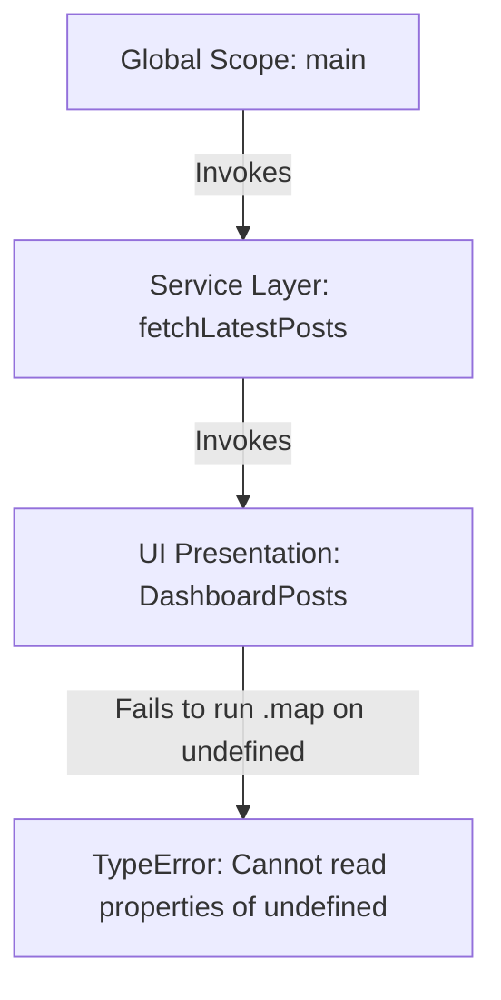

A few months ago, while building DailyDevPost, I saw this error:

`TypeError: Cannot read properties of undefined (reading 'map')`

I spent nearly an hour looking at React code before realizing the bug was in my own API response. That mistake completely changed how I interpret React error messages and read stack traces. Since then, I've followed a streamlined workflow whenever I hit a runtime error. 

Here's the system.

<AeoAnswer>
**How do you read a React stack trace without panicking?**  
To read a React stack trace, locate the boundary line where the trace transitions from library internals (like `node_modules` or `react-dom`) back to your local files (e.g., in `/app` or `/components`). The line of your code immediately preceding the library internal calls is where the bug lives.
</AeoAnswer>

---

## What is a Stack Trace?

A **React stack trace** is a snapshot of the call stack at the precise millisecond an exception was thrown. The call stack represents the list of active function frames that the browser's JavaScript engine was executing. The top frame of the stack shows the function where the error occurred, while each line below it represents the parent function that called it.

Understanding this flow visually is critical for [debugging React applications](/blog/a-bug-i-recently-faced-and-how-i-actually-tracked-it-down). Here is how the engine schedules these calls before hitting a crash:



---

## The Boundary Line Rule

Whenever I debug React applications and parse confusing **React error messages**, I look for one thing: the **Boundary Line**.

The boundary line is the point where a stack trace transitions from framework internals and third-party dependencies (Vite loaders, webpack runtime, `node_modules`) back into your local project files (typically starting with `src/`, `app/`, or `components/`).

Here is a visual breakdown of a typical React runtime error:

```text
TypeError: Cannot read properties of undefined (reading 'map')
    at ProductGallery (ProductGallery.tsx:24:21)  <-- The Boundary Line: Actual bug location
    at renderWithHooks (react-dom.development.js:154) <-- React internal call (Ignore)
    at mountIndeterminateComponent (react-dom.development.js:178) <-- React internal call (Ignore)
```

Instead of letting your eyes glaze over when the console fills with red, scroll straight to the boundary line. In my experience, the bug is usually introduced in the line of your code immediately preceding the framework internal calls.

<PullQuote quote="Most React stack traces look complicated because you're reading framework internals. The real bug is usually hiding where the trace returns to your code." />

---

## My Actual Debugging Flow

This is my personal step-by-step [frontend debugging workflow](/blog/a-bug-i-recently-faced-and-how-i-actually-tracked-it-down) using **Chrome DevTools debugging** to isolate bugs on the boundary line:

1. **Read the First Line:** Find the error type and message, such as **Cannot read properties of undefined**.
2. **Find the Boundary Line:** Scan past all lines pointing to `react-dom` or `node_modules` until you hit your own source file.
3. **Set a Breakpoint in DevTools:** Click the blue file link next to your source file to jump directly to the Sources panel, then click the line number column right before the crash statement.
   
   <ArticleImage src="/static/images/blog/build-in-public/chrome-devtools-debugging.png" alt="Chrome DevTools Console showing a JavaScript TypeError call stack and runtime error" />

4. **Trigger the Crash Interaction:** Refresh the page or click the UI trigger. The browser will pause execution at your breakpoint before the crash happens.
   
   <ArticleImage src="/static/images/blog/build-in-public/vscode-debugger-breakpoint.png" alt="VS Code Debugger panel showing variables, call stack, and an active breakpoint" />

5. **Inspect Local Variable Shapes:** Hover over variables in your code or check the Scope panel on the right side of the screen to identify mismatched data shapes.
6. **Fix the Root Cause:** Wrap execution in fallbacks, check optional chaining, or correct API payloads.

---

## React-Specific Stack Traces

Debugging React applications introduces unique framework issues. Here are three common **React error messages** you will encounter, along with how to resolve them:

### 1. "Cannot update a component while rendering another component"
*   **What it means:** You are triggering a state update of a parent or sibling component directly in the render path of a child component.
*   **How to fix:** Wrap the state setter in a `useEffect` hook so it runs after the render cycle completes, or place it inside a proper user event handler.

### 2. "Rendered more hooks than during previous render"
*   **What it means:** You violated the Rules of Hooks by wrapping a hook inside a conditional statement, loop, or early return.
*   **The Trap:**
    ```jsx
    if (!user) return <Loading />;
    const [theme, setTheme] = useState('dark'); // ❌ Conditionally called hook will crash the component
    ```
*   **How to fix:** Move all hooks to the very top of your component, ensuring they are always called unconditionally.

### 3. "Maximum update depth exceeded"
*   **What it means:** The component is trapped in an infinite render loop, often because a state update immediately triggers another render that triggers the same update.
*   **How to fix:** Double-check your `useEffect` dependency lists and ensure state updates are guarded by comparison conditions to avoid infinite loops.

When these runtime crashes happen, React displays a red error overlay in your browser:

<ArticleImage src="/static/images/blog/build-in-public/react-error-overlay.png" alt="React runtime error overlay showing a Red Screen of Death with error boundary details" />

To prevent this red screen from taking down your production application, wrap your layout components in a **React error boundary**:

```tsx
<ErrorBoundary fallback={<ErrorFallback />}>
  <App />
</ErrorBoundary>
```

This tiny snippet provides a visual safety net, displaying a graceful fallback UI instead of crashing the entire page.

---

## Case Study: Fetching Blog Metadata on DailyDevPost

While building the blog metadata caching script and RSS feed generator for DailyDevPost, I hit a real-world version of this issue. The compilation process crashed immediately during static page builds, outputting a `TypeError: Cannot read properties of undefined (reading 'map')` stack trace pointing to `MetadataLoader.ts:18`.

Here is the unoptimized helper function that caused the build script to crash:

```tsx
// ❌ Crashes when any blog post frontmatter lacks a tags field
export function compilePostMetadata(posts: RawBlogPost[]) {
  return posts.map(post => {
    const keywords = post.frontmatter.tags.map(t => t.toLowerCase());
    return {
      title: post.title,
      slug: post.slug,
      keywords
    };
  });
}
```

By tracing the error back to the boundary line in `MetadataLoader.ts:18`, I realized that while most blog posts had tags properly declared, a temporary draft log post was missing the `tags` field in its frontmatter, returning undefined.

Instead of rewriting the entire metadata loader, I stabilized the component by adding a short-circuit fallback directly during tags access:

```tsx
// ✅ Fallback default array prevents mapping over undefined tags
export function compilePostMetadata(posts: RawBlogPost[]) {
  return posts.map(post => {
    const keywords = (post.frontmatter.tags || []).map(t => t.toLowerCase());
    return {
      title: post.title,
      slug: post.slug,
      keywords
    };
  });
}
```

### Optional Chaining vs. Default Fallbacks

When teaching beginners, this is a common point of confusion. Many developers search for ways to prevent mapping errors using optional chaining:

```ts
// ⚠️ If post.frontmatter.tags is undefined, keywords becomes undefined
const keywords = post.frontmatter.tags?.map(t => t.toLowerCase());
```

It is crucial to understand when to use **optional chaining (`?.`)** versus a **default fallback array (`|| []`)**:
1. **Optional Chaining (`?.`)**: Use this when the property might be missing and you are completely fine with the final value being `undefined`. However, if you pass this value downstream to a component or method that expects an array to render or loop over (e.g. `keywords.map(...)`), the application will still crash because you cannot call `.map()` on `undefined`.
2. **Default Fallback Array (`|| []`)**: Use this when you *must* return a valid array type to ensure that subsequent loops, map operations, or other methods don't throw an error.

In our metadata script, using `(post.frontmatter.tags || [])` ensures we always have an array instance to process, preventing downstream compilation crashes.

This simple correction resolved the compilation crash instantly and prevented future frontmatter mistakes from breaking the build pipeline.

---

## Conclusion: Breadcrumbs, Not Obstacles

Stack traces are not walls of text. They are breadcrumbs.

Every error already contains clues about exactly what is broken. The goal isn't to memorize every React error message or library quirk. The goal is to learn how to read the clues calmly, isolate the boundary lines of your own code, and debug systematically.

The next time a red error log takes over your screen: slow down, locate the boundary line, translate the error into plain English, and trace the state logic. Your code will thank you.
