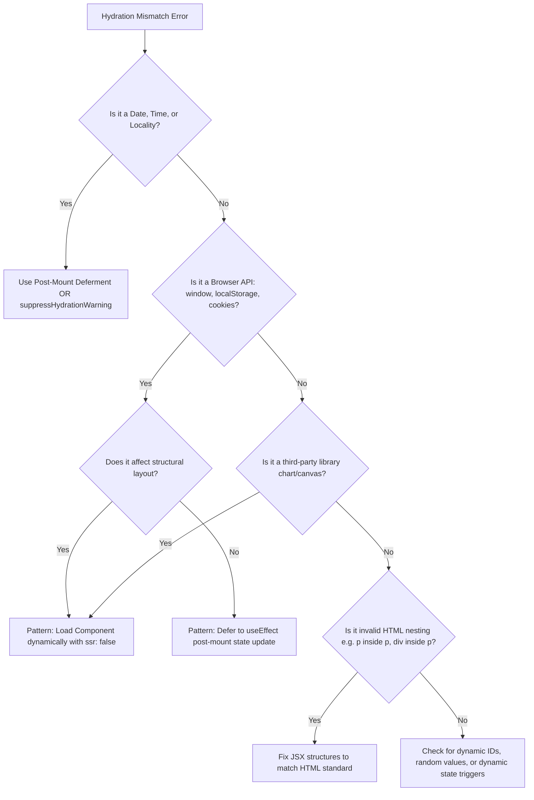
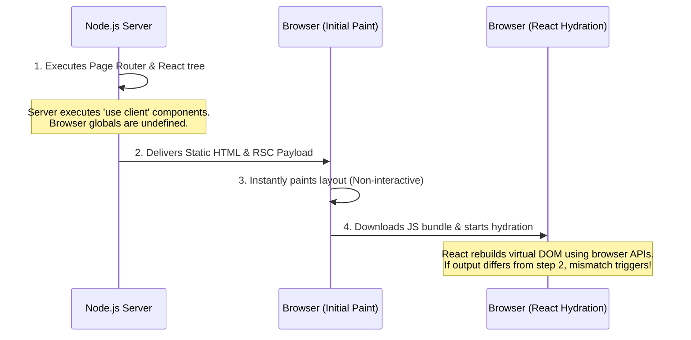

You deployed your Next.js app.

Everything worked locally.

Production suddenly shows:

"Text content does not match server-rendered HTML."

Here's why it happens and how to fix it.

<AeoAnswer>
**Quick Answer:** A hydration mismatch occurs when the HTML rendered by the server differs from the HTML React generates during the browser's first render. Common causes include dates, browser APIs, localStorage, random values, and invalid HTML.
</AeoAnswer>

---

## Common Hydration Error Messages

When searching for answers, developers run into different variants of the same core issue:

### 1. "Text content does not match server-rendered HTML"
This is the most common text-node mismatch. It happens when raw text values (such as dates, currency strings, or localized text) differ between your Node server (which runs on UTC in a remote cloud datacenter) and the user's browser.

### 2. "Hydration failed because the initial UI does not match what was rendered on the server"
This is React's general hydration failure notification. It indicates that React could not reconcile the pre-rendered markup with the browser's initial virtual DOM representation.

### 3. "Warning: Did not expect server HTML to contain a `<tag>` in `<tag>`"
This is a structural nesting error. Browser parser engines automatically correct invalid syntax in the DOM (like nesting a block element like a `<div>` inside a paragraph `<p>`), causing React's expected virtual layout to mismatch with the browser's parsed structure.

### 4. "Warning: Prop 'className' did not match. Server: '...' Client: '...'"
An attribute mismatch. It occurs when styles or class names are dynamically assigned during the render path based on client-only values.

---

## Hydration Mismatch Troubleshooting Flowchart

Use this decision tree to diagnose and fix hydration errors:



---

## Hydration Mismatch Examples by Category

Here is a quick reference table of common hydration mismatch categories, the buggy code pattern, and why they trigger errors:

| Category | Mismatched API / Element | Why it Mismatches |
| :--- | :--- | :--- |
| **Date & Time** | `new Date().toLocaleDateString()` | Server UTC time differs from user's local browser timezone. |
| **Browser APIs** | `window.innerWidth` | Server Node environment lacks a `window` global, so values differ. |
| **Storage** | `localStorage.getItem("theme")` | Server has no local storage; reads fallback while client reads stored preference. |
| **Random Values** | `Math.random()`, `crypto.randomUUID()` | Server compiles one value/ID, but client generates a different one. |
| **Third-Party Libraries** | Dynamic Charts / Canvas widgets | Client mounts interactive elements that aren't represented in static HTML. |
| **Invalid HTML** | `<p><div>Nest text</div></p>` | Browsers force-close paragraph tags, corrupting the expected element tree. |

---

## Anatomy of Hydration: What Actually Happens?

To make pages load instantly, Next.js generates static HTML on the server. The browser displays this HTML right away. 

However, this initial HTML is static; it has no active event listeners or client-side logic. To make it interactive, the browser downloads the JavaScript bundle, and React attaches event handlers to the painted HTML elements. This process is called **hydration**.

If there is any difference between the server-rendered HTML and the client's initial Virtual DOM tree, the hydration handshake fails.

---

## Hydration Mismatch in Server Components vs Client Components

A very common misconception among Next.js developers is:
> *"Since I added 'use client' to the top of my component, it only runs on the client. Therefore, I can access window and localStorage directly."*

**This is wrong.** In the Next.js App Router, **Client Components are still pre-rendered on the server**.



Because your client components run on the Node server first, referencing browser-only globals (like `window` or `localStorage`) inside the render body returns `undefined` on the server but actual values in the browser. 

Choosing whether to use static generation or server-side rendering is a core architectural choice—see our [static vs. CMS comparison](/blog/best-developer-blog-tech-stack) for more details.

---

## What's Different in Next.js 15 & React 19?

If you are upgrading to Next.js 15, you are also upgrading to **React 19**. React 19 and newer Next.js releases provide significantly more actionable hydration diagnostics than earlier versions.

- **Improved Console Errors:** React 19 logs cleaner error stacks to the console. It filters out internal React library code and highlights only your code boundaries, making it much easier to pinpoint the exact component.
- **Incremental Streaming:** Next.js 15 relies on React 19's streaming rendering. If a component wrapped in `<Suspense>` mismatches, React isolates the mismatch to that specific Suspense boundary instead of failing for the entire page.

---

## Dynamic IDs and Random Values

Another common source of hydration errors is generating random values or dynamic IDs during render.

```tsx
// ❌ BUGGY: Server generates one ID, client generates another
export default function FormInput() {
  const id = `input-${Math.random()}`; 
  return <input id={id} />;
}
```

The fix is simple: for auto-generated IDs, use React's built-in `useId` hook, which generates stable, matching IDs across server and client renders. For other random content, defer generation to a `useEffect` hook.

```tsx
//  FIXED: Stable IDs for server and client
import { useId } from "react";

export default function SafeFormInput() {
  const id = useId(); 
  return <input id={id} />;
}
```

---

## Case Study: Tracing a Theme & Responsive Layout Bug

Let's look at a real-world bug. We deployed a dashboard with a collapsible side navigation panel for screens narrower than 768px and a theme that was saved in `localStorage`.

### The Buggy Code
```tsx
"use client";

import { useState } from "react";
import MobileMenu from "./MobileMenu";
import DesktopSidebar from "./DesktopSidebar";

export default function DashboardLayout({ children }) {
  // ❌ Reading localStorage and window during render
  const savedTheme = typeof window !== "undefined" ? localStorage.getItem("theme") : "light";
  const isMobileSize = typeof window !== "undefined" ? window.innerWidth < 768 : false;

  return (
    <div className={`app-container ${savedTheme === "dark" ? "theme-dark" : "theme-light"}`}>
      <div className="flex">
        {isMobileSize ? <MobileMenu /> : <DesktopSidebar />}
        <main className="flex-1 p-6">{children}</main>
      </div>
    </div>
  );
}
```

### Why it Broke in Production
1. **On the Server:** `window` is `undefined`, so `savedTheme` resolved to `"light"` and `isMobileSize` to `false` (rendering `<DesktopSidebar />`).
2. **On the Client:** If a user loading the dashboard was on a mobile device (width 390px) with dark mode active:
   - The browser initially painted the light, desktop sidebar layout.
   - During hydration, React executed the component. Since `window` was defined, it calculated `savedTheme = "dark"` and `isMobileSize = true` (rendering `<MobileMenu />`).
   - The virtual DOM expected `<MobileMenu />` inside a dark container, but the browser DOM contained `<DesktopSidebar />` inside a light container.
   - React may discard parts of the server-rendered tree, rebuild them on the client (triggering a visible flash), and break interactive event listeners on the mobile menu.

### The Fix
The fix was simple: stop reading localStorage during render.

```tsx
"use client";

import { useState, useEffect } from "react";
import MobileMenu from "./MobileMenu";
import DesktopSidebar from "./DesktopSidebar";

export default function SafeDashboardLayout({ children }) {
  const [mounted, setMounted] = useState(false);
  const [theme, setTheme] = useState("light");
  const [isMobile, setIsMobile] = useState(false);

  useEffect(() => {
    // Runs strictly in the browser post-hydration
    setMounted(true);
    setTheme(localStorage.getItem("theme") || "light");
    setIsMobile(window.innerWidth < 768);
  }, []);

  if (!mounted) {
    // Render a stable, identical layout shell on server & browser
    return (
      <div className="app-container theme-light opacity-0">
        <div className="flex">
          <div className="w-64 h-screen bg-gray-100 dark:bg-gray-800 animate-pulse" />
          <main className="flex-1 p-6">{children}</main>
        </div>
      </div>
    );
  }

  return (
    <div className={`app-container ${theme === "dark" ? "theme-dark" : "theme-light"}`}>
      <div className="flex">
        {isMobile ? <MobileMenu /> : <DesktopSidebar />}
        <main className="flex-1 p-6">{children}</main>
      </div>
    </div>
  );
}
```

Alternatively, you can solve the layout portion by rendering both sidebars and using CSS media queries (e.g. `block md:hidden` and `hidden md:block`) to show or hide them. This is often cleaner because CSS avoids layout shifts and doesn't require waiting for JavaScript hydration.

---

## Four Proven SSR Design Patterns

### Pattern 1: Defer Browser Logic to `useEffect`
Keep state updates deferred to `useEffect` to ensure the initial client render matches the server.

```tsx
"use client";

import { useEffect, useState } from "react";

export default function InteractiveDate() {
  const [formattedDate, setFormattedDate] = useState<string | null>(null);

  useEffect(() => {
    setFormattedDate(new Date().toLocaleDateString("en-US", { timeZone: "America/New_York" }));
  }, []);

  return <p>Current Date: {formattedDate ?? "Calculating..."}</p>;
}
```

### Pattern 2: Disable SSR via Dynamic Imports
If a component relies heavily on browser-only canvas rendering, WebGL, or complex chart libraries, wrap the component import using Next's `dynamic` utility and set `ssr: false`.

```tsx
import dynamic from "next/dynamic";

const DynamicClientChart = dynamic(() => import("./ClientChart"), {
  ssr: false,
  loading: () => <div className="h-64 animate-pulse bg-gray-100 rounded-xl" />
});
```

### Pattern 3: Use `suppressHydrationWarning` for Immutable Differences
If you are displaying minor text values that cannot easily be made deterministic (like local dates) and you accept a brief layout flash, you can use React's built-in escape hatch:

```tsx
export default function LocalSystemDate() {
  return (
    <span suppressHydrationWarning className="font-semibold">
      Current date: {new Date().toDateString()}
    </span>
  );
}
```

<Warning>
Use `suppressHydrationWarning` sparingly. It only silences the warning; it does not stop React from having to patch the DOM. Never use this for complex structural components.
</Warning>

### Pattern 4: Restructure Invalid HTML Nesting
Ensure your JSX matches standard HTML rules. Never place block elements inside text elements. If you need a refresher on analyzing compile-time issues and debugging outputs, check our guide on [how to read a React stack trace](/blog/how-to-read-react-stack-trace).

```tsx
// ❌ INVALID: Will crash hydration
<p>
  Check out this link: <div>Click here</div>
</p>

//  VALID: Clean, semantic nesting
<div>
  Check out this link: <p className="inline">Click here</p>
</div>
```

This reminds me of a [bug I recently faced and how I tracked it down](/blog/a-bug-i-recently-faced-and-how-i-actually-tracked-it-down) when dealing with recursive component rendering cycles always double-check your DOM nesting.

---

## Production Debugging Workflow

If you encounter hydration mismatches in a production environment, follow these steps to isolate the issue:

1. **Enable Source Maps:** Turn on browser source maps temporarily by adding `productionBrowserSourceMaps: true` in your `next.config.js` to map production errors back to your original source code files.
2. **Pause on Caught Exceptions:** In Chrome DevTools, go to the **Sources** tab, check the **Pause on caught exceptions** option, and trigger the error page. React catches hydration mismatches internally, so pausing on caught errors lets you inspect the state variables at the exact moment of the mismatch.
3. **Compare Network Response:** Open the **Network** tab, inspect the initial HTML document payload, and compare it with the live structure in the **Elements** tab to see exactly where the server-rendered DOM tree differs from the client-rendered DOM tree.


---

## Actionable Steps: Your Hydration Verification Checklist

*   [ ] **Review Console Logs:** Identify target mismatched tags (`p`, `span`, `div`).
*   [ ] **Wrap Browser Globals:** Ensure all references to `window`, `document`, and `navigator` are wrapped in mount checks or `useEffect`.
*   [ ] **Audit Dates and Numbers:** Check that timestamps use static server time zones or are deferred.
*   [ ] **Verify HTML Specifications:** Ensure block-level elements are not nested inside inline elements.
*   [ ] **Run Production Build Tests:** Always run `npm run build && pnpm start` locally to verify that production builds work seamlessly.

---

## CTA
Open your browser console right now. If you see a hydration warning, trace every value coming from window, localStorage, Date, or Math.random(). One of them is usually the culprit.