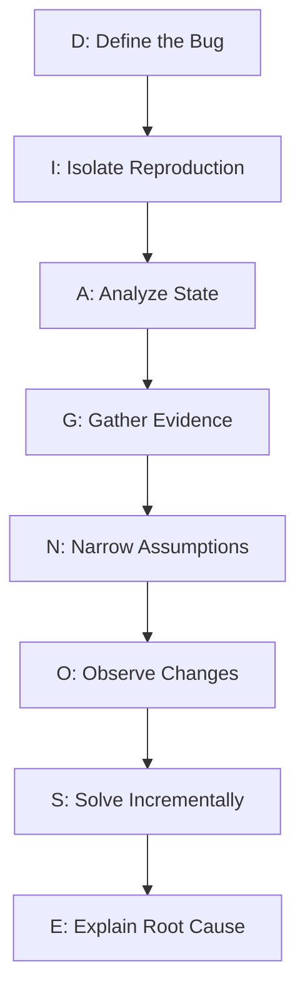
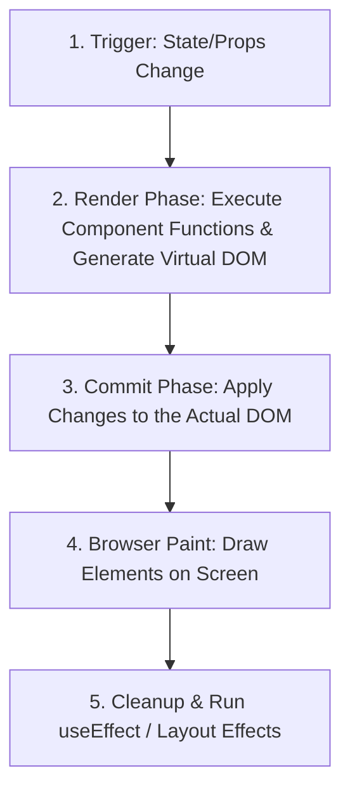

For a long time, I thought finishing tutorials meant I was improving as a developer. 

Then I started building real projects. 

Suddenly, things broke. APIs returned unexpected data. Components rendered twice. State updates behaved strangely. I spent hours debugging problems that tutorials never mentioned. 

Looking back, I learned more from those bugs than from dozens of tutorial videos.

Last year, I spent an entire evening debugging a React component that wouldn't update. I was tearing my hair out, checking the styling, questioning the state logic, and rebuilding the hooks from scratch. The fix? One missing dependency in a `useEffect` dependency array. The lesson took four hours. No tutorial had ever taught me that, but now it is permanently burned into my muscle memory.

That is the difference between passive learning and real engineering. When you follow a tutorial, you are guided along a paved road. When you debug, you are forced to understand how the vehicle actually runs.

<AeoAnswer>
**Quick Answer:** Real-world debugging accelerates developer mastery by forcing you to analyze active execution, challenge assumptions, and learn the runtime mechanics of your tools—lessons that pre-designed "happy-path" tutorials completely bypass.
</AeoAnswer>

---

## Why Debugging is Important

Many developers view bugs as interruptions to their work. In reality, debugging *is* the work. 

When you write code, you are expressing intent. When you debug, you are reconciling that intent with the cold, logical reality of the computer. That mismatch is where the actual learning happens.

The first time I debugged an API race condition in a multi-user comment thread on DailyDevPost, I was completely baffled. I had loaded standard tutorials on React state, but none of them explained why a comment would randomly duplicate or overwrite a sibling's input on slow 3G networks. 

It was only when I opened the browser's Network tab and traced the asynchronous requests that I finally understood how JavaScript's event loop, task queue execution, and race conditions actually operated under network latency. That single four-hour debugging session taught me more about JavaScript scheduling than five courses ever did.

```tsx
// ❌ BUGGY: Slower fetch request overwrites faster fetch state (race condition)
useEffect(() => {
  fetch(`/api/comments?post=${postId}`)
    .then(res => res.json())
    .then(data => setComments(data));
}, [postId]);
```

If a user switches from Post A to Post B rapidly, we fire fetch(A) (Promise A) and fetch(B) (Promise B). If Promise A takes 2 seconds but Promise B takes 500ms, Promise B resolves first, updating the comment state to Post B's comments. Then, Promise A resolves last, overwriting the state with Post A's comments. The user is left looking at Post B but seeing comments for Post A!

The fix required returning a clean-up cancellation flag:

```tsx
// ✅ FIXED: Clean-up boolean ignores out-of-order resolved promises
useEffect(() => {
  let active = true;
  fetch(`/api/comments?post=${postId}`)
    .then(res => res.json())
    .then(data => {
      if (active) setComments(data);
    });
  return () => { active = false; };
}, [postId]);
```

<ArticleImage src="https://ik.imagekit.io/bqu15hkfo/build-in-public/chrome-devtools-network-panel.png" alt="Chrome DevTools Network tab showing HTTP fetch requests, status codes, and timing waterfalls." />

Transitioning from a junior coder to a senior developer requires moving past surface-level syntax confidence. You must learn how systems behave when they fail. Debugging:
1. **Demystifies Runtime Environments:** You learn how browsers parse JavaScript, allocate heap space, and manage memory cycles.
2. **Deconstructs Third-Party Abstractions:** When a dependency crashes, you have to read its source code, exposing you to advanced design patterns.
3. **Builds a Defensive Mindset:** Having spent nights chasing null pointers, you naturally write self-healing code that prevents errors before they happen.

---

## The D.I.A.G.N.O.S.E Method: A Structured Debugging Workflow

One of the biggest mistakes developers make is changing code at random when something breaks. Guesswork is slow and stressful. To solve this, I developed my own personal debugging workflow: the **D.I.A.G.N.O.S.E Method**.



Here is how to apply it:

1. **D → Define the bug:** Write down exactly what is happening versus what *should* happen. Avoid vague descriptions like "the layout is broken." Instead, use: "The dashboard header overlaps the sidebar on screens below 768px."
2. **I → Isolate reproduction:** Find the absolute smallest set of inputs, configurations, or clicks required to trigger the issue. If the bug occurs on a complex page, create a temporary blank page with just that single component to see if it still fails.
3. **A → Analyze state:** Inspect the values of variables, props, and states immediately before the crash occurs.
4. **G → Gather evidence:** Read stack traces completely. Check network payloads, browser console warnings, memory logs, and server logs.
5. **N → Narrow assumptions:** List all parts of the system you *assume* are working correctly. Systematically test and cross them off. (e.g., "Is the database returning data? Yes. Is the API formatting it? Yes. Is the client receiving it? Yes. So the bug must be in the UI rendering logic.")
6. **O → Observe changes:** Make one modification at a time. Change a single variable, class, or dependency, then test. If the issue is not fixed, revert your change before trying another.
7. **S → Solve incrementally:** Apply a localized, clean fix. Do not write complex workarounds to hide the bug; address the root cause directly.
8. **E → Explain root cause:** Once it works, write down a one-sentence explanation of *why* it broke. If you cannot explain the fix, you haven't truly solved it you've just masked it.

---

## How to Debug React Apps

Debugging in modern declarative UI frameworks like React requires a different mental model than debugging procedural code. In React, you are not managing DOM nodes directly; you are managing state that determines the DOM.

When a React app behaves unexpectedly, the issue is almost always a mismatch between your state lifecycle and React's rendering cycles.



This is very similar to the time I got caught in rendering loops when building nested comments, which I documented in my guide on [how I tracked down rendering loops](/blog/a-bug-i-recently-faced-and-how-i-actually-tracked-it-down).

Here are the best ways to debug React applications:
* **Leverage the React Developer Tools:** Use the Components tab to inspect the current state and props of any component in your rendering tree. Use the Profiler tab to record render cycles and find why a component is rendering twice.
* **Trace Render Triggers:** If a component is re-rendering too often, use the `why-did-you-render` library or place a simple `console.count("X")` inside the component body to see if it is rendering unnecessarily.
* **Understand the `useEffect` Lifecycle:** Many React bugs stem from synchronization issues. Remember that `useEffect` runs *after* render. If you modify state inside `useEffect` without a proper dependency list, you risk creating infinite rendering loops.

---

## Core Debugging Techniques

Depending on the complexity of the issue, you should have multiple tools in your toolbox:

### 1. Browser Breakpoints (Sources Tab)
Stop using `console.log` for everything. In Chrome or Edge DevTools, go to the **Sources** tab and set breakpoints on the exact line of code you want to inspect. This pauses execution, allowing you to walk through stack frames, inspect scope variables, and see the call history in real time.

<ArticleImage src="https://ik.imagekit.io/bqu15hkfo/build-in-public/chrome-devtools-debugging.png" alt="Chrome DevTools Console showing a JavaScript TypeError call stack and runtime error" />

### 2. Binary Search Debugging (Commenting Out)
If you have a massive component or module and don't know where it's failing, comment out half of the code. If the bug disappears, the issue is in the commented-out half. Repeat this process to pinpoint the exact line in seconds.

### 3. Reading the Stack Trace
Stack traces tell a chronological story of how your application arrived at an exception. Learn to read them from the top (where the crash happened) down to the bottom (the entry point of your application). Look for the "boundary line" where the trace transitions from library internals (like `node_modules` or `react-dom`) back to your local files (e.g., in `/app` or `/components`).

If you're not yet comfortable identifying the boundary in a stack trace, see my detailed guide on [decoding React error logs](/blog/how-to-read-react-stack-trace).

<ArticleImage src="https://ik.imagekit.io/bqu15hkfo/build-in-public/react-error-overlay.png" alt="React runtime error overlay showing a Red Screen of Death with error boundary details" />

---

## Case Study: Tracing a Silent Memory Leak in DailyDevPost

While working on DailyDevPost, I noticed page memory climbing dramatically during local testing. In local development, the app ran smoothly. However, when deployed to a staging environment, the browser tab would freeze or crash after five minutes of active user interaction.

Instead of guessing or rebuild-copying another state management tutorial, I decided to gather hard evidence. I opened Chrome DevTools, went to the **Memory** panel, and recorded a series of **Heap Snapshots** before and after toggling the table filter 10 times.

Here is the exact data I gathered:
* **Before Toggling (Initial Load):** 32 MB
* **After 10 Navigations / Filter Clicks:** 148 MB
* **Difference:** +116 MB (Unreleased memory)

By comparing the two heap snapshots, the memory profiler pointed to a massive buildup of **Detached DOM nodes** (specifically, thousands of unreleased `HTMLDivElement` references).

<ArticleImage src="https://ik.imagekit.io/bqu15hkfo/build-in-public/chrome-devtools-heap-snapshot.png" alt="Chrome DevTools Heap Snapshot comparison showing memory growing from 32MB to 148MB due to detached HTMLDivElements." />

By searching the memory allocation paths, I traced the root cause back to an event listener inside a third-party charting library. The listener was added during render but was never cleaned up when the component unmounted. The browser could not garbage-collect the detached DOM nodes because the listener kept a live reference to them.

To fix it, I added a clean-up callback to the `useEffect` hook to explicitly destroy the chart instance:

```typescript
// Clean up third-party event listeners on component unmount
useEffect(() => {
  const chartInstance = chartRef.current;
  return () => {
    chartInstance.destroy();
  };
}, []);
```

Recording a new Heap Snapshot after this fix showed a stable baseline: memory stayed around **32 MB to 35 MB** even after 20 filter clicks. This data-driven adjustment reduced memory usage by over **70%** under stress, eliminated the tab crashes, and proved the value of systematic debugging over guesswork.

---

## My Biggest Debugging Lessons

Over years of breaking and fixing applications, I have learned five core lessons that I keep on my wall:

1. **Never trust assumptions:** When debugging, verify everything. Do not assume the database is up, or that the prop contains an array, or that an API returned a success payload. Log it, inspect it, or write a test to prove it.
2. **Reproduce before fixing:** Never try to fix a bug until you can reliably reproduce it. If you cannot make the code fail at will, you cannot verify that your changes actually solved the problem.
3. **Read the error completely:** Error messages are not warnings to ignore; they are blueprints. The computer is literally telling you exactly what went wrong and where. Read it.
4. **One change at a time:** If you modify three different lines of code, upgrade a dependency, and change a configuration file all in one go, you won't know which change fixed the bug or what new issues you have introduced.
5. **Most bugs are simpler than they appear:** When code fails, we often imagine massive, complex bugs in the compiler or browser engine. In 99% of cases, the bug is a typo, a missing import, a misplaced conditional, or a missing dependency in a hook array.

---

## Conclusion / Key Takeaways

Developer tutorials are excellent starting blocks, but diagnostic debugging is where senior-level engineering skills are forged. Do not fear compiler errors or runtime warnings. Treat every bug as an opportunity to understand the execution environment, trace data boundaries, and write more resilient code.

---

## Related Links
*   [The Stack Trace Blueprint: Decoding Console Errors](/blog/how-to-read-react-stack-trace)
*   [React Performance Troubleshooting: Resolving Loops](/blog/a-bug-i-recently-faced-and-how-i-actually-tracked-it-down)
*   [Developing a Writing Habit: Lessons from a Developer](/blog/what-surprised-me-about-writing-daily-this-week)

---

## CTA

What's the most frustrating, head-scratching bug you've ever solved? How did you track it down?

Reply in the comments below or connect with me on LinkedIn to share your story; I read and reply to every single one!
