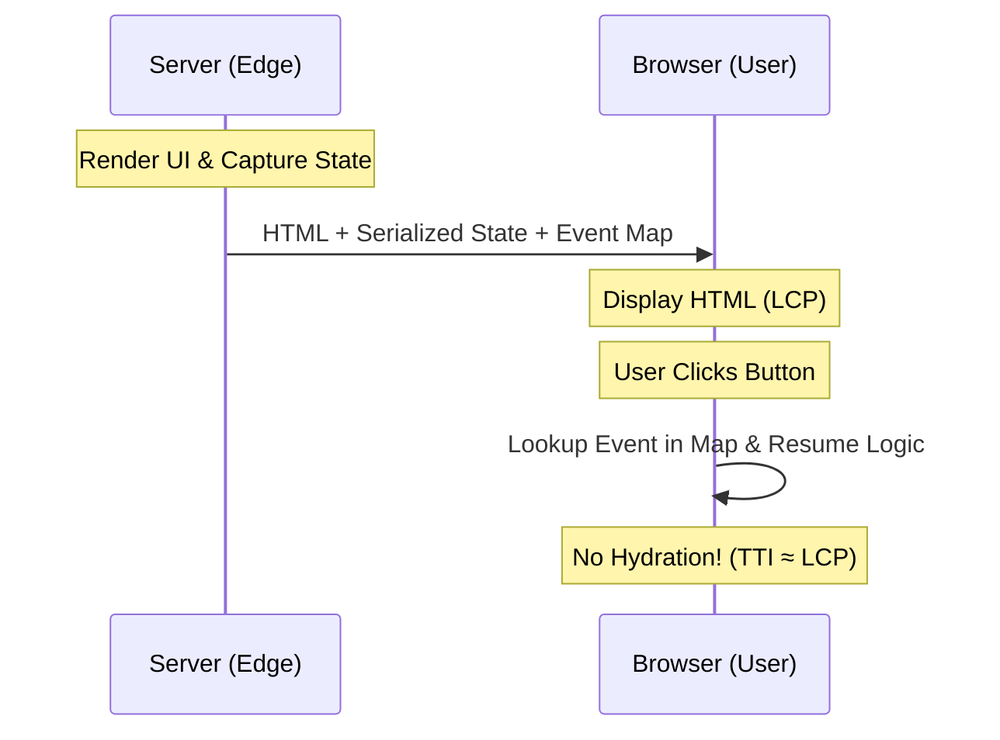

The biggest challenge in a resumable architecture is type safety. If your application "pauses" on the server and "resumes" in the browser, how do you ensure the types remain valid? 

### Resumability and Serialization
Resumability allows an application to "pause" its state on the server and "resume" execution in the browser without re-executing any logic or re-rendering components. It minimizes the hydration tax by serializing event listeners and application state directly into the HTML, making interactivity incredibly fast.



### The Resumability Challenge: Typing the "Intermediate"

In a traditional SPA, the application state is a big object in memory. In a **Resumable** application (like those built with Qwik or modern RSC patterns), the state is serialized into the HTML. 

The challenge: **JSON is not TypeScript.** Your complex classes, Maps, and Sets cannot be easily serialized. If you have a `User` object with a `greet()` method, that method is lost the moment it crosses the serialization boundary.

We can solve this with a "Plain Data Partition" pattern. We use TypeScript to strictly separate behavior from state.
-   **States** are defined as pure, serializable interfaces (only primitives, arrays, and plain objects).
-   **Behaviors** are defined as pure functions that operate on those states.

This ensures that when our [Server Action](/blog/server-actions-vs-useeffect-fetching) returns data, we don't accidentally expect a method to exist on a serialized object.

### Advanced Pattern: Branded Types for Domain Integrity

One of the biggest sources of bugs in large-scale apps is "ID Confusion." You have a `UserId` (string) and a `PostId` (string). They are both strings. TypeScript, by default, will let you pass a `PostId` into a function that expects a `UserId`.

We can use **Branded Types** (also called "Opaque Types") to prevent this.

```typescript
type Brand<T, K> = T & { __brand: K };

type UserId = Brand<string, "UserId">;
type PostId = Brand<string, "PostId">;

function deleteUser(id: UserId) { /* ... */ }

const myPostId = "post_123" as PostId;
// deleteUser(myPostId); // ❌ Error: Type 'PostId' is not assignable to 'UserId'
```

This adds zero runtime overhead but creates a level of domain integrity that makes it almost impossible to ship data-mixing bugs. Branded Types are an excellent line of defense in a complex business domain.

### The Domain Integrity Tier List

| Pattern | Type Safety | Runtime Overhead | Developer Experience |
| :--- | :--- | :--- | :--- |
| **Plain Types** | Low | Zero | High |
| **Zod Schemas** | High | Low (Validation) | Medium |
| **Branded Types** | **Maximum** | **Zero** | High |

### Template Literal Types: The "Type-Safe API" Revolution

Template Literal Types allow us to model strings with high precision. 

I use them for everything from **CSS Utility Classes** to **Internal Routing**.

```typescript
type Color = "red" | "blue" | "green";
type Shade = 100 | 500 | 900;

// Generates "text-red-100" | "text-red-500" | ...
type TailwindColor = `text-${Color}-${Shade}`;

function setTextColor(color: TailwindColor) { /* ... */ }

setTextColor("text-red-500"); // ✅
// setTextColor("text-purple-200"); // ❌ Error!
```

This is particularly powerful for [Edge vs. Origin](/blog/edge-vs-origin-business-logic-cdn) architectures. We can type-safe our API routes so that a change in the server's directory structure immediately breaks the client's build.

### The "Serializability Enforcement" Pattern

When we use [Server Actions](/blog/server-actions-vs-useeffect-fetching), we often pass data back and forth. But what happens if we accidentally pass a `Function` or a `Circular Reference`? The app crashes at runtime.

We can use a utility type to enforce **serializability at compile time**:

```typescript
type Serializable = 
  | string | number | boolean | null
  | { [key: string]: Serializable }
  | Serializable[];

function serverAction<T extends Serializable>(data: T) {
  // Now I'm guaranteed this can be sent over the wire safely
}
```

This "Strict Serialization" is the foundation of our stability. It ensures that our ["Server-First"](/blog/frontend-development-roadmap-2026) move is grounded in technical soundness.

### Schema-First Design: Zod-to-TypeScript

We don't need to write interfaces and validation separately; the schema can be the source of truth.

We use libraries like Zod to define the shape of our data. We then extract the TypeScript interface from the schema.
-   **The Schema** handles runtime validation (e.g., when data arrives from a form or an API).
-   **The Type** handles compile-time safety (e.g., when you're writing the code).

```typescript
import { z } from "zod";

const UserSchema = z.object({
  id: z.string().uuid(),
  email: z.string().email(),
  age: z.number().min(18),
});

type User = z.infer<typeof UserSchema>;
```

This "Validation-First" approach is critical for **Resumable** apps. Because state is often coming from a "stringified" source (the HTML), we need to validate it the moment it "resumes" in the browser.

### Effect Thinking: Dependency Injection with Types

I've largely moved away from global singleton managers, opting instead for **environmental types** to handle dependency injection.

This is a pattern where we define an "Environment" interface that contains our services (DB, Logger, Email). Our functions then "require" an environment that satisfies that interface.

```typescript
interface Env {
  db: DatabaseService;
  logger: LoggerService;
}

function processOrder(orderId: string, { db, logger }: Env) {
  // ...
}
```

This makes testing incredibly easy and allows us to swap out "Browser Services" for "Server Services" seamlessly while keeping the business logic 100% type-safe.

### Case Study: The "any" Refactor

I recently audited a legacy app that was 40% `any`. The team was terrified to touch the data-fetching layer because they didn't know what shape the data actually was.

We applied three steps:
1.  **Zod Invasion**: We added schemas to every API entry point. This immediately surfaced six different data-mismatch bugs.
2.  **Branding the IDs**: We converted all raw strings to Branded Types. This found two places where "User IDs" were being passed to "Account" services.
3.  **Strict Serializability**: We enforced the `Serializable` constraint on and Server Actions.

Within three months, their production error rate dropped by 70%. **TypeScript isn't just a language; it's a safety harness for your business.**

### Conclusion: Types as the Foundation

TypeScript is the glue that holds these systems together. It allows us to build robust applications that are resilient to the complexities of the web.

Stop treating TypeScript as an obstacle. Start treating it as a powerful architectural tool. When your types are sound, your architecture is sound.

### The "Serializability Bound" Utility

One of the most useful utilities in my toolkit is the `SerializabilityBound<T>` helper. As I mentioned in the Server Actions guide, we need to ensure that data passed across the network is pure data.

```typescript
type NonFunctionKeys<T> = {
  [K in keyof T]: T[K] extends Function ? never : K
}[keyof T];

type Serialized<T> = Pick<T, NonFunctionKeys<T>>;

function sendToEdge<T>(data: Serialized<T>) {
  // This ensures no functions or private symbols leak into our JSON stream
}
```

This pattern prevents the "TypeError: Cannot read property of undefined" when a callback is lost during serialization. It forces you to think about [Data Locality](/blog/edge-vs-origin-business-logic-cdn) at the type level.

Instead of using plain string-based paths for routing, you can use type-safe manifests. Edge functions can export a type definition of their available routes, and the client can typecheck against it.

```typescript
// edge-routes.ts
export type Routes = {
  "/api/user": { method: "GET", response: User },
  "/api/order": { method: "POST", body: OrderRequest, response: OrderResult }
};

// client.ts
const api = createEdgeClient<Routes>();
api.post("/api/order", { /* Body must be OrderRequest */ }); 
```

This pattern has eliminated many "Route Not Found" and "Malformed Body" errors from our routing flows.

---

> [!TIP]
> This advanced type study is part of our [Frontend Development Roadmap 2026](/blog/frontend-development-roadmap-2026). To see how these types impact real-world performance, visit our guides on [V8 Performance](/blog/v8-garbage-collector-react-performance) and [WebGPU](/blog/webgpu-vs-webgl-performance-guide).
