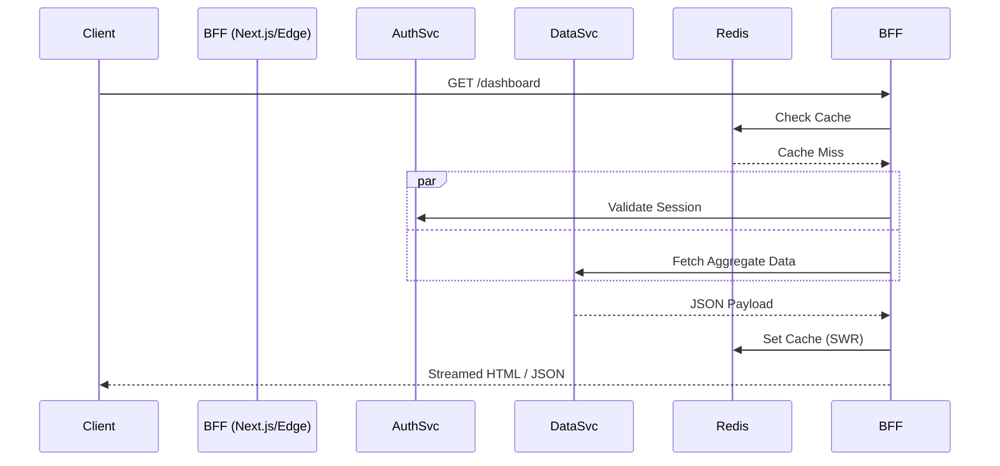

> ### TL;DR
> - **Modern Context**: RSC has blurred the lines of the BFF, acting as an implicit orchestration layer for Next.js apps.
> - **The Core Problem**: Excessive client-side orchestration leads to unmanageable latency and payload bloat.
> - **Production Hardships**: Real-world BFFs require circuit breakers, distributed tracing, and complex caching strategies.
> - **Streaming**: 2026 systems leverage **React Suspense** and **Streaming SSR** to fulfill the BFF order progressively.

---

### **Definitions for Distributed Systems**
- **Orchestration**: Coordinating multiple service calls to fulfill a single user intent.
- **Circuit Breaker**: Stops requests to a failing service to prevent cascading failures.
- **Distributed Tracing**: Tracking a request across services using trace IDs (OpenTelemetry).
- **Edge Aggregation**: Running BFF logic on **Vercel Edge Runtime** or **Cloudflare Workers**.

---

> [!TIP]
> ### The 2026 BFF Perspective
> In contemporary architecture, the **BFF pattern** is less about "where the code lives" and more about "where the data is shaped." While **React Server Components** handle much of the web-specific orchestration today, a robust BFF remains the primary buffer for security, payload optimization, and cross-platform consistency.

---

I used to think a Backend-For-Frontend (BFF) was just unnecessary glue code.

Early on, I pushed for "clean" microservice architectures where the frontend talked to APIs directly. It worked fine in development. Then we launched a global logistics dashboard that had to run on tablets in rural warehouses. 

Our API forced the client to make 15 sequential requests just to show a single shipment's status. On a 3G connection with 400ms of latency per round trip, the "Time to Interactive" was nearly 10 seconds. We were technically "clean," but operationally broken. 

The physics of the network don't care about your clean abstractions. 

In this audit, we'll look at the **BFF pattern frontend** through the lens of production reality in 2026. We'll discuss why **RSC** is changing the game, how to handle the inevitable failures of downstream services, and why **caching** is where most teams actually fail.

---

## The RSC Shift: Is Next.js the New BFF?

The most common question I get in 2026 is: *"If I'm using React Server Components, do I even need a BFF?"*

### RSC as an Implicit BFF
In a standard Next.js application, **React Server Components (RSC)** effectively act as your BFF. They run on the server, have access to your internal network (bypassing the public internet), and can fetch data from multiple services. 

*   **RSC Loaders**: Fetch data directly for a specific route. They eliminate the need for an intermediate API route for most web use cases.
*   **Server Actions**: Handle mutations securely, acting as a bridge to backend microservices.

### When RSC is NOT Enough
As you scale, you hit the "Boundary Problem." If you have a Mobile app (iOS/Android) and a Web app, you cannot share RSC logic with Swift or Kotlin. A dedicated BFF service (Node.js/Go) ensures that business logic and data shaping are centralized.

There's also the **Compute Density** issue. If your orchestration involves heavy data processing (like generating PDFs or manipulating large Kafka event streams), moving that to a dedicated service prevents your frontend server from becoming a bottleneck.

---

## The Caching Layer: The Real Hard Part

Caching in a BFF isn't just about `max-age=3600`. It’s about managing data freshness across a distributed system.

### Request Deduplication & SWR
A common production failure is the **Thundering Herd**. If 100 users hit your dashboard at the same time, your BFF shouldn't fire 100 requests to the "User Service." 

We use **Request Deduplication** (often via a Redis layer or internal in-memory cache) to ensure only one request hits the backend, while the others wait and share the result. We pair this with **Stale-While-Revalidate (SWR)**:
1.  Serve the stale data from the cache instantly.
2.  Revalidate in the background.
3.  Update the cache for the next user.

### Personalized Cache Fragmentation
The problem with BFF caching is that data is often highly personalized. You can't just cache `GET /api/dashboard` at the CDN level because every user sees different data.

In 2026, we solve this with **Edge Caching** and **Header-Based Partitioning**. We use the user's session ID or a "Cache-Key" header to shard the cache on **Cloudflare KV** or **Vercel Data Cache**. 

> [!NOTE]
> **Technical Tangent: The Cache Invalidation Ghost**  
> If your BFF caches the user's balance, but the "Billing Service" updates it via a Kafka message, how does your BFF know? You either need a **Webhook** from the billing service to purge the BFF cache, or a **TTL-based polling** strategy. Most teams underestimate the complexity of this "Dual Write" problem.

---

## Streaming Orchestration (RSC + Suspense)

One of the defining shifts of 2026 is **Progressive Orchestration**. Instead of waiting for *all* microservices to respond before sending *any* data, we stream the response.

### How it works in Next.js 15
By using **React Suspense**, the BFF (acting as the RSC layer) can send the "Shell" of the page immediately. As the slow microservices respond, the server "streams" the HTML segments to the client.

```javascript
// app/dashboard/page.tsx
export default async function Dashboard() {
  return (
    <main>
      <Header /> {/* Static / Fast */}
      
      <Suspense fallback={<ChartSkeleton />}>
        <SlowAnalyticsChart /> {/* Fetched via BFF, streamed when ready */}
      </Suspense>
      
      <Suspense fallback={<OrdersSkeleton />}>
        <OrdersList /> {/* Fetched via BFF */}
      </Suspense>
    </main>
  );
}
```

This changes the BFF's job from "Aggregate everything into one JSON" to "Fulfill the stream as data arrives." This significantly improves **Perceived Performance**, even if the total backend time remains the same.

---

## Production Resilience: Handling Partial Failures

In production, **one of your microservices is always failing.** If your BFF just uses a simple `await Promise.all()`, one slow service will block the entire response.

### The Senior Approach: `Promise.allSettled`
We use strict timeout budgets and `allSettled` to ensure the UI remains functional.

```typescript
// server/bff/orchestrator.ts
import { circuitBreaker } from './resilience';

export async function getDashboardData(userId: string) {
  const timeout = 1200; // 1.2s budget

  // Use allSettled to prevent one failure from killing the batch
  const [profile, orders, loyalty] = await Promise.allSettled([
    userService.get(userId),
    orderService.get(userId),
    // Wrapped in a circuit breaker to handle cascading Envoy failures
    circuitBreaker(loyaltyService.get(userId), { timeout })
  ]);

  return {
    profile: profile.status === 'fulfilled' ? profile.value : null,
    orders: orders.status === 'fulfilled' ? orders.value : [],
    // Handle the 'rejected' state gracefully
    loyaltyPoints: loyalty.status === 'fulfilled' ? loyalty.value : { status: 'unavailable' },
  };
}
```

If the Loyalty service is down, the user still sees their profile and orders. This is the difference between a "Bug Report" and a "Degraded State."

---

## The Infrastructure Stack

A production BFF doesn't live in a vacuum. It sits within a complex network layer.

1.  **Orchestration Layer**: **Next.js API Routes** or **Go/Node.js** services running on **Vercel Edge** or **Cloudflare Workers**.
2.  **Service Proxy**: **Envoy** or **NGINX** handling retries, load balancing, and mTLS.
3.  **Caching Layer**: **Redis (Upstash)** for shared state across edge regions.
4.  **Observability**: **OpenTelemetry** traces propagating from the frontend, through the BFF, and into the microservices.
5.  **Failover**: **Regional Failover** strategies where a BFF in `us-east-1` can fallback to `us-west-2` if a regional AWS outage occurs.

---

## Who Owns the BFF? (The Enterprise Nuance)

There is a common claim that the "Frontend team should own the BFF." In startups, this is 100% true. It gives the UI engineers total control over their data contracts.

However, in **Enterprise Environments**, ownership is often a "Shared Responsibility":
- **Product Teams**: Define the data requirements.
- **Platform Engineering**: Manage the infrastructure (Kubernetes, Envoy, CI/CD).
- **Security Teams**: Audit the BFF's role as a "Public Gateway" to prevent data leaks.
- **Domain Owners**: Provide the GraphQL subgraphs (if using Federation).

The most successful teams I've seen treat the BFF as a **Contract**. The frontend team writes the logic, but the platform team provides the "Guardrails" (Rate limiting, logging, security headers).

---

## Visualizing the Flow: Client vs BFF Orchestration



---

## Key Takeaways for Senior Architects

- **Caching is the Core**: If you aren't deduplicating requests and managing invalidation, your BFF will eventually crush your downstream services.
- **RSC + Suspense is the 2026 Default**: Stop building "All-or-Nothing" JSON APIs. Start building streaming architectures.
- **Resilience Over Purity**: Use `allSettled`, timeouts, and circuit breakers. Expect failure.
- **Physics Trumps Everything**: Orchestrate where the data lives. If you move logic to the edge but your data is in a centralized RDS, you are paying a "Latency Tax" on every request.

---

## Conclusion: The "Earned" Architecture

Building a **Backend-For-Frontend** isn't about following a trend. It's about acknowledging the reality that microservices are designed for servers, but our apps are designed for humans. 

I stopped trying to build the "perfectly clean" architecture and started building the one that survives the real world. That means handling partial failures, observing every hop, and knowing when to let the server do the heavy lifting.

If you are currently re-evaluating your data flow, I highly recommend reading our audit of [Next.js Edge vs Origin Rendering](/blog/edge-vs-origin-rendering-nextjs-guide) to decide where your BFF should live. For those managing complex UI states once the data arrives, our comparison of [Zustand vs Jotai](/blog/zustand-vs-jotai) is the next logical step.

---

> [!TIP]
> This post is part of our [Frontend Engineering Architecture](/blog/frontend-architecture-guide) Pillar. To see how this fits into the 2026 landscape of **frontend system design**, [start with the roadmap here](/blog/frontend-development-roadmap-2026).
