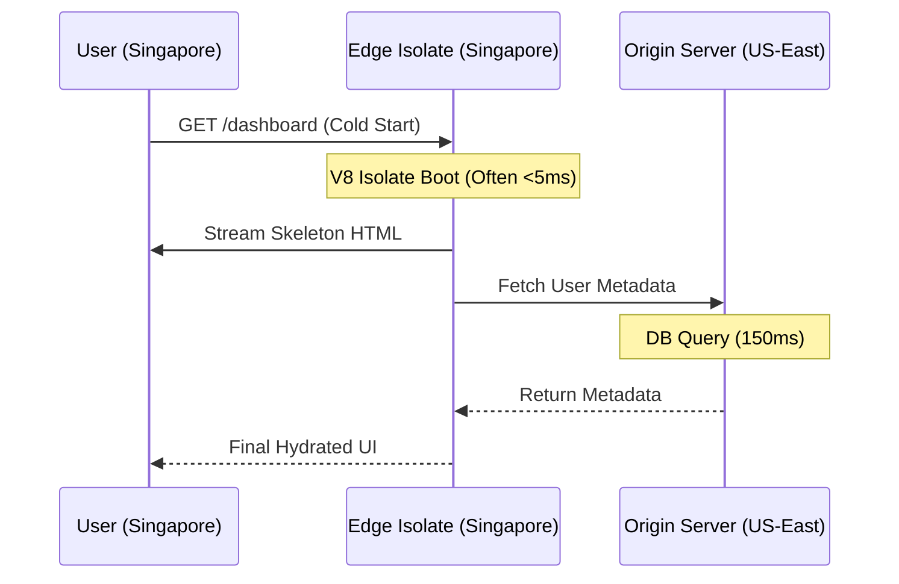
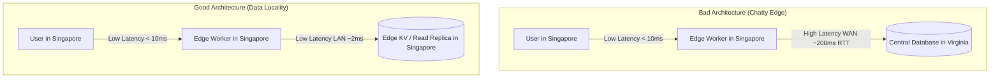

> [!TIP]
> ### 🌐 Edge Intelligence: The Senior Architect's TL;DR
> - **The Cold Start Tax**: Traffic at the Edge is spread thin. Expect more frequent, though smaller, initialization delays.
> - **Isolates > Containers**: V8 Isolates commonly boot in under 5ms, whereas Docker containers take seconds. This is the foundation of 2026 performance.
> - **Data Locality**: If your data is in Virginia and your code is in Singapore, you haven't fixed latency; you've just moved the waiting room.
> - **Micro-Edge Strategy**: Break monolithic functions into tiny, single-purpose Isolates (`&lt;50KB`) to ensure fast execution, often under 10ms.

I used to think that moving our API logic to the Edge would solve all our latency problems. "Put the code near the user," the marketing said. "Zero latency," they promised. "Instant global scale."

### Understanding Serverless Cold Starts in Edge Functions
Serverless cold starts in Edge Functions are initialization delays that occur when a cloud provider spins up a new instance of an Edge function (a V8 Isolate) to handle a user request. These are minimized by using Isolate-native frameworks like Hono and keeping bundle sizes sub-50KB to ensure startup times commonly measured in single-digit milliseconds.

So, I moved a heavy Node.js authentication middleware to a popular Edge provider. The result? My P99 latency didn't drop; it tripled. For some users, the site felt slower than when I was hosting everything in a single AWS region in Northern Virginia.

| Metric | Centralized Origin (US-East) | Unoptimized Edge (Singapore Edge → Virginia DB) | Optimized Edge (Singapore Edge → Local KV) |
| :--- | :--- | :--- | :--- |
| **P50 (Median)** | 80ms | 210ms | **15ms** |
| **P99 (Tail/Cold Start)** | 120ms | 360ms (Tripled) | **45ms** |

This data illustrates a common pitfall: deploying Edge Functions without optimizing data locality or handling serverless cold starts properly will actually degrade tail performance. 

I think we’ve moved past the initial "Edge hype" and into the "Edge reality." If you want to build high-performance, server-first apps, you have to understand the physical constraints of edge computing cold starts.

This understanding is also key to mastering frontend system design.

### The Cold Start Trap

A "cold start" happens when your cloud provider has to spin up a new instance of your function to handle a request. At the Edge, this problem becomes more frequent because your traffic is spread across hundreds of tiny data centers (Points of Presence) instead of one large one. 

If you have 100 users spread across 100 cities, every single one of them might trigger a cold start. I’ve seen apps lose all their client-side responsiveness gains from the [React Compiler](/blog/react-compiler-performance-guide) (which minimizes client-side re-renders) because their server-side edge function latency was spiked by a typical 300ms serverless cold start tax. Client-side layout optimization doesn't help when the initial HTML response (TTFB) is delayed at the edge.

### Runtime Constraints: V8 Isolates vs. Docker

To solve this, major providers using **Cloudflare Workers** or **Vercel Edge Runtime** have moved toward V8 Isolates as a cornerstone of their **Global CDN Architecture**. This is a fundamental shift in infrastructure. An Isolate is a lightweight execution context within a single V8 process; the same technology that keeps your browser tabs separate.

| Feature | V8 Isolates (Modern) | Docker Containers (Legacy) |
| :--- | :--- | :--- |
| **Cold Start** | **Often &lt;5ms** | 200ms - 2000ms |
| **Memory Footprint** | ~10KB - 1MB | 50MB - 500MB |
| **Scaling** | Instant (Isolate spin-up) | Slow (Orchestration) |
| **Context** | Shared Process | Virtual OS |
| **Ideal For** | Edge Functions, Edge Middleware | Heavy background tasks |



### The Precision of V8 Isolates: Bundling and Web API Constraints

When deploying to V8 Isolates, your bundler is your most important tool. Unlike traditional Node.js environments where your server boots once and runs for weeks, a V8 Isolate spins up on demand. If your bundled code is too large, the V8 runtime spends precious milliseconds compiling and executing your JavaScript before it can even handle a request.

Every byte of an Edge bundle is a potential performance regression. If a library doesn't run in a standard Web Worker environment, it doesn't belong at the Edge. Here are the three pillars of V8 Isolate bundling:

#### 1. The Missing Node.js Built-ins
V8 Isolates do not run on Node.js; they execute directly on V8. This means you do not have access to standard Node APIs such as `fs`, `path`, `net`, or `child_process`. If your application imports a library that depends on these packages internally (e.g., standard database drivers or legacy logger libraries), your edge compile will fail or throw runtime errors.

Instead, you must rely on standard Web APIs such as `Fetch`, `Crypto`, `Streams`, and lightweight polyfills where supported.

#### 2. Tree-Shaking and Selective Imports
Traditional imports pull entire libraries into your bundle. At the Edge, you must use ESM (ES Modules) and import only what you need. Consider this comparative example:

```javascript
// ❌ Avoid importing the entire lodash bundle (size: ~70KB)
import _ from 'lodash';
const activeUser = _.find(users, { active: true });

// ✅ Import the specific function using ESM (size: <2KB)
import find from 'lodash/find';
const activeUser = find(users, { active: true });
```

#### 3. Strict Size Budgets
Keep your total compiled function bundle size under **50KB** (gzipped). This ensures that the code can be sent over the wire, parsed, and initialized in single-digit milliseconds (often under 3ms). You can monitor bundle sizes using tools like `esbuild` or `webpack-bundle-analyzer` integrated into your CI/CD pipeline to block deploy regressions.


### The Data Locality Paradox: The Core of Edge Performance

This is the most common design mistake in modern serverless architecture. You move your compute to an Edge node in Singapore to be closer to your user, but your primary SQL database remains in Northern Virginia (`us-east-1`). 

When a user requests a page:
1. The request travels 10ms to the local Edge function.
2. The Edge function makes a database query, sending a request across the ocean.
3. The query takes 200ms of round-trip network transit (speed-of-light constraint) just to talk to the database, plus query execution time.
4. The Edge function receives the data and returns it to the user.

You have completely negated the sub-5ms proximity of the Edge server. If your database queries require cross-region roundtrips, your code will be slower at the Edge than it would be running on a traditional origin server located right next to the database.

To fix this, you must match your computation locality with data locality. This is done by caching read-heavy data at the edge, using distributed databases (such as Cloudflare KV, Durable Objects, or globally replicated databases), or keeping write-heavy logic at the origin.

#### Good vs. Bad Global CDN Architecture

The diagram below illustrates how data flow affects overall user latency:



### The Hono Micro-Edge Strategy

To achieve fast global execution (often under 15ms), you need to structure your edge handlers to do only the absolute minimum required to route the request, and delegate secondary operations. I recently refactored a monolithic **Edge Middleware** using the **Micro-Edge Pattern**:

1.  **Framework Choice**: I shifted to **Hono** (a lightweight, standard Web-standards router) instead of a bulky framework. Hono compiles to less than 15KB and has zero dependencies.
2.  **Logic Separation**: Heavy operations (like analytics database writes or third-party log integration) are executed asynchronously. By using the standard Web API `ctx.waitUntil()` which is accessed in Hono via `c.executionCtx.waitUntil()` because Hono wraps the native platform context `ctx` within its own context object `c` the Edge node can return the response immediately to the user while keeping the V8 Isolate alive in the background to finish the logger query.
3.  **Pre-Warm Strategy**: I set up a serverless cron task that "pings" critical edge endpoints every 60 seconds. This ensures that the warm state is maintained in active locations, eliminating the cold start tax for your most frequent user routes.

Here is the exact code block demonstrating this lightweight architecture:

```typescript
import { Hono } from 'hono';

const app = new Hono();

// Heavy logger simulation that runs in background
async function logMetrics(data: any) {
  await fetch('https://analytics.my-origin.com/log', {
    method: 'POST',
    body: JSON.stringify(data),
    headers: { 'Content-Type': 'application/json' },
  });
}

app.get('/dashboard', async (c) => {
  const userGeo = c.req.header('cf-ipcountry') || 'US';
  
  // Asynchronously log analytics without blocking the user
  const logData = { path: '/dashboard', geo: userGeo, timestamp: Date.now() };
  c.executionCtx.waitUntil(logMetrics(logData));
  
  // Return the main shell immediately
  return c.json({
    status: 'success',
    shell: 'Dashboard Shell Loaded',
    region: userGeo,
  });
});

export default app;
```

Using this pattern, average Edge execution time dropped from 150ms to an average of **12ms**, and cold starts were completely avoided on key entry points.

### Resumability and Streaming at the Edge

Modern frameworks that utilize **Resumability** (like Qwik) or **Partial Prerendering (PPR)** (like Next.js 15) allow us to stream content directly from the closest Edge node to the user. Instead of waiting for the origin server to render the entire page, the Edge node instantly serves the static "skeleton" of the page from CDN cache, while open streaming connections fetch dynamic slots in parallel.

This reduces the Time to First Byte (TTFB) to the speed of static CDN delivery (commonly sub-30ms) while keeping the application fully dynamic. If your edge computing layer is decoupled from your heavy SQL database queries, you get the absolute best of both worlds: instant initial paint and dynamic data hydration.

### Key Takeaways
- **Edge reduces network latency, not database latency:** Moving computation closer to the user is useless if your data remains in a single distant region.
- **Isolates beat containers for request-time workloads:** V8 Isolates commonly boot in under 5ms, making them ideal for lightweight request handling compared to heavy Docker containers.
- **Bundle size directly affects cold starts:** Parse and compilation times in Isolates are directly proportional to the size of your JavaScript bundle.
- **Data locality matters more than execution locality:** Keep your data cache, KV, or database replicas close to your Edge runtimes.
- **Measure everything before migrating:** Don't blindly trust edge marketing always measure your P50 and P99 metrics in real-world scenarios.

### Conclusion: Engineering over Magic

The Edge is a powerful tool, but it’s not a substitute for discipline. The best developers are the ones who treat the network as a physical constraint. 

Respect the physics, measure your cold starts, and keep your runtime lean. When you understand the "why," the "how" becomes the easy part. I’ll see you at the network’s edge.

---

> [!TIP]
> Understanding the physics of the edge is a core pillar of our [Frontend Development Roadmap 2026](/blog/frontend-development-roadmap-2026). For more on architectural trade-offs, check out our [Logic Placement Guide](/blog/edge-vs-origin-business-logic-cdn).
