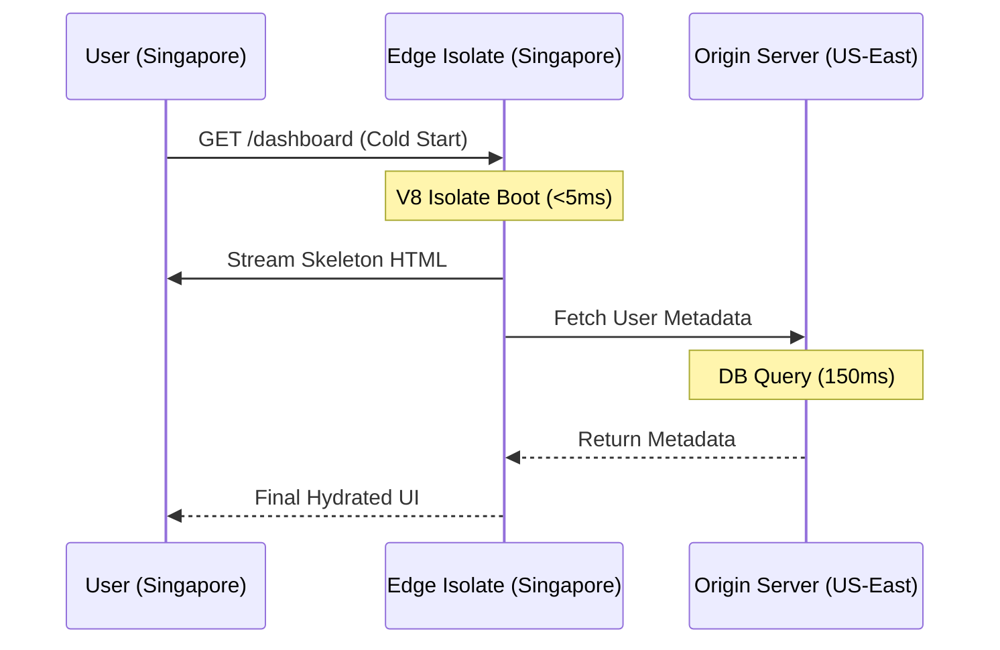

> [!TIP]
> ### 🌐 Edge Intelligence: The Senior Architect's TL;DR
> - **The Cold Start Tax**: Traffic at the Edge is spread thin. Expect more frequent, though smaller, initialization delays.
> - **Isolates > Containers**: V8 Isolates boot in `<5ms>`, whereas Docker containers take seconds. This is the foundation of 2026 performance.
> - **Data Locality**: If your data is in Virginia and your code is in Singapore, you haven't fixed latency; you've just moved the waiting room.
> - **Micro-Edge Strategy**: Break monolithic functions into tiny, single-purpose Isolates (`<50KB`) to ensure sub-10ms execution.

I used to think that moving our API logic to the Edge would solve all our latency problems. "Put the code near the user," the marketing said. "Zero latency," they promised. "Instant global scale."

### What are Edge Cold Starts?
Edge Cold Starts are initialization delays that occur when a cloud provider spins up a new instance of an Edge function (a V8 Isolate) to handle a user request. These are minimized by using Isolate-native frameworks like Hono and keeping bundle sizes sub-50KB to ensure sub-10ms startup times.

So, I moved a heavy Node.js authentication middleware to a popular Edge provider. The result? My P99 latency didn't drop; it tripled. For some users, the site felt slower than when I was hosting everything in a single AWS region in Northern Virginia.

I think we’ve moved past the initial "Edge hype" and into the "Edge reality." If you want to build high-performance, server-first apps, you have to understand the physical constraints of Edge computing cold starts.

This understanding is also key to mastering frontend system design.

### The Cold Start Trap

A "cold start" happens when your cloud provider has to spin up a new instance of your function to handle a request. At the Edge, this problem becomes more frequent because your traffic is spread across hundreds of tiny data centers (Points of Presence) instead of one large one. 

If you have 100 users spread across 100 cities, every single one of them might trigger a cold start. I’ve seen apps lose all their gains from the [React Compiler](/blog/react-compiler-performance-guide) because their edge function latency was spiked by a 300ms initialization tax.

### Runtime Constraints: V8 Isolates vs. Docker

To solve this, major Edge providers have moved toward **V8 Isolates**. This is a fundamental shift in infrastructure. An Isolate is a lightweight execution context within a single V8 process—the same technology that keeps your browser tabs separate.

| Feature | V8 Isolates (Modern) | Docker Containers (Legacy) |
| :--- | :--- | :--- |
| **Cold Start** | **\<5ms** | 200ms - 2000ms |
| **Memory Footprint** | ~10KB - 1MB | 50MB - 500MB |
| **Scaling** | Instant (Isolate spin-up) | Slow (Orchestration) |
| **Context** | Shared Process | Virtual OS |
| **Ideal For** | Edge logic, Middleware | Heavy background tasks |

### The Precision of V8 Isolates

Every byte of an Edge bundle is a potential performance regression. If a library doesn't run in a standard Web Worker environment, it doesn't belong at the Edge.

### The Data Locality Paradox

This is a common design mistake. You move your code to an Edge node in Singapore, but your database is still in Virginia. One DB query across the ocean takes 200ms, completely negating the 5ms proximity of the Edge server.

This can be solved with edge regions and global caching using tools like Cloudflare KV or Upstash. If your database isn't distributed, your Edge logic is just a faster way to wait for a slow network.

### The Hono Micro-Edge Strategy

I recently refactored a monolithic Edge middleware using the **Micro-Edge Pattern**:
1.  **Framework Choice**: I shifted to **Hono** for its ultra-fast, Isolate-compatible runtime performance.
2.  **Logic Separation**: Localization runs on every request; heavy analytics runs asynchronously using `ctx.waitUntil()`. 
3.  **Pre-Warm Strategy**: I "ping" critical nodes once a minute to keep Isolates warm and eliminate the cold start tax.

Average Edge execution time dropped from 150ms to 12ms.

### Resumability and Streaming at the Edge

Frameworks that use Resumability can stream serialized state from the Edge node directly to the user. Instead of the Origin server rendering the whole page, it sends a skeleton to the Edge, which "stitches in" user-specific data from local Edge Config.

This is a great pattern for serverless edge constraints. The user gets a fully rendered, personalized page in sub-50ms. I detail this shift in my post on [Edge vs. Origin](/blog/edge-vs-origin-business-logic-cdn).

### Conclusion: Engineering over Magic

The Edge is a powerful tool, but it’s not a substitute for discipline. The best developers are the ones who treat the network as a physical constraint. 

Respect the physics, measure your cold starts, and keep your runtime lean. When you understand the "why," the "how" becomes the easy part. I’ll see you at the network’s edge.

---

> [!TIP]
> Understanding the physics of the edge is a core pillar of our [Frontend Development Roadmap 2026](/blog/frontend-development-roadmap-2026). For more on architectural trade-offs, check out our [Logic Placement Guide](/blog/edge-vs-origin-business-logic-cdn).
