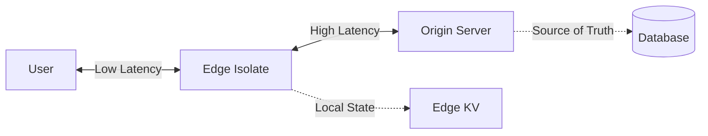

I remember when the CDN was just a place for our images and CSS. We called it "Static Asset Delivery." We had a "Backend" in a big data center and a "Frontend" in the user's browser. The boundary was clear, the deployment was simple, and the latency was... well, it was what it was.

### What is Edge Business Logic Placement?
**Edge Business Logic Placement is the architectural decision to execute specific application code (like auth, A/B testing, or rendering) on CDN nodes near the user instead of a centralized origin server.** In 2026, it is governed by "Data Gravity" - if the data required for the logic lives at the Edge, the logic should too; otherwise, the "Chatty Edge" anti-pattern will increase latency.

As I explored in my [2026 Frontend Roadmap](/blog/frontend-development-roadmap-2026), we are no longer building "sites" - we are building distributed systems. The most critical decision a senior architect makes today is no longer "which database should I use?" but **"where should this code execute?"**

### Defining the 2026 Architecture

Before we dive into the decision matrix, let’s define our terms for the modern era:

-   **The Origin**: Your central "Source of Truth." Typically a Kubernetes cluster or a serverless environment (like AWS Lambda) with direct high-speed access to your primary database (Postgres, MongoDB, etc.). This is where your long-running processes and complex ACID transactions live.
-   **The Edge**: Geographically distributed compute nodes (like Cloudflare Workers or Vercel Edge Runtime) that live "at the wire" near your users. These have sub-millisecond access to the user but often have limited access to your central data.

### The Performance Gap: Why We Care

In 2021, we were happy with a 200ms Time to First Byte (TTFB). In 2026, users expect the UI to respond in **sub-50ms**. 

The speed of light is the ultimate bottleneck. A signal takes about 70ms to travel from London to New York and back. If your user is in London and your Origin is in New York, you’ve already lost the "instant" UX battle before you’ve even executed a single line of code.

### The Proximity Paradox: A Quick Comparison

| Layer | Latency (Avg) | Reliability | Complexity |
| :--- | :--- | :--- | :--- |
| **User Device** | \<1ms | Low (Battery/CPU) | High (Hydration) |
| **The Edge** | 10ms - 30ms | Medium (Isolates) | Medium (Dist.) |
| **The Origin** | 100ms - 300ms | High (Monolith) | Low (Central) |

By moving business logic to the Edge, we eliminate those 70ms. We can handle authentication, A/B testing, and even initial page rendering at the literal "Edge" of the network. But - and this is a big "but" - if that Edge function then has to call the New York Origin to get data, you haven't saved any time. You've just moved the waiting room.

### The Decision Matrix: When to Stay at the Origin

I see many teams "over-Edge" their applications. They move everything to the Edge and then wonder why their complexity has skyrocketed. You should keep your logic at the Origin if:

1.  **Heavy Data Mutation**: If a request requires updating five different tables with strict transaction integrity, do it at the Origin. Trying to coordinate distributed transactions from the Edge is a recipe for data corruption or massive latency.
2.  **Large Dependency Trees**: If your logic requires a 10MB PDF generation library or a heavy image processing SDK, keep it at the Origin. [Edge cold starts](/blog/edge-computing-cold-start-optimization) are highly sensitive to bundle size.
3.  **Long-Running Tasks**: Edge functions are usually capped at 10ms-50ms of CPU time. If you’re crunching numbers or training a local model, the Edge will kill your process before it finishes.

### The Decision Matrix: When to Move to the Edge

On the flip side, the Edge is the "High-Performance Layer" of 2026. Move your logic here if:

1.  **Authentication and Authorization**: Why send an unauthenticated request all the way to your Origin? Verify the JWT or session at the Edge. If it’s invalid, reject it in 5ms.
2.  **A/B Testing and Feature Flags**: This is the "killer app" for the Edge. You can swap out components or change colors at the Edge without a "flicker" on the client or a heavy check at the Origin.
3.  **Personalization (The "Tailored Content" Problem)**: If you need to show "Welcome back, [Name]" on a static marketing page, don't make the page dynamic at the Origin. Use **Edge Middleware** to "stitch" the name into the static HTML as it flies by.
4.  **Bot Mitigation and Rate Limiting**: Stop the "bad actors" before they even touch your expensive Origin resources.

### The 2026 Perspective: Resumable Business Logic

As we move toward **Resumability** (seen in frameworks like Qwik), the Edge becomes even more critical. 

In 2026, we don't "Hydrate" anymore. We don't download 500KB of JS just to make a button clickable. Instead, the Edge node can store the "Serialized State" of the component. When the user clicks a button, the request goes to the Edge, which "resumes" the component's logic, performs the action, and returns a tiny patch of HTML. 

This is the "Full Stack Frontend." The boundary is no longer between Client and Server, but between **Latency-Sensitive Logic (Edge)** and **Data-Sensitive Logic (Origin)**.

### Case Study: The E-commerce Checkout Migration

I recently consulted for a global retailer whose checkout page had a 2-second TTFB. They were doing everything at the Origin: calculating tax, checking shipping rates, and verifying inventory.

We migrated them to a "Hybrid Edge" model:
-   **The Edge**: Handled the initial render of the checkout shell, applied the user's saved preferences from an Edge-side Key-Value store, and verified the user's session. (TTFB dropped to 45ms).
-   **The Origin**: Handled the actual "Place Order" button. This required a heavy inventory check and a payment gateway call - things that demand the safety and TCP-access of the Origin.

The result? The "perceived performance" was instant. The user saw their cart and preferences immediately, and the single "Place Order" pause was acceptable because it was a high-stakes action.

### Common Mistake: The "Chatty Edge"

The biggest mistake I see "Senior" engineers make is failing to account for **data locality**. 

If your Edge function in Japan has to call a database in Ireland three times to render a single component, you have built a "Chatty Edge." You have effectively tripled the latency of your application. 

In 2026, we solve this with **Read Replicas** and **Durable Objects**. We move the data *to* the Edge. If your data can't move, your code shouldn't either. I discuss this "Physics of the Web" extensively in my post on [Architecting for the Edge](/blog/edge-computing-cold-start-optimization).

### Conclusion: Master the Hybrid Orchestration

The **business logic placement 2026** strategy is about being a "Physics-Aware Engineer." Stop following the hype and start measuring the RTT. We are no longer "Frontend" or "Backend" developers; we are platform orchestrators balancing the [Edge performance](/blog/edge-computing-cold-start-optimization) with the [Origin reliability](/blog/frontend-development-roadmap-2026).

If you want a responsive app, move your *checks* to the Edge. If you want a reliable app, keep your *writes* at the Origin. I look forward to seeing how you balance the two in your next project.

---

> [!TIP]
> This deep dive into logic placement is a companion to our [Frontend Development Roadmap 2026](/blog/frontend-development-roadmap-2026). For more on performance, check out our guide on [Edge Computing and Cold Start Optimization](/blog/edge-computing-cold-start-optimization).
