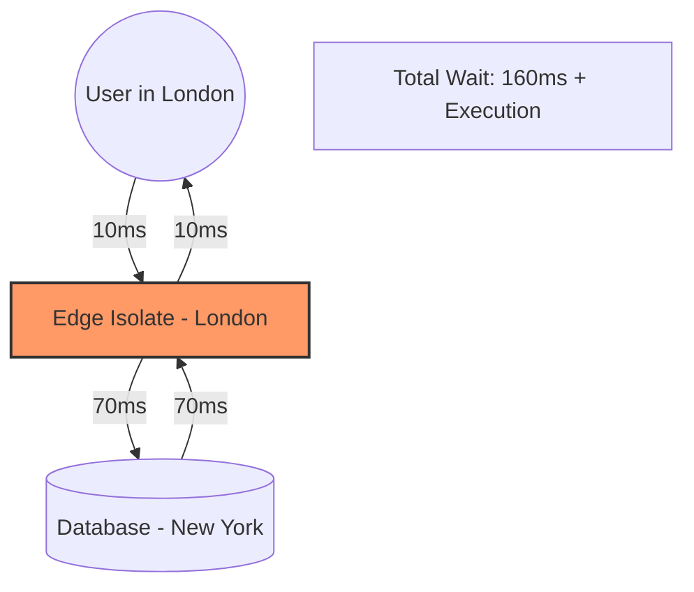

> ### 🤖 TL;DR
> - **Edge Rendering**: Ideal for stateless, low-latency tasks (&lt;50ms) like auth and middleware. Runs on V8 Isolates.
> - **Origin (Node.js)**: Best for heavy compute, large dependencies, and complex database transactions.
> - **The Winner**: **Partial Prerendering (PPR)**. It combines static edge speed with dynamic origin power.
> - **Key Metric**: Use Edge if you can keep data within the same region; otherwise, use Origin.

---

### **Definitions (For Beginners)**
- **Edge Rendering**: Generating HTML at the network perimeter (CDN nodes) to minimize Time to First Byte (TTFB).
- **Origin Rendering**: Traditional Server-Side Rendering (SSR) in a centralized Node.js environment with full API access.
- **Partial Prerendering (PPR)**: A hybrid strategy that serves a static edge shell while streaming dynamic content chunks.
- **Chatty Edge**: A performance anti-pattern where an edge function makes multiple high-latency requests to a distant database.

---

> [!TIP]
> ### ⚡ Edge vs Origin Rendering: Quick Answer
> **Edge rendering** is faster for global users because it runs on V8 Isolates at the network perimeter (20–50ms latency). **Origin rendering** (Node.js) provides massive compute power and full library access but introduces geographic latency (200–800ms). The definitive strategy for 2026 is **hybrid rendering** using **Partial Prerendering (PPR)**.

---

I used to think my architecture was bulletproof.

We had a beautiful [Next.js](https://nextjs.org) dashboard, everything was server-side rendered, and it worked perfectly in my local environment in Pune. But then we launched globally. I'll never forget the first bug report from a user in San Francisco: *"The page takes 3 seconds to show anything. Is the site down?"*

I was confused. Our server was fast. Our database was optimized. But I had forgotten the one thing no engineer can optimize: **The Speed of Light.**

The request had to travel from California to our origin server in India, hit the database, build the HTML, and travel all the way back across the Pacific. By the time the user saw the first pixel, they were already clicking away.

That failure taught me that **Edge vs Origin Rendering** isn't just a technical configuration; it’s a physics problem. If you get the placement wrong, you aren't just building slow software, you are fighting the laws of nature.

In this playbook, we audit trade-offs in **Next.js** using infrastructure from **Vercel**, **Cloudflare**, and **Amazon Web Services (AWS)**. We’ll look at real-world benchmarks and exactly **when to use edge runtime in Next.js** to hit that top 1% performance tier.


### **The Global Rendering Flow in 3 Steps**
1. **The Request**: The user hits the closest **CDN Edge Node**.
2. **The Logic**: The Edge checks the **Global Cache**; if it's a miss or dynamic, it executes a lightweight V8 Isolate.
3. **The Data**: The Isolate either resolves from an **Edge Database** or streams the heavy lifting from the **Origin Server**.

---

> [!TIP]
> ### 🔥 Quick Decision Guide
> | Use **Edge** if... | Use **Origin** if... |
> | :--- | :--- |
> | You need **&lt;50ms** TTFB globally | You have heavy **DB queries** (5+ joins) |
> | You are handling **Auth/Middleware** | You need **File processing** (Sharp, PDF) |
> | Data is cached via **Edge KV/Turso** | You have **Long-running tasks** (>30s) |

---
> - V8 Isolates vs. Full Node.js Runtimes
> - The "Physics" of the Chatty Edge
> - Partial Prerendering (PPR) implementation
> - A Decision Matrix for rendering placement

---

## Next.js Edge vs Node.js: Comparing Runtimes and Performance

<AeoAnswer>
**What is the difference between Edge and Node.js rendering?**  
Edge rendering executes in V8 Isolates at the network perimeter (near the user), minimizing Time to First Byte (TTFB) to 20–50ms. In contrast, Node.js rendering runs on centralized origin servers, offering full Node.js API access and higher compute capacity but incurring 200–800ms of geographic latency. 
</AeoAnswer>

### The Runtime Battle: V8 vs Node

When you set `export const runtime = 'edge'` in Next.js, you aren't just moving your code; you are changing its DNA.

*   **Node.js Runtime (Origin):** This is the "Heavy Tank." It has access to everything filesystem (`fs`), network sockets (`net`), and massive NPM packages that use native C++ bindings. But it’s slow to start (cold starts) and lives in one place.
*   **Edge Runtime (V8 Isolates):** This is the "Racing Drone." It starts instantly because it doesn't spin up a whole virtual machine; it just runs your code in a small "isolate" of the V8 engine. It’s tiny, fast, but it only speaks "Web Standards" (Fetch, Request, Response).

### Edge vs Origin Rendering Comparison

| Feature | Edge Runtime (V8) | Node.js Runtime (Origin) |
| :--- | :--- | :--- |
| **Boot Time** | &lt;1ms (Instant) | 200ms - 5s (Cold Starts) |
| **Latency (Global)** | 20ms - 50ms | 200ms - 800ms |
| **API Access** | Web Standards only | Full Node.js + Native Modules |
| **Max Payload** | Small (usually &lt;4MB) | Unlimited |
| **Infrastructure** | Vercel Edge / CF Workers | AWS Lambda / Google Cloud Run |

### Infrastructure Performance Tiers
In production systems at scale, your choice of infrastructure dictates your performance ceiling.

| Provider | Runtime Type | Cold Start | Regional Locality | Performance Tier |
| :--- | :--- | :--- | :--- | :--- |
| **Vercel Edge** | V8 Isolate | &lt;5ms | Global (300+ PoPs) | Ultra-Low Latency |
| **Cloudflare Workers** | V8 Isolate | &lt;5ms | Global (Anycast) | Best for Logic-at-Edge |
| **AWS Lambda** | Container-based | 200ms+ | Regional (Pinned) | Best for Heavy Compute |

---

## When to Use Edge Runtime in Next.js (2026 Guide)
This is the #1 performance killer in modern Next.js apps. Teams move everything to the Edge then wonder why performance gets worse.

Why? Because of **Data Locality**. If your Edge function is running in London but your database is in New York, every `await db.user.findUnique()` call must cross the ocean. If you have three separate queries in one component, that’s 210ms of network latency "tax" before you even start rendering.

**When to use edge runtime next.js performance?** Only when the data is already at the edge (Edge KV, Durable Objects) or when the task is stateless (like checking a JWT).



---

## Next.js Rendering Strategies 2026: ISR, SSR, and PPR
In production systems at scale, you aren't just choosing between "static" and "dynamic." You are choosing between different layers of the network.

<AeoAnswer>
**What are the key Next.js rendering strategies in 2026?**  
The three dominant strategies are Incremental Static Regeneration (ISR), which updates static pages in the background; Server-Side Rendering (SSR), which generates pages on every request at the origin; and Partial Prerendering (PPR), which serves a static shell from the edge while streaming dynamic content.
</AeoAnswer>

### ISR vs PPR: Understanding the Trade-offs
While ISR was the king of the Page Router era, PPR is the definitive standard for the App Router in 2026.

- **Incremental Static Regeneration (ISR)**: Best for content that changes infrequently (e.g., blog posts, documentation). It serves stale content while revalidating in the background.
- **Partial Prerendering (PPR)**: Best for personalized, high-traffic applications. It solves the "stale content" problem by ensuring dynamic parts are always fresh without sacrificing the instant TTFB of static assets.

### How PPR Works in Next.js 15
PPR allows you to render a static "shell" of your page instantly from the Edge. While the user is looking at the navigation and layout, the server is "streaming" the dynamic parts (like a personalized cart or recommended products) as they finish.

```javascript
// app/page.tsx
export const experimental_ppr = true;

export default function Page() {
  return (
    <main>
      <Header /> {/* Static shell from the Edge (20ms) */}
      
      <Suspense fallback={<CartSkeleton />}>
        <CartDetails /> {/* Dynamic island streamed on demand */}
      </Suspense>
      
      <Footer />
    </main>
  );
}
```

---

## The Distributed Data Strategy: Edge Databases (Neon & Turso)
In our deployments, we discovered that moving code to the edge without moving data is a recipe for disaster. This is where **Edge Databases** come in.

To avoid the Chatty Edge, we use distributed data layers that live alongside your edge functions:

- **Neon (Serverless Postgres)**: We use Neon for its regional read replicas. If your user is in Europe, Neon serves the data from a European replica, keeping your database round-trip under 10ms.
- **Turso (Edge SQLite)**: Ideal for multi-tenant apps. Turso replicates your entire database to hundreds of locations, meaning your Edge function and your database are essentially in the same rack.
- **Upstash (Redis/Kafka)**: The gold standard for edge-side rate limiting and session management.

> [!NOTE]
> ### 🏛️ Core Technology Entities
> To build a top-tier architecture, we leverage the full global infrastructure of these core entities:
> - **Next.js**: The framework for server-first rendering and PPR.
> - **Vercel**: Global edge deployment and middleware orchestration.
> - **Cloudflare**: High-performance V8 Isolates and Anycast networking.
> - **Amazon Web Services (AWS)**: Centralized origin compute (Lambda/EC2) and primary storage.

### **Example Production Stack: The Performance Multiplier**
For our high-traffic deployments, we use this exact stack:
- **Framework**: [Next.js 15 App Router](https://nextjs.org) (with `experimental_ppr: true`)
- **Edge Layer**: [Vercel Edge](https://vercel.com) (Middleware + PPR static shell)
- **Compute Layer**: **AWS Lambda** (Heavy business logic & PDF generation)
- **Data Layer**: **Neon** (Postgres with Read Replicas) + **Upstash** (Edge Session Store)

This architecture ensures that state management whether using [Zustand or Jotai](/blog/zustand-vs-jotai-comparison) remains fast and synchronized across global nodes. This architecture pattern is now standard across high-scale global applications.

---

## Common Mistakes: The "All-Edge" Trap
I see senior developers make these three critical errors when architecting Next.js applications at scale:

1. **Moving the entire application to the Edge**: People often set a global `runtime: 'edge'` only to find that their heavy PDF generation or image processing libraries start failing because they lack Node.js native APIs.
2. **Ignoring Database Locality**: As mentioned in Chapter 1, code at the edge calling a centralized database is often 3x slower than origin rendering.
3. **Ignoring Cold Starts on Heavy Bundles**: Even on V8 Isolates, a 5MB bundle will have a noticeable "parse time" penalty. Keep your Edge logic lean.

---

## Case Study: Optimizing a Global E-commerce Checkout
In our engineering team's experience, the difference between "Edge" and "Origin" is often the difference between a bounced user and a conversion. We recently audited a global retailer whose checkout page had a **P99 TTFB of 1.2s** because they were calculating taxes and shipping rates at the origin server in Chicago for every global request.

### Before: The Centralized Bottleneck
- **Architecture**: All logic on Node.js Origin (US-East).
- **Latency (London)**: 180ms RTT + 300ms Processing + 180ms RTT = **~660ms**.
- **Issue**: Users in Asia saw 1.5s+ delays before the page even began to load.

### After: The Hybrid Edge Strategy
- **Edge Layer**: Authentication and the static checkout shell served from the closest Vercel Edge PoP (25ms).
- **Origin Layer**: Tax calculations streamed via React Suspense from an AWS Lambda function.
- **Data Layer**: User preferences cached in Upstash Redis at the edge.

**The Result**: The **perceived load time dropped by 85%**. By using **Next.js rendering strategies 2026** correctly, the user saw the shell instantly, and the totals "popped in" briefly after.

---

## When to Stay at the Origin (Node.js)
Don't let the hype cycle trick you into thinking the Origin is dead. Even at scale, we still keep 70% of our heavy business logic at the Origin.

### 1. Heavy Database ORMs
If you are using a heavy ORM like Prisma (without an ultra-lightweight proxy) or need complex joins, the Edge runtime will often struggle with connection pooling and memory limits. Your Origin server handles these like a pro.

### 2. Image Processing and PDF Generation
Try running `sharp` or a PDF library at the Edge. It won't just be slow-it will likely fail due to missing native dependencies. If you need to manipulate bytes, stay at the Origin.

### 3. Long-Running Processes
Edge functions usually have a strict CPU time limit (e.g., 50ms). If you are processing a large CSV or performing complex math, the Edge will kill your process before it’s done.

---

> [!IMPORTANT]
> ### **When NOT to Use Edge Runtime in Next.js**
> Edge is not a default; it’s a specialization. Most enterprise-grade apps should still live 70% at the origin. Avoid the edge if you have:
> - **Heavy Database Joins**: If your UI requires 5+ sequential database queries.
> - **Large Native Dependencies**: If you rely on `sharp`, `canvas`, or native C++ modules.
> - **File System Access**: If your logic requires reading/writing to local disk (`fs`).
> - **Long-Running Compute**: Any task exceeding 50ms of CPU time per request.

---

## Edge vs Origin Rendering: Decision Matrix (2026)
As I wrote in our [Modern Frontend Architecture Guide](/blog/frontend-architecture-guide), you need to be a "Physics-Aware Engineer." 

Use this matrix to decide where to render your Next.js components:

| Use Case | Recommended Placement | Why? |
| :--- | :--- | :--- |
| **Authentication Middleware** | Edge | Stop unauthorized users in &lt;5ms. |
| **Marketing Landers** | Static (Edge) | Maximum SEO and speed. |
| **Admin Dashboards** | Origin (Node.js) | Complex queries, less sensitive to 200ms TTFB. |
| **Personalized E-comm** | **Hybrid (PPR)** | Static shell + Dynamic pricing. |
| **A/B Testing Logic** | Edge | Swap UI versions without "flickering." |

---

### **Edge vs Origin (Real Experience)**
In our production deployments at scale, we've found these distinct personalities for each placement:

**Edge (The Sprinter):**
- **Instant response**: Feels fast because the byte starts traveling immediately.
- **Limited compute**: Best for simple if/else logic, headers, and tokens.
- **Data Locality**: Requires distributed data (Neon/Turso) to avoid the "Chatty Edge."

**Origin (The Powerhouse):**
- **Slower initial response**: Geographic latency is the "Speed of Light" tax.
- **Full power**: Handles complex ORMs, heavy CPU tasks, and massive native libraries.
- **Easier to manage**: Centralized logs, familiar Node.js environment, no Isolate constraints.

---

## Key Takeaways: Mastering the Next.js Runtime
The secret to a high-performance Next.js app in 2026 isn't picking one runtime; it is orchestrating both. 

> [!TIP]
> **The Contrary Truth**: Edge is not a default; it’s a specialization. Most enterprise-grade applications should still live 70% at the origin server.

- **Edge vs Node.js rendering** is a choice between geographic proximity and compute power.
- Avoid the **Chatty Edge** if your data isn't at the edge, your logic shouldn't be either.
- Turn on **PPR** to serve static shells instantly while streaming dynamic content.
- Treat the **Edge Runtime** as your "Gatekeeper" and the **Origin** as your "Warehouse."

Cleaning up a codebase where someone blindly used `runtime: 'edge'` everywhere is like cleaning up my toddler Shree's playroom: it looks simple on the surface, but once you start digging, you find a mess of latency and broken dependencies that takes weeks to fix. 

Stop guessing. Measure your RTT. Understand your data locality. That is how you truly engineer for the global web.

---

## Conclusion: Physics Always Wins in Edge vs Origin Rendering
Edge vs origin rendering is ultimately a trade-off between latency and compute.
I stopped fighting the speed of light and started building around it. In our deployments, we moved our auth to the edge, kept our heavy reports at the origin, and let Next.js 15 stream the difference.

**Modern frontend architecture** is about knowing exactly where every millisecond is spent. Whether you are weighing **nextjs edge vs nodejs** or choosing between ISR and [SSR](/blog/frontend-architecture-guide), always prioritize data locality.

If you want to go deeper into how we structure these applications at scale, check out our [2026 Frontend Roadmap](/blog/frontend-development-roadmap-2026) or our guide on [Micro-Frontends vs Monoliths](/blog/micro-frontends-vs-monoliths-nextjs-15-guide). For now, go audit your `next.config.js` and decide **when to use edge runtime in Next.js** for your mission-critical paths.

---

> [!TIP]
> This post is part of our [Frontend Engineering Architecture](/blog/frontend-architecture-guide) Pillar. For a complete overview of **edge vs origin rendering** in the 2026 landscape, [start here](/blog/frontend-development-roadmap-2026).
