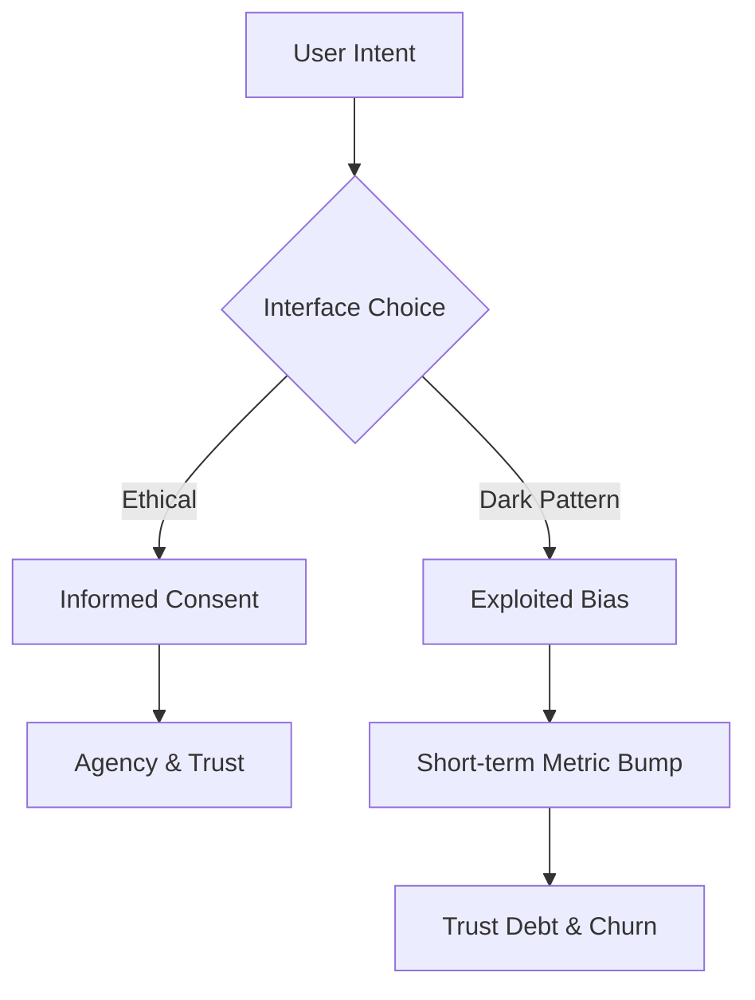

I spent an hour yesterday trying to cancel a subscription. It took me three separate confirmation screens, two discount offers, and a final questionnaire where I had to check "No, I prefer to pay full price." By the end of it, I wasn't just annoyed—I felt manipulated.

It made me think about my own code. How many times have I built interfaces that trade user trust for a temporary bump in a conversion funnel? 

Ethical UI design is about prioritizing user agency, transparency, and cognitive well-being over short-term conversion metrics. It involves eliminating manipulative patterns, making accessibility a default, and building interfaces that respect the user's attention.

To understand why manipulative patterns are so effective (and so dangerous), we have to look at the cognitive biases they exploit. As human beings, we are hardwired to take the path of least resistance. We rely on heuristics—mental shortcuts—to navigate the world.

Manipulative design weaponizes these shortcuts:
-   **Loss Aversion**: We are twice as motivated to avoid a loss as we are to achieve a gain. Dark patterns like "Confirm Shaming" ("No, I prefer to pay full price") trigger this primitive fear.
-   **Social Proof**: When we see a "5 other people are looking at this hotel" alert, our brain triggers an urgency response. In 2026, many of these "real-time" alerts are revealed to be simple random-number generators.
-   **Scarcity**: Artificially limiting choices to force a quick, unthinking decision.

When you use these tactics, you aren't "optimizing a funnel." You are effectively bypassing the user's rational brain. You are stealing their **agency**.

1.  **The "Pre-checked" Illusion**: We know not to pre-check "Sign me up for the newsletter." But now, I see more sophisticated designs where the "Accept All" button is a bright, vibrant green, while the "Customize Settings" link is buried in a font size that is barely legible.
2.  **Forced Continuity**: This is the free trial that never ends and is difficult to cancel. In some modern apps, the cancellation flow requires navigating five different sub-menus, each with its own discount modal. 
3.  **Confirm Shaming**: I still see this everywhere. "No thanks, I don't want to save money." It’s a guilt trip masquerading as a choice. It treats the user like a child.
4.  **Bait and Switch**: You click an "X" to close a popup, but the "X" is actually a link to the product page. Or you click "Play" on a video, and it triggers a background download.

I call these **"User-Hostile Design."** They might give you a 5% bump in short-term conversion rates, but they crater long-term retention and trust.

### The Ethics vs. Conversion Balance

| Tactic | Conversion Impact | Trust Impact | Regulatory Risk |
| :--- | :--- | :--- | :--- |
| **Dark Patterns** | +5% (Short-term) | **-25% (Debt)** | High (Fines) |
| **Intentional Friction** | -2% (Safety) | **+15% (Loyalty)** | Low (Safe) |
| **Calm UI** | Neutral | **+30% (Usage)** | Zero (Gold Std) |

### The Framework: The Ethical UI Audit

To make sure I stay on the right side of this, I’ve started using a simple "Ethical UI Audit" checklist for my own work. I ask four questions:

1.  **The Fatigue Test**: If the user was tired, distracted, or stressed, would they still understand exactly what this action does?
2.  **The "Easy Out" Test**: Is it just as easy to cancel/unsubscribe as it was to sign up? (The "1-to-1 Click Rule").
3.  **The Consent Test**: Have we used "Negative Defaults" (options that assume a 'yes')? If so, why?
4.  **The Accessibility Test**: Is this choice truly available to a screen reader user, or are we hiding the "negative" choice from them?

Every byte has a cost, and every dark pattern has a "Trust Cost." I think of this "Trust Debt" as being just as real and dangerous as technical debt.

### The Regulatory Reality: Fines and Regulations

We are no longer in the Wild West. The legislative landscape has caught up with deceptive design. From the EU's Digital Services Act to the FTC’s "Click to Cancel" rules, the financial risk of using dark patterns is now higher than the potential gain.

I’ve seen companies fined hundreds of millions of dollars for deceptive billing cycles. Modern browsers are also starting to flag sites with known deceptive patterns. If a site gets flagged, its organic search traffic can vanish overnight. 

**Ethics is now a compliance requirement.**

### Technical Ethics: Coding for Autonomy

How do you implement this in code? It’s not just about the design; it’s about the logic.

1.  **Intentional Friction**: Sometimes, slower is better. If a user is about to delete an account or transfer a large sum of money, I add intentional friction. I ask for a confirmation that requires them to type a specific word. This prevents accidental actions.
2.  **Transparent Consents**: Instead of a privacy policy that is 50 pages long, I prefer "Just-in-Time Consents." If I need to track a user's location, I ask right at the moment I need it and explain exactly *why* and *how long* the data will be kept.
3.  **Calm Notifications**: Avoid engagement hijacking. Don't send a push notification at 9 PM on a Saturday just to say "Hey, you haven't used the app in a while." That is user-hostile.

Last year, a client asked me to "optimize" their cancellation flow. They wanted to add three "Are you sure?" steps and a mandatory exit survey before the "Confirm" button appeared.

I pushed back. I argued that a fast, respectful cancellation experience would leave a better impression, making them more likely to return in the future. 

I implemented a simple, direct cancellation instead. 
-   **Short-term**: Cancellations increased by 15%. 
-   **Long-term (1 year)**: Re-subscriptions increased by 40%. Users told us: "I came back because I knew I could leave if I needed to. I trust you."

That is the power of building for agency. Trust is a long-term compound interest.

### Conclusion: Building a Web I'm Not Ashamed Of

The era of tricking users is coming to an end. We don't just build for viewports; we build for the people behind them. 

When you prioritize agency, transparency, and accessibility, you aren't just being nice—you are building a more resilient, more valuable product. As developers, we are the gatekeepers of user trust. I want to make sure I'm holding the gate open for the right reasons.

---

> [!TIP]
> Ethical design is a key pillar of our [Frontend Development Roadmap 2026](/blog/frontend-development-roadmap-2026). To keep your UI responsive and honest, master [Server Actions vs useEffect](/blog/server-actions-vs-useeffect-fetching).
