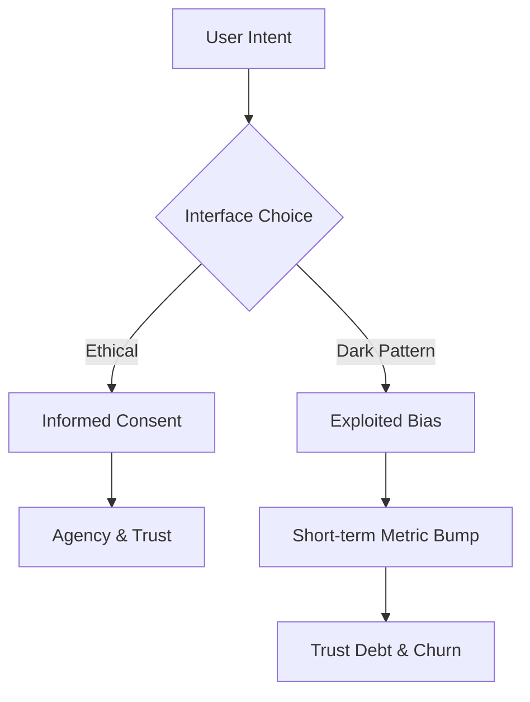

### What is Ethical UI Design?
**Ethical UI Design is a frontend methodology that prioritizes user agency, transparency, and cognitive well-being over short-term conversion metrics.** In 2026, it involves eliminating "Dark Patterns," ensuring accessibility is a first-class citizen, and architecting interfaces that respect the user's attention and data privacy as outlined in our [2026 Roadmap](/blog/frontend-development-roadmap-2026).

To understand why **dark patterns** are so effective (and so dangerous), we have to understand the cognitive biases they exploit. As human beings, we are hardwired to take the path of least resistance. We rely on "heuristics" - mental shortcuts - to navigate the world.

Manipulative design weaponizes these shortcuts:
-   **Loss Aversion**: We are twice as motivated to avoid a loss as we are to achieve a gain. Dark patterns like "Confirm Shaming" ("No, I prefer to pay full price") trigger this primitive fear.
-   **Social Proof**: When we see a "5 other people are looking at this hotel" alert, our brain triggers an urgency response. In 2026, many of these "real-time" alerts are revealed to be simple random-number generators.
-   **Scarcity**: Artificially limiting choices to force a quick, unthinking decision.

When you use these tactics, you aren't "optimizing a funnel." You are effectively bypassing the user's rational brain. You are stealing their **agency**.

### The Taxonomy of Deception (2026 Edition)

We’ve moved past the simple "hidden checkboxes." In 2026, dark patterns have become more sophisticated, often leveraging AI and generative UI to create personalized traps.

1.  **The "Pre-checked" Illusion**: We know not to pre-check "Sign me up for the newsletter." But now, I see "Privacy Zuckering" 2.0, where the "Accept All" button is a bright, vibrant green, while the "Customize Settings" link is buried in a font size that would make a lawyer blush.
2.  **Forced Continuity**: This is the "Free Trial" that never ends and is impossible to cancel. In some modern apps, the cancellation flow requires navigating five different sub-menus, each with its own "Wait! Don't go!" discount modal. 
3.  **Confirm Shaming**: I still see this everywhere. "No thanks, I don't want to save money." It’s a guilt trip masquerading as a choice. It treats the user like a child.
4.  **Bait and Switch**: You click an "X" to close a popup, but the "X" is actually a link to the product page. Or you click "Play" on a video, and it triggers a background download.

On my team, we call these **"User-Hostile Design."** They might give you a 5% bump in your short-term conversion rate, but they will crater your long-term retention and your [Net Promoter Score (NPS)](/blog/frontend-system-design-interview-guide).

### The Ethics vs. Conversion Balance

| Tactic | Conversion Impact | Trust Impact | 2026 Regulatory Risk |
| :--- | :--- | :--- | :--- |
| **Dark Patterns** | +5% (Short-term) | **-25% (Debt)** | High (Fines) |
| **Intentional Friction** | -2% (Safety) | **+15% (Loyalty)** | Low (Safe) |
| **Calm UI** | Neutral | **+30% (Usage)** | Zero (Gold Std) |

### The Framework: The Ethical UI Audit

To ensure my team stays on the right side of history, I’ve implemented an "Ethical UI Audit" for every new feature. We ask four questions:

1.  **The Fatigue Test**: If the user was tired, distracted, or stressed, would they still understand exactly what this action does?
2.  **The "Easy Out" Test**: Is it just as easy to cancel/unsubscribe as it was to sign up? (The "1-to-1 Click Rule").
3.  **The Consent Test**: Have we used "Negative Defaults" (options that assume a 'yes')? If so, why?
4.  **The Accessibility Test**: Is this choice truly available to a screen reader user, or are we hiding the "negative" choice from them?

As I mentioned in my post on [Measuring Carbon Footprint](/blog/sustainable-frontend-engineering-guide), every byte has a cost. Every dark pattern has a "Trust Cost." We track this "Trust Debt" as seriously as we track technical debt.

### The 2026 Legal Reality: Fines and Regulations

We are no longer in the "Wild West." In 2026, the legislative landscape has caught up with deceptive design. From the EU's Digital Services Act to the FTC’s "Click to Cancel" rules, the financial risk of using dark patterns is now higher than the potential gain.

I’ve seen companies fined hundreds of millions of dollars for "Dark Patterned" billing cycles. Modern browsers are also starting to "flag" sites with known deceptive patterns, much like they flag sites without SSL certificates. If your site gets flagged, your SEO will vanish overnight. 

**Ethics is now a compliance requirement.**

### Technical Ethics: Coding for Autonomy

How do you implement "Ethics" into your code? It’s not just about the design; it’s about the **logic**.

1.  **Intentional Friction**: Sometimes, slow is better. If a user is about to delete their entire account or transfer a large sum of money, we add "intentional friction." We ask for a confirmation that requires them to type a word. This prevents "Dark Accidental" actions.
2.  **Transparent Consents**: Instead of a "Privacy Policy" that is 50 pages long, we use "Just-in-Time Consents." If we need to track a user's location, we ask right at the moment we need it and explain exactly *why* and *how long* we’ll keep the data.
3.  **Calm Notifications**: Avoid "Engagement Hijacking." Don't send a push notification at 9 PM on a Saturday just to say "Hey, you haven't used the app in a while." That is user-hostile.

### Case Study: The "Cancel Button" Miracle

Last year, a client asked us to "optimize" their cancellation flow. They wanted to add three "Are you sure?" steps and a mandatory exit survey before the "Confirm" button appeared.

We pushed back. We argued that a fast, respectful cancellation experience would leave a better taste in the user's mouth, making them more likely to return in the future. 

We implemented a **One-Click Cancel** instead. 
-   **Short-term**: Cancellations increased by 15%. 
-   **Long-term (1 year)**: "Re-subscriptions" increased by 40%. Users told us: "I came back because I knew I could leave if I needed to. I trust you."

That is the power of building for agency. Trust is a long-term compound interest.

### Conclusion: Building a Web We aren't Ashamed Of

The era of "tricking the user" is dead. The era of the **Ethical Engineer** has begun. In 2026, we don't just build for the viewport; we build for the person behind it. 

When you prioritize agency, transparency, and accessibility, you aren't just being "nice" - you are building a more resilient, more valuable product. As senior engineers, we are the gatekeepers of user trust. Let's make sure we're holding the gate open for the right reasons.

---

> [!TIP]
> Ethical design is a key pillar of our [Frontend Development Roadmap 2026](/blog/frontend-development-roadmap-2026). To keep your UI responsive and honest, master [Server Actions vs useEffect](/blog/server-actions-vs-useeffect-fetching).
