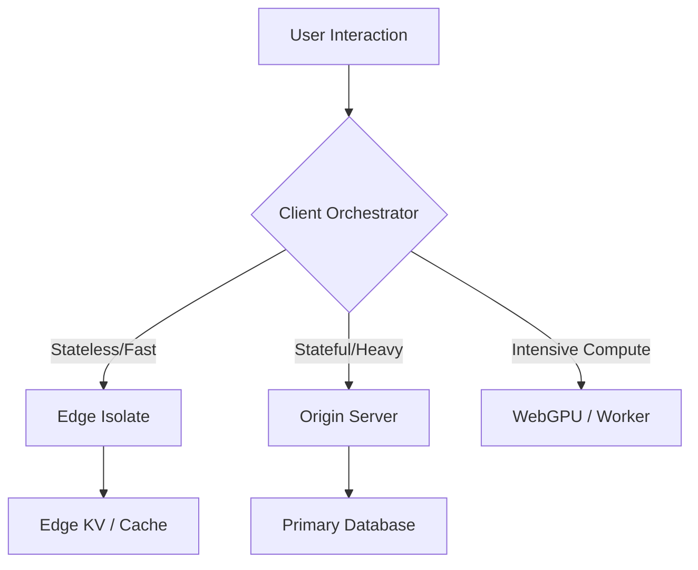

## What is Frontend System Design in 2026?
**Frontend System Design is the architectural practice of designing resilient, scalable, and high-performance client-side applications by considering data locality (Edge vs Origin), state serialization (Resumability), and main-thread efficiency (V8 profiling).** In 2026, it shifted from simply "building components" to orchestrating distributed systems that span from the user's browser to the global CDN perimeter.

As I detailed in the [Frontend Development Roadmap 2026](/blog/frontend-development-roadmap-2026), the senior frontend engineer of 2026 is a systems thinker.

## The "AI-Augmented" Engineer: The New Baseline

In 2026, the first thing we look for is "AI Fluency." If you come into an interview and refuse to use an AI assistant, you are signaling that you are 5x less productive than your peers.

But "using AI" isn't the skill. The skill is **AI Orchestration**. We want to see:
-   **Prompt Engineering for Architecture**: Can you guide an AI to generate a [Resumable architectural pattern](/blog/advanced-typescript-resumability-guide)?
-   **Validation and Debugging**: When the AI hallucinates a non-existent React hook, do you catch it immediately because you understand [V8 internals](/blog/v8-garbage-collector-react-performance)?
-   **Security Awareness**: Do you realize the AI just generated a pattern vulnerable to XSS?

The coding round of 2026 is often "Here is a 500-line generated component with three subtle architectural flaws. Find them and fix them."

## Senior Frontend System Design: The 5 Pillars

This is the core of the modern senior interview. We give you a vague prompt (e.g., "Design a real-time collaborative map tracking system for 10 million users") and watch you build the mental model. We expect you to cover the **5 Pillars of Frontend System Design**:

#### 1. State Management (The "Resumability" Pillar)
We don't care if you use Redux or Zustand. We want to know: How do you handle **Serialized State** across the network? How do you ensure that when the app "resumes" on the client, the state is consistent without triggering a massive [Rehydration waterfall](/blog/server-actions-vs-useeffect-fetching)?

#### 2. Networking and Data Flow
We want to hear about **Edge vs. Origin**. When do you fetch data at the literal network edge, and when do you go back to the central DB? How do you handle [Server Actions](/blog/server-actions-vs-useeffect-fetching) in a high-latency environment?

#### 3. Persistence and Caching
How do you leverage `IndexedDB`, `LocalStorage`, and `Edge Key-Value` stores? What is your cache invalidation strategy? If the user goes offline, how does the system recover once they are back?

#### 4. Rendering Strategy
This is where you show your 2026 knowledge. When do you use **Static Export**, **Server Components**, or **Compute-Heavy WebGPU**? How do you optimize for [LCP and INP](/blog/v8-garbage-collector-react-performance)?

#### 5. Security and Ethics
As I discussed in [Ethical UI](/blog/ethical-ui-design-principles), security is no longer just a "backend problem." We want to know how you protect user agency and ensure data privacy in an AI-driven environment.

## Beyond the Framework: The "Expert Fundamentalist"

Because AI can handle the "boilerplate" of React or Svelte, we are seeing a massive "Flight to Fundamentals." In a 2026 interview, we will drill deep into topics that were once considered "too niche":

-   **Memory Forensics**: "Here is a heap snapshot. Where is the memory leak in this cluster post?" (See our [Memory Efficiency Guide](/blog/memory-safe-frontend-typedarrays-performance)).
-   **V8 Optimization**: "Why is this tight loop causing a de-optimization in the JIT compiler?" (See our [V8 Garbage Collector guide](/blog/v8-garbage-collector-react-performance)).
-   **Hardware Acceleration**: "When should we move this data processing from the CPU to a [WebGPU compute shader](/blog/webgpu-vs-webgl-performance-guide)?"

If you only know "how to use React," you are replaceable by an AI. If you know "how the browser works," you are invaluable.

## Behavioral Ethics: The "Sustainable" Engineer

Company values are shifting. In 2026, we ask questions about **Sustainability and Social Impact**.
-   "How would you reduce the [carbon footprint](/blog/sustainable-frontend-engineering-guide) of this video streaming platform?"
-   "A stakeholder wants to implement a 'forced-subscription' dark pattern. How do you push back while maintaining a good relationship?"

We are hiring the "Moral Compass" of our engineering teams.

## 2026 Frontend System Design Interview Questions: A Mock Scenario

**Interviewee**: "Okay, I'll start by defining our [Advanced TypeScript](/blog/advanced-typescript-resumability-guide) domain model. I’ll use Branded Types for our IDs to ensure we don't mix up Users and Orders across the Edge boundary."

**Interviewer**: "Great. Now, how do we handle the synchronization if two users update the same order at the same time on different Edge nodes?"

**Interviewee**: "I’d implement a **Conflict-Free Replicated Data Type (CRDT)** pattern. We can store the partial operations in an Edge-side Key-Value store and use a Server Action to merge them at the Origin once per minute to save on [carbon costs](/blog/sustainable-frontend-engineering-guide)."

That is the level of conversation we expect. It’s about **Trade-offs**.

## The Portfolio of the Future: Proof of Systems

In 2016, your portfolio was a list of "Pretty Websites." In 2026, it should be a list of **"Hard Engineering Problems Solved."**
-   "I reduced the TTFB of this site by 80% by migrating to an Edge-First architecture."
-   "I built a type-safe bridge that reduced production runtime errors by 60%."
-   "I optimized this WebGL dashboard using WebGPU to support 10x more data points."

Show us your **Architectural Diagrams**, not just your screenshots.

## Conclusion: Becoming a Frontend Architect

The web is becoming more complex, not less. While AI handles the "typing," we need humans to handle the "thinking." 

In 2026, the best way to "ace" your frontend interview is to stop thinking like a "coder" who follows a ticket. Start thinking like a **System Designer** who is responsible for the health, speed, and ethics of the entire platform.

Master the [V8 engine](/blog/v8-garbage-collector-react-performance), master the [Edge infrastructure](/blog/edge-performance-cold-starts-guide), and master [Advanced TypeScript](/blog/advanced-typescript-resumability-guide).
 When you understand the "why," the "how" becomes the easy part.

Your next job isn't about writing code. It’s about building a legacy.

## 2026 Staff Engineer Interview: High-Level Orchestration

**Interviewer**: "We are seeing a performance bottleneck in our global checkout flow. The [LCP is high](/blog/v8-garbage-collector-react-performance) in South East Asia. How would you diagnose and fix this?"

**Candidate**: "First, I’d check if we are doing a full [hydration of the cart components](/blog/server-actions-vs-useeffect-fetching). If so, I’d move that logic to a [Resumable pattern](/blog/advanced-typescript-resumability-guide) where the cart state is serialized at the [Edge](/blog/edge-performance-cold-starts-guide).
 Then, I’d analyze our [V8 heap snapshot](/blog/memory-safe-frontend-typedarrays-performance) to see if we're creating too many objects in the main thread during checkout. Finally, I’d audit our [font loading strategy](/blog/sustainable-frontend-engineering-guide) to ensure we're not blocking the render with heavy custom weights."

**Interviewer**: "And what about the business requirement for 'nudging' users to finish their purchase?"

**Candidate**: "I would recommend against any [dark patterns](/blog/ethical-ui-design-principles) like 'scarcity counters' unless they are 100% authentic. Instead, I’d focus on removing friction - using [WebGPU](/blog/webgpu-vs-webgl-performance-guide) for data-heavy product previews to make the experience feel 'visceral' and instant."

This is the "Full System" answer we are looking for in 2026.

## The Post-Interview Audit Checklist

After your next interview, ask yourself these three questions:
1.  **Did I mention "trade-offs"?** (If you didn't, you sounded like a junior).
2.  **Did I discuss "gravity"?** (Did you account for [Data Locality](/blog/edge-vs-origin-business-logic-cdn)?).
3.  **Did I own the "End-to-End"?** (Did you talk about the [Compiler](/blog/react-compiler-performance-guide) and the [Edge](/blog/edge-performance-cold-starts-guide), or just the UI?).

Master the entire stack, and the job is yours.

> [!TIP]
> This post is a part of our [Frontend Development Roadmap 2026](/blog/frontend-development-roadmap-2026). If you're serious about the "Systems" part of system design, you need to understand the underlying engines - check out [Understanding the V8 Garbage Collector](/blog/v8-garbage-collector-react-performance).
