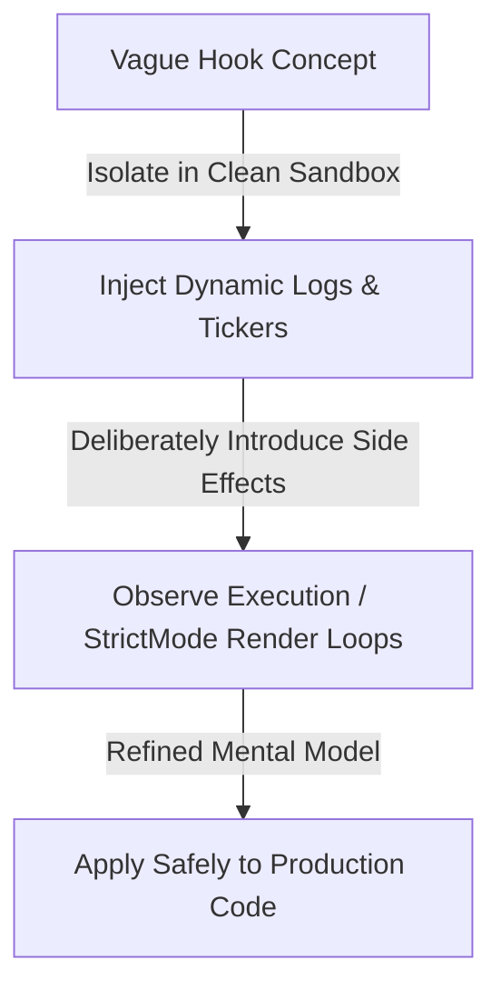

## Intro / TL;DR
For a long time I thought reading React docs meant I understood React.

Then I hit a real bug.

Suddenly all that knowledge felt useless.

What finally helped wasn't another tutorial. It was creating tiny sandbox projects and breaking things on purpose.

In this article, I want to share how you can build that active learning habit, configure lightweight local scratchpads to inspect the React rendering cycle, and turn daily bugs into deep framework mental models.

---

## The Bug That Changed How I Learn React
A year ago, I was debugging a dashboard where counters kept increasing unexpectedly. After a few minutes the browser became almost unusable, locking up the thread entirely. 

I spent hours reading the React documentation about rendering behavior and hook lifecycles. I understood the words. But looking at the complex project code in my editor, I had no idea how to debug it. I experienced **real confusion** because the dry guidelines in the documentation didn't map to the sprawling component structure in front of me. 

Frustrated, I closed the main repository and created a tiny Vite sandbox. I copy-pasted only the core hook code and a single counter component into a blank template.

Within minutes of isolating the variables, the **real bug** stood out: a missing dependency in a `useEffect` hook was causing a WebSocket connection to re-initialize on every single render, which triggered a state update, causing an infinite render loop. That **real project lesson** taught me more about React's render lifecycle than any tutorial could. It changed how I learn.

---

## How to learn React effectively
The strategy of active framework analysis is built on isolating a vague hook concept in a clean local environment, injecting dynamic console logs, deliberately introducing side effects to observe StrictMode behavior, and applying the refined mental models back to production code:



To bridge the documentation gap, we must look beyond syntax. For instance, the official [React Docs: Render and Commit](https://react.dev/learn/render-and-commit) guide outlines the conceptual steps of rendering: triggering, rendering, and committing. However, seeing how React schedules a state commit in real time requires active exploration. When you write code specifically to test a hypothesis, your brain encodes the resulting failures and successes, laying down permanent mental models of the library's internal execution paths.

---

## Setting up a React sandbox project
An effective learning sandbox must be stripped of all excess styling, global routers, query clients, and complex dependencies:
1. **Initialize a clean Vite template:** Run `npm create vite@latest react-sandbox --template react-ts` to bootstrap the workspace.
2. **Strip the noise:** Delete standard CSS stylesheets, icons, and template components. Retain only a clean `App.tsx` and a few helper files.
3. **Use StrictMode:** Keep StrictMode enabled. It is designed to intentionally execute components twice in development to highlight side effects and event listener leaks.
4. **Expose values programmatically:** Bind component states or setters to the global browser `window` object during scratchpad testing to trigger state transitions directly from the dev console.

---

## React debugging techniques: Sandbox Debugging Examples

To understand the core reasons of **why React re-renders** and how the reconciliation engine behaves, let us walk through four essential sandbox exercises.

### 1. Understanding useEffect Dependencies
A common source of bugs in React projects is a stale closure inside an effect hook. When developers write effects with empty dependency arrays to avoid re-runs, they often capture stale state values.

Consider this sandbox component:

```tsx
import { useState, useEffect } from 'react';

export function StaleTimer() {
  const [count, setCount] = useState(0);

  useEffect(() => {
    const id = setInterval(() => {
      // ❌ Bug: count is captured as 0 from the initial render closure.
      // Every second, this evaluates to setCount(0 + 1), locking the count at 1.
      setCount(count + 1);
    }, 1000);

    return () => clearInterval(id);
  }, []); // Empty dependency array captures stale closure

  return <div>Timer Count: {count}</div>;
}
```

By inspecting this in a sandbox, you see the timer increment to `1` and freeze. To fix it, you can either add `count` to the dependency array (which causes the interval to tear down and rebuild on every tick) or use the functional state updater callback (`setCount(prev => prev + 1)`), which does not rely on closure variables:

```tsx
// ✅ Correct approach using functional state updates
useEffect(() => {
  const id = setInterval(() => {
    setCount(prev => prev + 1);
  }, 1000);
  return () => clearInterval(id);
}, []);
```

This sandbox test helps explain **why React re-renders** and demonstrates the core execution concepts detailed in the official guide on [React Docs: Synchronizing with Effects](https://react.dev/learn/synchronizing-with-effects).

### 2. Understanding Memoization (`useMemo` and `useCallback`)
React re-renders all child components recursively by default when parent state changes, unless those child components are optimized. This behavior is due to JavaScript’s referential equality rules: `{}` never equals another `{`, and `() => {}` never equals another `() => {}`.

You can trace this behavior by building a parent-child sandbox:

```tsx
import React, { useState, useCallback } from 'react';

// Child component wrapped in React.memo
const ChildComponent = React.memo(({ onClick }: { onClick: () => void }) => {
  console.log("ChildComponent rendered!");
  return <button onClick={onClick}>Click Me</button>;
});

export function MemoSandbox() {
  const [count, setCount] = useState(0);

  // ❌ Without useCallback, this reference changes on every single render
  const handleClick = () => console.log("Clicked!");

  // ✅ With useCallback, the function reference is preserved across renders
  // const handleClick = useCallback(() => console.log("Clicked!"), []);

  return (
    <div>
      <button onClick={() => setCount(c => c + 1)}>Increment Parent: {count}</button>
      <ChildComponent onClick={handleClick} />
    </div>
  );
}
```

By profiling this sandbox with logs, you observe that even though `ChildComponent` is wrapped in `React.memo`, it re-renders every time you click the parent button because `handleClick` gets a new reference.


Uncommenting the `useCallback` hook freezes the child renders. These sandbox runs build a clear understanding of the referential equality models described in [React Docs: useMemo](https://react.dev/reference/react/useMemo) and [React Docs: useCallback](https://react.dev/reference/react/useCallback).

### 3. Understanding React Keys and Reconciliation
Many React tutorials advise using unique keys for dynamic arrays but rarely explain what happens when keys are handled incorrectly. The React reconciliation engine uses keys to identify which virtual DOM nodes correlate to actual DOM elements.

In this reconciliation sandbox, we render a list using the array index as the key:

```tsx
import { useState } from 'react';

export function ListKeysSandbox() {
  const [items, setItems] = useState(['Item A', 'Item B']);

  const prependItem = () => {
    setItems(['New Item', ...items]);
  };

  return (
    <div>
      <button onClick={prependItem}>Prepend Item</button>
      <ul>
        {items.map((item, index) => (
          // ❌ Bug: Using array index as key
          <li key={index}>
            {item} <input type="text" placeholder="Write notes here..." />
          </li>
        ))}
      </ul>
    </div>
  );
}
```

**How to observe the bug in under 30 minutes:**
1. Type some text into the input field next to "Item A".
2. Click the "Prepend Item" button.
3. Observe that the typed text remains on the first row (now next to "New Item"), while "Item A" shifts down with a blank input field.

Because React matched nodes by the index key `0`, it assumed the first list item simply changed its text from "Item A" to "New Item", preserving the local DOM input state on the wrong row. Changing the key to a unique item ID resolves the issue. This sandbox exercise brings the conceptual details of [React Docs: Preserving and Resetting State](https://react.dev/learn/preserving-and-resetting-state) to life.

### 4. Understanding Suspense
React Suspense is designed to let your components "wait" for something before rendering. The most straightforward way to observe this behavior in a local sandbox is through dynamic code-splitting using `React.lazy`.

```tsx
import { useState, Suspense, lazy } from 'react';

// Lazily load a heavy sandbox component
const HeavyDetails = lazy(() => import('./HeavyDetails'));

export default function SuspenseSandbox() {
  const [show, setShow] = useState(false);

  return (
    <div>
      <button onClick={() => setShow(true)}>Show Details</button>
      {show && (
        <Suspense fallback={<div>Loading component bundle...</div>}>
          <HeavyDetails />
        </Suspense>
      )}
    </div>
  );
}
```

In your sandbox, you can simulate slow network speeds using Chrome DevTools (Network tab -> change 'No throttling' to 'Slow 3G' or 'Fast 3G') and click the button. You will visually see the `Loading component bundle...` fallback placeholder display. This sandbox test demystifies the dynamic mounting lifecycle, showing how React suspends render updates until the required resources are fully fetched. This sandbox demo maps directly to the design patterns detailed in [React Docs: Suspense](https://react.dev/reference/react/Suspense).

---

## React rendering explained: State Batching
To understand how React batches state updates to prevent unnecessary re-renders, we can write a simple test component that breaks the typical mental model of sequential updates:

```tsx
import { useState } from 'react';

export default function BatchingSandbox() {
  const [count, setCount] = useState(0);

  const handleClick = () => {
    // ❌ Assumed: state updates sequentially and console shows "1"
    setCount(prev => prev + 1);
    console.log("Current count in click handler:", count); // Prints "0" due to closure capturing
  };

  console.log("Component rendering. Count state:", count);

  return <button onClick={handleClick}>Count: {count}</button>;
}
```

By tracing this execution path in a sandbox, you learn:
1. React batches the update and avoids unnecessary intermediate renders.
2. The logged value inside the event handler remains the old value because the handler closure captures the state value of the render cycle in which it was created.
3. This teaches us that React state updates are scheduled updates rather than immediate variable mutations.

---

## Actionable Steps: Your Sandbox Checklist
* [ ] **Create a scratch project:** Keep a clean Vite + React app on your computer at all times.
* [ ] **Test assumptions immediately:** When you read about a new pattern, write a 20-line component to check how it behaves.
* [ ] **Log render commits:** Print timestamps to the console inside render cycles to verify how often components execute.
* [ ] **Add error boundaries:** Learn to wrap experimental components in ErrorBoundaries to understand how React recovers from runtime crashes.
* [ ] **Explore strict mode checks:** Run your sandbox in React's StrictMode to catch uncleaned subscriptions or race conditions.

---

## Conclusion / Key Takeaways
Do not study React passively. Treat the framework as a physical machine: build it, run it, break it, and observe the trace outputs. The Reactive Learning Model turns abstract documentation into solid, practical engineering skills.

Every React concept I truly understand today came from a bug, not a tutorial.

Tutorials introduced the concept.

Bugs forced me to understand it.

---

## Related Links
* [Choosing My Blog Tech Stack: Static vs. CMS Comparison](/blog/best-developer-blog-tech-stack)
* [Developing a Writing Habit: Lessons from a Developer](/blog/what-surprised-me-about-writing-daily-this-week)
* [React Performance Troubleshooting: Resolving Loops](/blog/a-bug-i-recently-faced-and-how-i-actually-tracked-it-down)

---

## CTA
Are you struggling to understand a React API? Create a clean Vite project right now, write a micro-component to isolate the hook, and observe the logs. Take control of your learning process.

