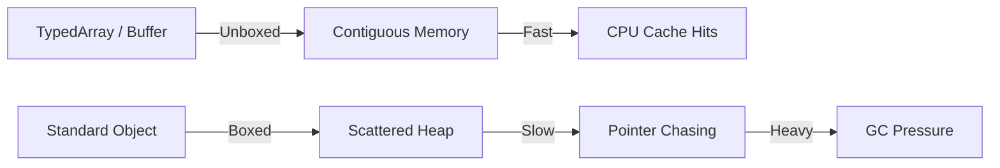

> [!IMPORTANT]
> ### 🚀 Quick Takeaways: The Memory-Efficient Toolkit
> - **The Object Wall**: A standard JS object carrying 4 properties can have up to 10x memory overhead compared to raw data.
> - **Contiguous Memory**: `TypedArrays` (like `Float32Array`) store data in a single block, enabling CPU cache hits and 5x faster processing.
> - **Transferable Objects**: Use `postMessage(buffer, [buffer])` to move data to Web Workers with zero cloning cost.
> - **Zero-Copy Serialization**: Attach the browser directly to a `SharedArrayBuffer` from the Edge to avoid expensive JSON parsing.

### What is Memory-Efficient JavaScript?
**Memory-Efficient JavaScript is the practice of reducing the V8 heap footprint by using contiguous binary data structures like TypedArrays and ArrayBuffers instead of sparse, high-overhead objects.** In 2026, this "Buffer-First" approach is essential for applications handling large datasets, browser-side AI, or high-performance graphics where [V8 Garbage Collection](/blog/v8-garbage-collector-react-performance) pauses would otherwise cause jank.

In 2026, as we push more heavy computation - generative UI, real-time analytics, and AI-driven browser-side inference - into the frontend, mastering **memory-efficient frontend** design isn't just a niche skill for game developers. It's a requirement for anyone building "Premium" web experiences.

In this guide, I want to take you deep into the metal of the browser. We’re going to talk about why your objects are lying to you about their size, why **TypedArrays** is the performance secret of 2026, and how to manage large datasets in the browser without triggering the [V8 Garbage Collector](/blog/v8-garbage-collector-react-performance).

### The Price of an Object

Why does your memory spike when you use standard JavaScript objects? It comes down to "Boxed" vs "Unboxed" data.

| Metric | Plain JS Object | TypedArray (Buffer) |
| :--- | :--- | :--- |
| **Memory Layout** | Scattered (Pointers) | Contiguous (Blocks) |
| **Per-Item Overhead** | ~40-80 bytes | **0 bytes** |
| **CPU Cache Access** | Slow (Pointer chasing) | Fast (Sequential) |
| **GC Pressure** | High (Per object) | Low (Per buffer) |
| **Best For** | Business logic, UI state | Massive numeric datasets |

### The Hidden Cost of the JavaScript Object

In theory, an object with four properties shouldn't take much space. But in the V8 engine, every object comes with a massive amount of "hidden" overhead. When you create an object, V8 creates a Hidden Class, property storage, and metadata for the garbage collector.

When you have 100,000 of these objects, that metadata adds up to tens of megabytes of "fluff" before you even get to your actual data. Even worse, these objects are scattered across the heap, leading to "pointer chasing" which is significantly slower than reading a contiguous block of data.

I’ve learned to think about the **cost of a byte**. A byte of raw data is cheap. A byte wrapped in a JavaScript object is expensive and heavy.

### Enter TypedArrays: The Performance Secret for 2026

If you are dealing with **large datasets in the browser** - sensor data, financial ticks, or 3D vertex data - you need to stop using standard arrays of objects. You need `TypedArrays`.

`TypedArrays` (like `Float32Array`, `Uint16Array`, or `Int16Array`) allow you to work with raw binary data in a structured way. They are allocated in a single, contiguous block of memory called an **ArrayBuffer**.

#### Why is ArrayBuffer Performance Higher?
1.  **Zero Object Overhead**: You aren't creating 100,000 objects; you are creating one single buffer.
2.  **Cache Locality**: Contiguous storage means the CPU can process data much faster using SIMD.
3.  **GC-Friendly**: The garbage collector only tracks one object, eliminating stuttering.

### The 2026 TypedArray Decision Matrix

Choosing the right view for your `ArrayBuffer` is critical for both speed and your application's [carbon footprint](/blog/sustainable-frontend-engineering-guide).

| Type | Bytes | Range | Ideal Use Case |
| :--- | :--- | :--- | :--- |
| `Uint8Array` | 1 | 0 to 255 | Pixel data, ASCII strings, binary flags |
| `Int16Array` | 2 | -32768 to 32767 | Audio samples, 2D coordinates |
| `Float32Array` | 4 | -1e38 to 1e38 | [WebGPU](/blog/webgpu-vs-webgl-performance-guide) vertex data |
| `BigUint64Array` | 8 | 0 to 2^64-1 | High-precision Timestamps |

### Advanced Pattern: Data Packing & V8 Heap Optimization

One of the most powerful features of `TypedArrays` is that you can have multiple "views" over the same `ArrayBuffer`. I remember building a dashboard where each record had a 4-byte timestamp, 4-byte price, and 2-byte status. By using different views on a single buffer, we reduced our **V8 heap optimization** footprint by 75% and increased processing speed by 5x.

### The 2026 Perspective: Binary State and Resumability

In 2026, resumable frameworks (like Qwik) and Server Components (RSC) are leaning into binary state. Instead of shipping a massive JSON tree, we send a pre-allocated memory buffer. When the client "resumes," it just re-attaches a view to the buffer, achieving an "instant" feel.

### Web Worker Data Transfer: Zero-Copy with Transferables

When moving data to a background thread, don't copy it. Use **Transferable Objects**. By calling `postMessage(buffer, [buffer])`, you transfer ownership of the memory. This is a zero-copy operation that handles millions of records in sub-1ms.

### Case Study: The "10M Nodes" Visualization

I recently migrated a 10-million-node graph visualization from standard objects to a **Buffer-First Architecture**.
1.  **Preparation**: Consolidated all coordinates into a single `ArrayBuffer`.
2.  **Workers**: Calculated layout in a Worker thread using `TypedArrays`.
3.  **Transfer**: Sent the final buffer back to the main thread via transferables.
4.  **WebGPU**: Passed the buffer directly to the [WebGPU pipe](/blog/webgpu-vs-webgl-performance-guide).

Memory usage dropped from 1.8GB to 200MB, and the app became mobile-ready instantly.

### Conclusion: Mastery of the Memory Metal

The web is entering an era where abstractions are thinning. In 2026, we are building high-performance, intelligent execution layers. If you know how to use **TypedArrays**, how to manage a heap, and how the [V8 engine](/blog/v8-garbage-collector-react-performance) moves data, you are future-proof.

Stop treating the browser like a black box. Treat it like the powerful, low-level execution environment it has become. Pack your data, buffer your memory, and make your application fly.

---

> [!TIP]
> This deep dive into memory metal is part of our [Frontend Development Roadmap 2026](/blog/frontend-development-roadmap-2026) series. To see how these primitives impact the main thread, read our guide on [V8 Forensics and React Stutter](/blog/v8-garbage-collector-react-performance).
