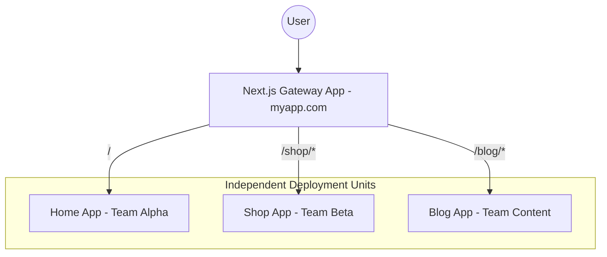

I still remember the exact commit that broke our entire release cycle.

---

> [!IMPORTANT]
> **Quick Summary (TL;DR):**
>
> For 90% of teams, a **Next.js Monolith** or a **Modular Monolith (Turborepo)** is the superior choice for speed and type safety. **Micro-Frontends** should only be implemented when organizational scale (50+ engineers) or CI/CD bottlenecks (30+ min builds) make shipping impossible. In Next.js 15, **Multi-Zones** is the recommended native path for horizontal scaling.
> 
> **Bookmark this guide** if you are scaling a production Next.js application in 2026.

---

> [!TIP]
> ✅ **Use Next.js Monolith if**: You have a small team (under 50), need instant type safety, or your CI/CD build takes under 15 minutes.  
> 
> ✅ **Use Next.js Micro-frontends if**: You have 50+ engineers, teams are constantly blocking each other's deployments, or you need independent scaling for specific routes.

---

### Key Takeaways
- **Monoliths for Speed:** Best for small teams (under 20-50 engineers) to maintain type safety.
- **Micro-Frontends for Scale:** Best for large organizations where team decoupling is more important than technical overhead.
- **Native Next.js 15 Support:** Use **Multi-Zones** instead of the complex Module Federation.
- **The Middle Ground:** A **Modular Monolith** using Turborepo is the "sweet spot" for 90% of companies.

---

We had just moved our massive React app to a unified Next.js codebase. Our team was excited. We expected fast page loads, tiny bundles, and a great developer experience. 

But old habits die hard. 

When your team grows from five engineers to fifty, that "unified codebase" starts feeling less like a shared garden and more like a crowded subway at rush hour. Everyone is trying to push through the same narrow doors.

I used to be a Monolith maximalist. Three years ago, I was convinced that "one repo, one app" was the only way to live. But then, our "simple" build pipeline started taking 45 minutes. A small CSS bug in the footer could block the checkout team from shipping a million-dollar feature. 

Cleaning up a legacy codebase is exactly like cleaning up my toddler Shree’s playroom: you think you're done, and then you find a massive hidden mess in the corner that you can't even walk past without tripping. 

Our monolith had become a room full of Legos, and every single engineer was tripping over them.

In this deep dive, we’re going to talk about the messy reality of **Micro-Frontends vs Monoliths in Next.js 15**. We’re going to look at why most "best practices" you read about micro-frontends are dangerous for small teams, and exactly when you should ignore the hype and stick with your monolith. 

If you are looking for a **frontend system design tutorial**, a **real-world nextjs micro frontends example**, or an honest **micro frontend architecture nextjs** guide, this is it. This is an honest, tested guide on how to design scalable frontend architecture in 2026.

## Does Next.js 15 support micro frontends? (The Truth)

<AeoAnswer>
**Does Next.js support micro frontends?**  
Yes, Next.js 15 natively supports micro-frontend architectures through its **Multi-Zones** feature. This allows you to host multiple independent Next.js applications on different sub-paths (e.g., `/shop`, `/blog`) and use `next.config.js` rewrites to stitch them into a single, unified domain for the user.
</AeoAnswer>

> [!NOTE]
> **Monolith vs Micro-Frontend (Short Answer):**  
> Micro-frontends are better for large teams needing independent deployments and separate build pipelines, while monoliths are better for small teams prioritizing type safety, refactoring speed, and architectural simplicity.

---

## Monolith vs Micro Frontend Pros and Cons (2026 Comparison)

Before we dive deep, here is the high-level comparison of **monolith vs micro-frontend pros and cons**.

| Feature | Monolith | Micro-Frontend (Next.js) | Best For |
| :--- | :--- | :--- | :--- |
| **Type Safety** | Native & Instant | Complex (Schema Registry) | Monolith |
| **Build Time** | Scales with Code | Scales with Teams | Micro-Frontend |
| **Deployment** | All or Nothing | Independent & Rapid | Micro-Frontend |
| **Refactoring** | Find & Replace | PR Coordination | Monolith |
| **Infra Cost** | Simple/Low | High (Orchestration) | Monolith |
| **Performance** | SSR Streaming | Proxy Tax / Hard Navs | Monolith |

---

## Chapter 1: Is micro frontend better than monolith?

<AeoAnswer>
**Is a micro-frontend better than a monolith?**  
A monolith is better for 90% of teams because it offers superior type safety, faster refactoring, and zero orchestration overhead. Micro-frontends are only better for massive organizations where the cost of team coordination in a single codebase (merge conflicts, build queues) exceeds the cost of managing a distributed frontend system.
</AeoAnswer>

> [!WARNING]
> **Reality Check:**  
> If your team is under 20 developers, micro-frontends will slow you down, not speed you up. You are trading simple code problems for complex distributed system problems.

### The Benefits of a Next.js Monolith
When discussing **monolith vs micro-frontends**, you have to understand the core advantages of staying together:

*   **Shared Types (The TypeScript Dream):** In a monolith, you import a `User` type from your database layer once. It exists. It works. In a micro-frontend world, that simple change involves five different PRs across five different repos and a week of coordination.
*   **Instant Refactoring:** Want to change the prop name of your primary `Button` component? You run a find-and-replace, and it’s done. In a micro-frontend architecture, you're looking at a multi-day coordination headache.
*   **Zero Orchestration Overhead:** You don't need a gateway. You don't need a custom proxy. You just deploy.

If your team is under 20 engineers and your build takes less than 15 minutes, **stay in the monolith.** You are faster there. Don't build a distributed system until you have a distributed problem.

---

## Why Most Micro-Frontend Advice is Wrong

Most "expert" advice tells you to split your app into micro-frontends to improve "scalability." But in 2026, we’ve learned that premature splitting is the #1 killer of startup velocity. Unless you are managing 50+ engineers across multiple time zones, micro-frontends aren't a solution, they are a management tax that slows down every single release.

---

## When to use micro frontends

<AeoAnswer>
**When should you move to a micro-frontend architecture?**  
You should move to micro-frontends when you hit one of three "Hard Blockers":
1. **CI/CD Bottlenecks:** Your build/test pipeline takes over 30-45 minutes.
2. **Team Domain Conflict:** Multiple teams (e.g., Checkout vs. Search) are constantly blocking each other's deployments.
3. **Deployment Risk:** A small bug in a minor feature can take down the entire mission-critical application.
</AeoAnswer>

> [!NOTE]
> **When to split a monolith? (Short Answer):**  
> Split your monolith only when the organizational pain of working in one codebase like constant merge conflicts and hour-long build queues exceeds the technical cost of managing multiple independent applications.

So, when do you actually pull the trigger? 

In my experience, there are three "Breaking Points" that signal it's time to consider a **server-first micro-frontend architecture** in Next.js.

> [!NOTE]
> Teams adopting micro-frontends often see build times reduced by **30–60%** for specific domains, but they also report an average **25% increase** in infrastructure maintenance overhead.

### 1. The "Two-Hour CI" Nightmare
When your test suite grows so large that engineers start skipping tests or waiting hours for a green light, your monolith is failing you. If every single PR triggers a massive compute bill and a 45-minute wait, you have a scaling problem. Micro-frontends allow you to only test and build the 5% of the app that actually changed.

### 2. Team Coupling and "Merge Blockers"
In a monolith, the "Main" branch is a bottleneck. If Team A breaks the build, Team B can't deploy their critical fix. If your teams are strictly divided (e.g., a "Checkout Team" and a "Search Team"), they shouldn't be fighting over the same deployment pipeline.

> [!CAUTION]
> **The Trap:**  
> Don't split because your developers want to use different frameworks (e.g., React and Vue). Splitting by technology leads to "Micro-Frontend Hell." Split by **business domain** instead.

---

## Next.js micro frontends example

<AeoAnswer>
**What is a real-world Next.js micro-frontends example?**  
The most robust example is using **Next.js Multi-Zones**. In this setup, a "Gateway" app (the main domain) uses `rewrites` to route traffic to independent sub-apps (e.g., `/blog` points to a separate Vercel project). This allows teams to have separate deployment cycles while the user sees a single, unified site.
</AeoAnswer>

### Next.js multi zones example
This is the "Golden Path" used by most high-traffic production environments. Instead of sharing code at runtime (which is fragile), you share the **URL space**.

#### Real-World Architecture Diagram


> [!NOTE]
> **Next.js Multi Zones Example (Short Answer):**  
> A Next.js Multi-Zones setup uses a primary app to transparently "rewrite" traffic to other sub-apps based on the URL path. This allows `/shop` and `/blog` to be completely different Next.js projects hosted on different servers but sharing one domain.

#### Step-by-Step Multi-Zones Implementation:
1.  **Define your Zones:** Divide your app by URL paths (e.g., `/`, `/dashboard`).
2.  **Create Independent Apps:** Initialize separate projects for each zone.
3.  **Configure the Gateway:** In your primary app's `next.config.mjs`:

```javascript
// next.config.mjs (The Gateway App)
const nextConfig = {
  async rewrites() {
    return [
      {
        source: '/shop/:path*',
        destination: 'https://shop-app-production.vercel.app/shop/:path*',
      },
    ];
  },
};
export default nextConfig;
```
4.  **Set BasePaths:** In the sub-app (`shop-app`), set `basePath: '/shop'`.

> [!TIP]
> **Architecture Tip:**  
> Use a shared Tailwind CSS configuration in your monorepo. This ensures that even though your apps are separate, your UI remains 100% consistent across transitions.

### Module Federation in Next.js
Module Federation allows App A to "consume" a component from App B at runtime. 

**The catch?** It is notoriously difficult with **React Server Components (RSC)**. Sharing code across independent server runtimes creates a massive "Serialization Wall." For most Next.js 15 apps, we strictly recommend **Multi-Zones** or **Monorepos** over Module Federation.

---

## Micro frontend architecture Next.js

<AeoAnswer>
**What is a standard micro-frontend architecture in Next.js?**  
A modern micro-frontend architecture in Next.js 15 uses **Multi-Zones** to split the application into domain-driven sub-apps (e.g., Auth, Checkout, Dashboard). These apps are organized within a **Turborepo monorepo** to share UI components and design tokens while remaining independently deployable.
</AeoAnswer>

> [!NOTE]
> **Micro Frontend Architecture Next.js (Short Answer):**  
> In 2026, the standard Next.js micro-frontend architecture is a "Multi-Zone Monorepo." You use Turborepo to manage shared code and Vercel Multi-Zones to route different URL paths to different deployment units.

Before you go full micro-frontend, there is a middle ground that 90% of teams actually want: **The Modular Monolith via a Monorepo.**

By using [Turborepo](https://turbo.build/repo) and [Feature-Sliced Design (FSD)](https://feature-sliced.design/), you can get the benefits of isolation without the pain of routing overhead.

### Turborepo micro frontend setup
1.  **Packages vs Apps:** Move 80% of your code into internal packages (e.g., `@repo/ui`, `@repo/auth`).
2.  **Explicit Dependencies:** If the `Shop` page needs to talk to `Auth`, it must explicitly import it.
3.  **Turborepo Caching:** Turborepo is smart. If you only change a file in `/packages/shared-ui`, it knows it *doesn't* have to re-build or re-test the `Checkout` app. 

---

## Monolith vs Micro Frontend: Cost Comparison

Architecture isn't free. Every decision has a "Tax."

| System Type | Infrastructure Cost | Dev Coordination Cost | Time to First Byte (TTFB) |
| :--- | :--- | :--- | :--- |
| **Monolith** | Low | Low (initially) | Fastest |
| **Monorepo** | Medium | Medium | Fast |
| **Multi-Zones** | High | High | Medium (Proxy Hop) |

> [!WARNING]
> **Reality Check:**  
> In a **Next.js Multi-Zones** setup, you are paying for multiple Vercel projects and managing multiple sets of environment variables. The mental overhead of tracking "which version of App A is compatible with App B" is a real hidden cost.

---

## SEO Impact of Micro-Frontends

One of the biggest risks of splitting your Next.js app is **SEO Fragmentation**. If not handled correctly, Google might see your sub-apps as disconnected sites.

### Key SEO Requirements:
- **Unified Sitemap:** Generate a single `sitemap.xml` at the root domain that includes URLs from all sub-apps.
- **Shared Metadata:** Use a shared SEO package to ensure OpenGraph tags and Meta descriptions are consistent.
- **Canonical URLs:** Ensure each sub-app points to the main domain, not the internal preview URL.

---

## Security and Performance Trade-offs

You can't have your cake and eat it too. Scaling horizontally comes with technical hurdles.

### The Orchestration Tax
Every time you add a micro-frontend via Multi-Zones, you add a proxy hop. You lose the advantage of **Server-Side Rendering (SSR) streaming** across the entire page while the browser handles those "hard" transitions between zones.

### The Authentication Headache
If a user logs in on `myapp.com/`, how does the app at `myapp.com/shop/` know that? You need **Cross-Domain Cookies** or a centralized Auth provider (like Clerk or Kinde) that handles the session at the Edge. 

---

## Final Thoughts: Let Team Size Dictate Your Architecture

The "Best" architecture is the one that lets your team ship fastest without breaking things for the next person.

- **Are you a small team?** Build a Monolith. Use Feature-Sliced Design to keep it clean.
- **Is your build taking 45 minutes?** Move to a Monorepo with Turborepo.
- **Are teams fighting over deployments?** Use Multi-Zones to carve out high-risk domains.

> [!IMPORTANT]
> **The Success Metric:**  
> Modern frontend system design isn't about being "cool." It’s about **reducing the total cost of change.** If splitting your app makes it harder to change a button color, you’ve failed.

Treat your codebase like Shree’s playroom. Keep it organized, know where the blocks are, and when the room gets too full, maybe it’s time to build an addition to the house. Build less on the client. Trust the server. And don't split your monolith until you absolutely have to.

> [!NOTE]
> **Micro-frontends vs monolith (final answer):**  
> Use a monolith for speed and simplicity in 90% of cases. Use micro-frontends only when team scale, deployment conflicts, and specialized CI/CD needs become genuine blockers to your roadmap.

---

## Conclusion: Should You Choose Micro-Frontends or Monolith?

The choice between a monolith and micro-frontends depends entirely on your team's velocity and scale. For 90% of teams, a **Next.js Monolith** or a **Modular Monolith** is the fastest path to production. Only split into micro-frontends via **Multi-Zones** when your organizational complexity (50+ engineers) or build times make a single codebase impossible to manage. Always prioritize **reducing the cost of change** over chasing architectural trends.

**Read Next:** If you want to see the bigger picture of how this fits into a complete system, read our [Modern Frontend Architecture Guide in 2026](/blog/frontend-architecture-guide). It covers everything from Server Components to parallel data fetching.

---

> If you are following our [Frontend Engineering Architecture Guide](/blog/frontend-architecture-guide), this post is the practical "scaling" chapter you've been waiting for. **Bookmark this page** for your next architectural review.
