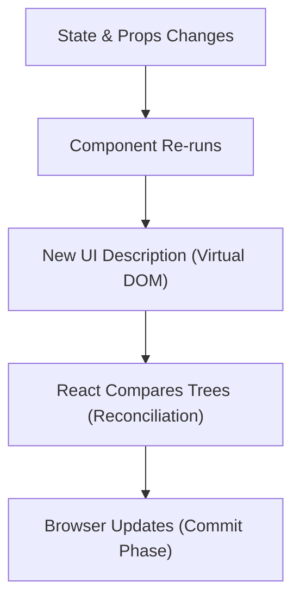

## Intro / TL;DR

For almost a year I thought React was "magic."

Components rerendered unexpectedly.
useEffect bugs kept appearing.
State somehow got out of sync.

Then one mental model changed everything:

$$UI = f(State, Props)$$

It sounds simple, but shifting from *how* to transition the browser DOM to *what* the UI should look like for any given configuration of data completely altered my engineering journey. 

Back in 2022, when I was building a real-time SaaS analytics dashboard, I was constantly stuck in a web of unpredictable render cycles. I was manually coordinating spinner states, triggering side-effects, and fighting React's rendering flow. I kept adding more state and more useEffect hooks, assuming React needed more coordination; each fix created another bug. Once I embraced the declarative mental model treating components as passive, pure mathematical descriptions of UI; my approach to React state management changed completely.

By reading this guide, you will learn how to design components as passive blueprints, how to replace fragile event-driven state synchronizations with clean derived calculations, and how to debug complex rendering bugs with logical precision.

---

## The Problem: The Imperative Mindset and State-Sync Hell

Many developers transition to React from traditional DOM-manipulation environments (like jQuery or vanilla JavaScript) and carry over an imperative coding style. They write components that actively coordinate UI updates: showing spinners, hiding modals, and manually modifying individual states in response to event handlers. 

This creates fragile codebases where state variables easily drift out of alignment. You end up in "state-synchronization hell," where updating one state variable requires triggering several `useEffect` hooks to recalculate other states. This leads to infinite loops, inconsistent user interfaces, and hard-to-reproduce rendering bugs that frustrate engineering teams.

This post solves the problem of state synchronization bugs by showing you how to treat components as clean, deterministic calculations.

### What this article covers:
1. The core formula behind declarative user interface rendering.
2. Under-the-hood details of the React rendering cycle (including Fiber and StrictMode).
3. Why React components should remain passive descriptions of input state.
4. How to decouple derived data from your component's local state storage.
5. Refactoring fragile state-sync code into clean, render-phase computations.

---

## Main Content: The Math Behind React Rendering

### What is the Declarative Mental Model?
In traditional DOM programming, you write step-by-step instructions to select an element, add classes, and append text nodes (Imperative). You define *how* the browser should transition the UI. In React, you describe *what* the UI should look like for any given configuration of data (Declarative). The React rendering cycle is defined by a simple formula:

$$UI = f(State, Props)$$

Here, $f$ is your component function, the inputs are $State$ and $Props$, and the resulting UI representation is the direct, predictable outcome of your data.



Choosing this pattern simplifies frontend engineering. When you stop worrying about how to change the DOM and focus entirely on managing your data structures, your application becomes predictable. If your UI has a bug, you do not look at the DOM; you inspect the input state. If the state is correct, the output must be correct.

### Under the Hood: The React Rendering Cycle
To truly master this mental model, you need to understand how React translates this mathematical function into physical pixels on the screen. The **React rendering cycle** runs in three distinct phases:

1. **The Render Phase:** React executes your component function (the $f$ in our equation) to generate the new Virtual DOM representation. Because the render phase is pure and doesn't affect the physical DOM, React can safely interrupt, pause, or discard rendering. In fact, React will purposefully run a component multiple times under development modes (like **StrictMode**) to surface hidden side effects. Knowing that a component can rerender multiple times in React is a core reason why keeping your component functions side-effect-free is not just a style guideline, it is a correctness requirement.
2. **The Reconciliation Phase (Diffing via Fiber):** React compares the newly generated Virtual DOM tree with the previous one. This is powered by React's **Fiber** architecture, which represents the component tree as a set of interconnected nodes that allow React to pause, prioritize, and resume rendering work. The Fiber engine calculates the minimal set of changes (the diff) needed to update the browser's UI.
3. **The Commit Phase:** React takes the list of calculated differences and applies them directly to the real browser DOM in a single, synchronous operation.

By keeping these phases separated, React ensures that visual transitions are fluid and state-driven, resolving the common developer confusion between a component function executing and the browser actually drawing pixels.

### The Philosophy of Purity
At the heart of the React mental model is the concept of a pure function. A pure function is one that, given the same input, always returns the same output without causing side effects. When your components are pure, they become trivial to test, reason about, and maintain. When you introduce impurity like modifying a global variable or triggering an uncontrolled timer inside the render function,you break the mathematical contract between your state and your UI.

### Why are components "passive descriptions"?
A healthy React component does not actively fetch data, manage timing schedules, or update itself. It is a passive blueprint. When React invokes the component, the function runs, evaluates the current state, and returns React elements. If the UI is incorrect, the bug is never in the rendering process itself; it is always in the input state. By treating your components as passive blueprints, you separate the *definition* of the interface from the *execution* of the update logic.

### How to distinguish State from Derived Data
To keep your components clean, you must categorize your variables:
*   **State:** The minimal set of changing data that cannot be calculated from other variables (e.g., the raw text query entered in a search input, or a list of items fetched from an API).
*   **Derived Data:** Values that can be calculated on the fly during the render phase (e.g., a filtered list of items, the total sum of cart values, or form validation flags).

Never store derived state in React's local state hook. Calculating these values during the render phase is fast, reliable, and guarantees the output always matches the input data. Over-storing state leads to "data duplication," which is one of the most common causes of state-synchronization bugs in React.

### Common mistakes in state design
*   **Syncing state with props via effects:** Avoid writing `useEffect` hooks to update local state variables when a prop changes. These are classic React `useEffect` anti-patterns that force extra render cycles and create sync issues.
*   **Treating renders as events:** Do not write logic assuming a component rendering cycle is an event callback. Components can render multiple times due to developer tooling (like StrictMode) or layout engine changes.
*   **Redundant State:** Storing a `list` and a `filteredList` as separate state variables is unnecessary. Store the `list` and the `filterCriteria`, then derive `filteredList` directly inside the component body.

---

## Example: Code Refactoring

### ❌ Imperative State Sync (Fragile, triggers double renders)
```jsx
export function ShoppingCart({ items }) {
  const [total, setTotal] = useState(0);

  // Syncing state with props via useEffect (Avoid!)
  // This creates a "flicker" where the user sees the old total before the effect runs.
  useEffect(() => {
    setTotal(items.reduce((sum, item) => sum + item.price, 0));
  }, [items]);

  return <div>Total Price: ${total}</div>;
}
```

###  Declarative Derived Data (Clean, instant, sync-safe)
```jsx
export function ShoppingCart({ items }) {
  // Calculate directly during render. No effect or extra state needed.
  // This is synchronous, deterministic, and impossible to get "out of sync".
  const total = items.reduce((sum, item) => sum + item.price, 0);

  return <div>Total Price: ${total}</div>;
}
```

By moving the logic into the render body, you eliminate the latency between the prop change and the state update. The user always sees the correct total immediately, with no intermediate render state where the values mismatch.

---

## Actionable Steps: Your Declarative Design Checklist
*   [ ] **Audit your state variables:** Review the states in your component. Mark any that can be derived from existing variables.
*   [ ] **Delete synced state:** Remove `useEffect` hooks whose only purpose is to synchronize one state variable with another.
*   [ ] **Keep component rendering pure:** Ensure your component functions do not mutate external variables or trigger API calls during execution.
*   [ ] **Test rendering reliability:** Ask yourself: *"If this component renders 10 times in a row, will it produce the exact same HTML?"*
*   [ ] **Memoize expensive derived data:** Wrap heavy data computations (like sorting a large dataset) in the `useMemo` hook to cache results.

---

## Case Study: Simplification of a Legacy Billing Dashboard

At my first SaaS developer role, I inherited a billing dashboard where invoice calculations lagged and occasionally displayed incorrect final prices when items were deleted in rapid succession. The component had bloated to over 300 lines because it used **12 state variables** and **5 `useEffect` hooks** to manually synchronize calculations.

### The Legacy Implementation (Before)

Here is a simplified representation of the original component, showing the fragile state-sync pattern:

```jsx
import React, { useState, useEffect } from 'react';

export function LegacyBillingDashboard({ initialItems }) {
  const [items, setItems] = useState(initialItems);
  const [itemCount, setItemCount] = useState(0);
  const [subTotal, setSubTotal] = useState(0);
  const [taxAmount, setTaxAmount] = useState(0);
  const [discount, setDiscount] = useState(0);
  const [finalPrice, setFinalPrice] = useState(0);
  const [isTotalValid, setIsTotalValid] = useState(true);
  const [promoCode, setPromoCode] = useState('');
  const [taxRate, setTaxRate] = useState(0.08); // 8% tax

  // Effect 1: Sync item count when items array changes
  useEffect(() => {
    setItemCount(items.length);
  }, [items]);

  // Effect 2: Sync subtotal
  useEffect(() => {
    const total = items.reduce((sum, item) => sum + item.price, 0);
    setSubTotal(total);
  }, [items]);

  // Effect 3: Sync tax amount when subtotal changes
  useEffect(() => {
    setTaxAmount(subTotal * taxRate);
  }, [subTotal, taxRate]);

  // Effect 4: Sync discount based on promo code and subtotal
  useEffect(() => {
    if (promoCode === 'SAVE10' && subTotal > 50) {
      setDiscount(subTotal * 0.1);
    } else {
      setDiscount(0);
    }
  }, [promoCode, subTotal]);

  // Effect 5: Sync final price and validate
  useEffect(() => {
    const calculatedFinal = subTotal + taxAmount - discount;
    setFinalPrice(calculatedFinal);
    setIsTotalValid(calculatedFinal >= 0);
  }, [subTotal, taxAmount, discount]);

  // ... (rest of render logic)
}
```

Because each state update triggered another effect, updating the items list caused a chain of sequential component rerenders. Users occasionally saw outdated intermediate values before the interface finally settled.

### The Refactored Implementation (After)

By treating the UI as a function of the data, we realized that `itemCount`, `subTotal`, `taxAmount`, `discount`, `finalPrice`, and `isTotalValid` could all be computed on the fly during the render phase:

```jsx
import React, { useState } from 'react';

export function CleanBillingDashboard({ initialItems }) {
  const [items, setItems] = useState(initialItems);
  const [promoCode, setPromoCode] = useState('');
  const taxRate = 0.08; // Standard config, no need to be reactive state

  // Derive all data on the fly during the render phase!
  const itemCount = items.length;
  const subTotal = items.reduce((sum, item) => sum + item.price, 0);
  const taxAmount = subTotal * taxRate;
  const discount = (promoCode === 'SAVE10' && subTotal > 50) ? subTotal * 0.1 : 0;
  const finalPrice = subTotal + taxAmount - discount;
  const isTotalValid = finalPrice >= 0;

  // Zero useEffect hooks, zero state synchronization lag!
  // ... (rest of render logic)
}
```

### Impact Metrics

Moving the calculations directly into the render body solved the lag issues, cleaned up the code, and permanently fixed the synchronization bugs:

| Metric | Legacy Dashboard | Refactored Dashboard |
| :--- | :--- | :--- |
| **File Size** | ~340 lines | ~140 lines |
| **State Variables** | 12 states | 2 states |
| **UseEffect Hooks** | 5 hooks | 0 hooks |
| **Updates per State Change** | Multiple cascading renders | Single rendering pass |
| **Sync Bugs** | Occasional price discrepancies | None |

Computing these values synchronously on every render took less than a millisecond, but it completely resolved the calculation bugs that had previously plagued our QA cycles.

---

## Conclusion / Key Takeaways

React is a deterministic mapping of data to DOM. Stop trying to imperatively push changes to the interface. Focus on designing clean, minimal input states, calculate your derived values inline, and let React handle the updates. Adopting a proper rendering model means you can build complex UIs without getting bogged down in state-sync hell.

---

## Related Links
*   [Choosing My Blog Tech Stack: Static vs. CMS Comparison](/blog/best-developer-blog-tech-stack)
*   [Developing a Writing Habit: Lessons from a Developer](/blog/what-surprised-me-about-writing-daily-this-week)
*   [React Performance Troubleshooting: Resolving Loops](/blog/a-bug-i-recently-faced-and-how-i-actually-tracked-it-down)

---

## CTA
Look at your codebase today. Find a component that uses `useEffect` to sync local state, delete the state, calculate the value inline, and see how much cleaner your code becomes.
