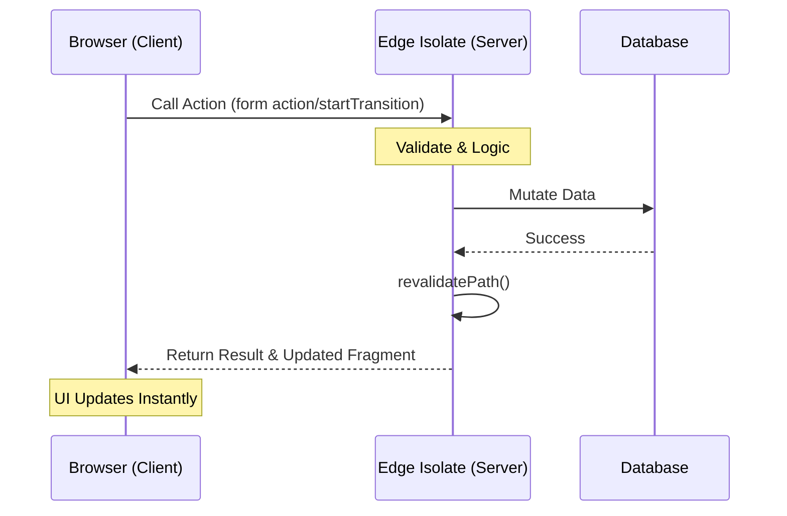

### What are React Server Actions?
**React Server Actions are asynchronous functions that run on the server but can be called directly from the client, simplifying data mutations and eliminating the need for manual API routes.** In 2026, they are the standard for "Server-First" frontend architecture, offering built-in security, zero-client-side JavaScript for form submissions, and seamless integration with [Resumable frameworks](/blog/advanced-typescript-resumability-guide).

As I’ve detailed in the [Frontend Development Roadmap 2026](/blog/frontend-development-roadmap-2026), the web has moved to a **server-first** mental model. **React Server Actions** and **Server Components** aren't just "new features" - they are the core of a new architecture that prioritizes the user's main thread and the developer's sanity.



### The Problem: The "useEffect" Waterfall

When you use `useEffect` for data fetching, you aren't just "fetching data." You are creating a "Waterfall of Doom." 

Think about the execution steps:
1.  **HTML Download**: The browser gets a near-empty shell.
2.  **JS Bundle Download**: The browser waits for your massive 500KB React bundle.
3.  **Parsing & Execution**: The CPU works overtime to parse the JS and boot up React.
4.  **Initial Render**: React renders the component tree, sees your `useEffect`, and realizes it needs data.
5.  **Data Fetching**: A network request is finally fired.
6.  **Second Render**: The response comes back, state updates, and React re-renders with the actual data.

By the time the user sees anything useful, they might have waited 2-3 seconds on a 4G connection. This is the primary driver of poor [Interaction to Next Paint (INP)](/blog/v8-garbage-collector-react-performance) and a terrible lighthouse score. Even worse, you have to manually handle every edge case: What if the component unmounts? What if the user submits the form twice? What if the network drops?

### The Solution: React Server Components (RSC) for Reads

Before we talk about Actions (Mutations), we have to talk about RSC (Reads). In 2026, if you just need to display data, you should never touch `useEffect`. You should use an `async` Server Component.

```typescript
// A 2026 Data Fetching Pattern
async function UserProfile({ id }: { id: string }) {
  // Direct DB access! No API route needed.
  const user = await db.user.findUnique({ where: { id } });

  if (!user) return <NotFound />;

  return (
    <section>
      <h1>{user.name}</h1>
      <p>{user.bio}</p>
    </section>
  );
}
```

This is a game-changer because the data is fetched **before** the code even touches the browser. The browser receives the finished HTML for the `UserProfile`. There is no waterfall, no loading skeletons (unless you explicitly use `<Suspense />`), and **zero client-side JS** for this operation. This is how we keep the [V8 engine quiet](/blog/v8-garbage-collector-react-performance).

### The Deep Dive: React Server Actions for Mutations

But what about "doing things"? What about submitting a form, liking a post, or updating a profile? This is where `useEffect` and `useState` used to create incredible complexity. 

In 2026, we use **Server Actions**. A Server Action is an `async` function that transitions the "Data Boundary" seamlessly.

```typescript
// lib/actions.ts
"use server";

export async function updateBio(formData: FormData) {
  const bio = formData.get("bio");
  // Validate, mutate DB, and revalidate in one go
  await db.user.update({ data: { bio } });
  revalidatePath("/profile");
}
```

When you call this function from a button or a form, React handles the entire HTTP request/response cycle for you. You don't build an API endpoint. You don't manage a `fetch()` call. You just call an `async` function.

### Advanced Pattern: The "Optimistic" Interface

The biggest argument for the "old way" was that you could update the UI "instantly" before the server responded. Well, in 2026, Server Actions do this even better with `useActionState` and `useFormStatus`. 

On my team, we use **Optimistic Updates** for every mutation. When a user clicks "Like," we update the UI locally within 16ms. If the Server Action succeeds, the UI stays. If it fails (e.g., net error), React automatically rolls back the UI and shows an error message.

```typescript
"use client";

import { useOptimistic } from "react";
import { likePost } from "./actions";

function LikeButton({ post }) {
  const [optimisticLikes, addOptimisticLike] = useOptimistic(
    post.likes,
    (state, newCount) => newCount
  );

  return (
    <button onClick={async () => {
      addOptimisticLike(post.likes + 1);
      await likePost(post.id);
    }}>
      {optimisticLikes} Likes
    </button>
  );
}
```

This is the "Full Stack Frontend." It’s cleaner, it’s faster, and it solves the "Race Condition" problem because React's internal state management is synchronized with the server's lifecycle.

### The Resumability Connection

As I discussed in [Architecting for the Edge](/blog/edge-performance-cold-starts-guide), the Edge is where our apps live in 2026. 

Server Actions are designed for the Edge. Because they are just functions, they can be executed at the CDN level. When you call an action, it can run on a [V8 Isolate](/blog/edge-performance-cold-starts-guide#v8-isolates-vs-docker) near the user, perform a quick check, and return the result. This eliminates the "Origin round trip" for many common interactions.

### Migration Guide: Step-by-Step

If you are currently maintaining a legacy `useEffect` app, here is the 2026 migration path I recommend:

1.  **Phase 1: Move Reads to RSC**: Identify your "Read" components (dashboards, lists, profiles). Convert them to `async` functions. Let the server handle the data fetching. This will immediately drop your JS bundle size by 30-50%.
2.  **Phase 2: Use Actions for Simple Forms**: Replace your `axios.post` or `fetch` calls in login/signup forms with Server Actions. Use `useFormStatus` to handle the "Submit" button state.
3.  **Phase 3: Implement Revalidation**: Instead of manually updating a local state (like a Redux store) after a mutation, use `revalidatePath` or `revalidateTag`. Let React do the "Sync" work for you.
4.  **Phase 4: Add Optimistic UI**: Once your actions are stable, add `useOptimistic` to your high-frequency interactions (likes, comments, toggles).

### When Does "useEffect" Still Make Sense?

I am not a fan of "absolute" rules. In 2026, `useEffect` is still a valid tool for **Client-Only side effects**:
-   Initializing a [WebGPU canvas](/blog/webgpu-vs-webgl-performance-guide).
-   Registering a scroll listener for a parallax effect.
-   Connecting to a WebSocket for a live chat.
-   Accessing `localStorage` or `window`.

If the logic requires the "Browser Environment" to function, use an effect. If it’s about "Data," move it to the server.

### Conclusion: Embracing the "Thick Server"

The "Thick Client" era (2015-2024) was an experiment. We tried to move the entire world into the user's browser, and we learned that it was too much. Browsers are for **interactivity**, not for building distributed architecture.

In 2026, we’ve returned to the "Thick Server" model, but with a modern twist. React Server Actions give us the power of a backend with the developer experience of a frontend. They allow us to build systems that are [sustainable](/blog/sustainable-frontend-engineering-guide), [accessible](/blog/ethical-ui-design-principles), and incredibly fast.

Stop fighting the browser's limitations with `useEffect`. Start leveraging the power of the server. Your code will be simpler, and your users will finally experience what "instant" actually feels like.

### Deep Dive: Error Handling in the Server Actions Era

One of the biggest questions I get from senior developers is: "How do I handle errors if the server isn't using `try/catch` on the client?"

In 2026, we use **Functional Error Boundaries**. Because Server Actions can return any serializable data, we return an "Outcome" object.

```javascript
// action.js
export async function updateProfile(formData) {
  try {
    await db.users.update(formData);
    return { success: true };
  } catch (e) {
    return { success: false, error: "Username already taken" };
  }
}
```

On the client, we use `useFormState` to capture this result. This keeps our UI deterministic. We don't have to manage a "loading" or "error" state manually - it’s baked into the action's lifecycle.

### The "Data-Fetching" Decision Flow

To stay ahead of the [Frontend Roadmap 2026](/blog/frontend-development-roadmap-2026), you need to know which tool to use and when.

| Scenario | 2026 Recommended Pattern | Benefit |
| :--- | :--- | :--- |
| **Static Reads** | RSC (React Server Components) | Zero Client JS |
| **Simple Forms** | Server Actions | No API Routes |
| **Optimistic UI** | useOptimistic + Actions | Instant Feel |
| **Real-time** | SWR / React Query | Background Sync |
| **Internal Routing** | [Type-Safe Manifests](/blog/advanced-typescript-resumability-guide) | Build-time Safety |

### The "Hydration Gap" and Resumability

As I discussed in [Advanced TypeScript](/blog/advanced-typescript-resumability-guide), the goal of modern architecture is to eliminate the "Hydration Gap." This is the period where the user sees the page but can't interact with it because the JavaScript is still loading.

Server Actions solve this by being "HTML-First." You can actually submit a form using a Server Action *before* the JavaScript has even finished downloading. This is the ultimate win for [Performance and Accessibility](/blog/ethical-ui-design-principles).

---


> [!TIP]
> Navigating data boundaries is a core skill in our [Frontend Development Roadmap 2026](/blog/frontend-development-roadmap-2026). For more on architectural trade-offs, read our guide on [Edge vs Origin: The Logic Placement Guide](/blog/edge-vs-origin-business-logic-cdn).
