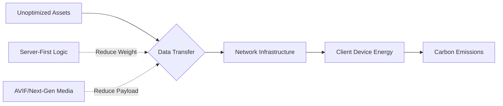

### What is Sustainable Frontend Engineering?
**Sustainable Frontend Engineering is the practice of reducing the carbon footprint of web applications by minimizing data transfer, optimizing asset delivery, and choosing green hosting providers.** In 2026, it is measured in grams of CO2 per visit, with a target of sub-0.2g for a highly efficient "A-weighted" site.

It’s easy to forget that data transfer requires physical energy. Routers, switches, undersea cables, and massive data centers all run on electricity. 

As I outlined in the [Frontend Development Roadmap 2026](/blog/frontend-development-roadmap-2026), the shift to "Server-First" and "Lean Client" architectures isn't just about speed - it's about survival.



### Tooling Deep Dive: Measuring the Invisible

How do you know if your app is "green"? In 2026, we’ve moved beyond simple scores and into granular forensics. On my team, we use a three-tier auditing strategy:

#### 1. The High-Level Audit: Website Carbon Calculator
This is the gold standard for a quick check. It tells you exactly how much CO2 each visit produces and compares it to the rest of the web. I aim for an "A" on every project. If we hit a "C," it triggers a mandatory performance sprint.

### The Carbon Intensity of Web Assets

| Asset Type | 2026 Avg Weight | Carbon (Est. per 1M Views) |
| :--- | :--- | :--- |
| **Video (Autoplay)** | 5MB - 10MB | 4.0 - 8.0 kg |
| **Images (WebP/AVIF)** | 500KB - 1MB | 0.4 - 0.8 kg |
| **JavaScript (JS)** | 300KB - 700KB | 0.2 - 0.5 kg |
| **Fonts (System)** | **0KB** | **0.0 kg** |

### Strategy: The Carbon Budget

In 2026, we don't just have "Performance Budgets"; we have **Carbon Budgets**. 

A carbon budget is a fixed limit on the emissions your page can produce per view. For a standard marketing page, my budget is **0.2g of CO2**. For a complex dashboard, it’s **0.5g**.

Establishing this budget early in the design phase is critical. It forces the conversation: "Is this autoplay hero video worth 0.3g of CO2 per user?" Usually, the answer is no. By putting a "price" (in carbon) on every feature, you naturally gravitate toward leaner, faster, and more accessible designs.

### Implementation: Automating Sustainability

I am a big believer in automation. If you have to remember to "check the carbon score," you won't do it. 

Here is how we’ve integrated CO2.js into our GitHub Actions:

```javascript
import { co2 } from "@tgwf/co2";

const swd = new co2({ model: "swd" });
const bytesSent = 2500000; // 2.5MB
const emissions = swd.perVisit(bytesSent);

console.log(`Estimated emissions: ${emissions}g of CO2`);

if (emissions > 0.5) {
  process.exit(1); // Fail the build
}
```

This simple script has done more to improve our site's sustainability than a dozen "best practice" articles. It makes the invisible visible.

### Sustainable Design Systems: UI Choices Matter

Your design choices are your biggest carbon drivers. In 2026, "Sustainable UX" is a specialization in itself.

-   **Dark Mode by Default**: On OLED screens, dark pixels require significantly less power. Offering a dark mode is a power-saving feature. 
-   **System Fonts**: Why download 200KB of "Inter" or "Roboto" when the user's OS already has high-quality fonts? Using system fonts is the single easiest way to drop your carbon footprint.
-   **Static over Dynamic**: If a page doesn't *need* to be dynamic, don't use a heavy framework. If you use a [Resumable framework](/blog/advanced-typescript-resumability-guide), you can keep the client extremely lean while still offering rich interactivity.

### The Green Hosting Maze

Data centers are the "smokestacks" of the digital age. But not all hosting is created equal. 

In 2026, the Green Web Foundation maintains a directory of "Green Hosts" - providers who either use 100% renewable energy or offset their consumption significantly. Major Edge providers like Cloudflare and Vercel are committed to this, but you should always verify.

I’ve learned to ask our infrastructure teams: "What is the PUE (Power Usage Effectiveness) of our primary data center?" A score of 1.0 is a perfect match of energy-in to energy-used. Anything over 1.5 is a signal that we need to migrate.

### Case Study: The 60% Footprint Reduction

Last year, we audited a legacy e-commerce site. It was a "Standard React App" with a 4.5MB home page. Its carbon score was an "F," producing 2.8g of CO2 per visit.

We applied three changes:
1.  **Image Optimization**: Switched to AVIF and implemented aggressive lazy loading. (Saved 2MB).
2.  **JS Cleanup**: Removed three unused analytics trackers and two legacy UI libraries. (Saved 800KB).
3.  **Edge Caching**: Moved business logic to the [Edge](/blog/edge-vs-origin-business-logic-cdn), reducing the number of round trips to the Origin.

The footprint dropped to 0.4g of CO2. The site didn't just become "greener"; it became 4 seconds faster on mobile devices. **Sustainability is performance.**

### Conclusion: The Ethical Obligation

I teach my senior engineers that our job isn't just to "ship features." It’s to build a web that can last for the next fifty years. 

In 2026, the "best" developers are those who build code that is invisible - it’s so efficient and fast that the user doesn't even notice the phone getting warm. We should be as proud of the bytes we *don't* ship as we are of the features we do.

Sustainability is the ultimate engineering challenge. It requires you to optimize every layer of the stack, from the [V8 engine](/blog/v8-garbage-collector-react-performance) to the [CDN configuration](/blog/edge-performance-cold-starts-guide). 

Let’s build a web that is fast for users and light for the planet. The time for "wasteful web development" is over.

---

> [!TIP]
> Building green is a core theme in our [Frontend Development Roadmap 2026](/blog/frontend-development-roadmap-2026). For more on hardware-aware performance, read our guide on [WebGPU vs WebGL: Is it Time to Switch?](/blog/webgpu-vs-webgl-performance-guide).
