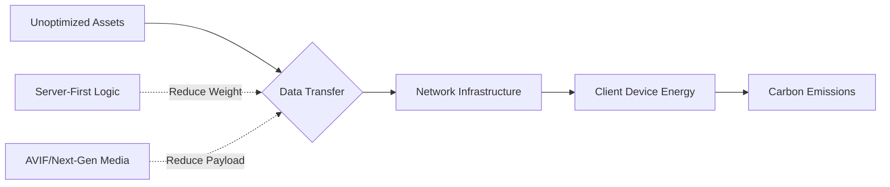

When I check my phone's battery usage and see my web browser sitting at the top of the list, I am reminded of a simple truth: code has a physical footprint. Every kilobyte we transfer across the network has a carbon cost, powered by routers, switches, and data centers that run day and night. 

Sustainable frontend engineering is about reducing this impact. It is measured in grams of CO2 per visit, with a target of sub-0.2g for a highly efficient, A-rated site.

The shift to server-first and lean client architectures isn't just about speed—it is about efficiency.



### Tooling Deep Dive: Measuring the Invisible

How do you know if your app is "green"? I've started using a three-tier auditing strategy:

#### 1. The High-Level Audit: Website Carbon Calculator
This is a helpful tool for a quick check. It estimates how much CO2 each visit produces and compares it to the rest of the web. I aim for an "A" on every project. If a site hits a "C," I start auditing and optimizing.

### The Carbon Intensity of Web Assets

| Asset Type | 2026 Avg Weight | Carbon (Est. per 1M Views) |
| :--- | :--- | :--- |
| **Video (Autoplay)** | 5MB - 10MB | 4.0 - 8.0 kg |
| **Images (WebP/AVIF)** | 500KB - 1MB | 0.4 - 0.8 kg |
| **JavaScript (JS)** | 300KB - 700KB | 0.2 - 0.5 kg |
| **Fonts (System)** | **0KB** | **0.0 kg** |

### Strategy: The Carbon Budget

I've started using **Carbon Budgets** alongside performance budgets. 

A carbon budget is a fixed limit on the emissions your page can produce per view. For a standard marketing page, my budget is **0.2g of CO2**. For a complex dashboard, it’s **0.5g**.

Establishing this budget early in the design phase is critical. It forces the conversation: "Is this autoplay hero video worth 0.3g of CO2 per user?" Usually, the answer is no. By putting a "price" (in carbon) on every feature, you naturally gravitate toward leaner, faster, and more accessible designs.

### Implementation: Automating Sustainability

I am a big believer in automation. If you have to remember to "check the carbon score," you won't do it. 

Here is how I integrated CO2.js into a recent project's GitHub Actions:

```javascript
import { co2 } from "@tgwf/co2";

const swd = new co2({ model: "swd" });
const bytesSent = 2500000; // 2.5MB
const emissions = swd.perVisit(bytesSent);

console.log(`Estimated emissions: ${emissions}g of CO2`);

if (emissions > 0.5) {
  process.exit(1); // Fail the build
}
```

This simple script has done more to improve my site's sustainability than a dozen "best practice" articles. It makes the invisible visible.

### Sustainable Design Systems: UI Choices Matter

Your design choices are your biggest carbon drivers. Sustainable UX is becoming a discipline of its own.

-   **Dark Mode by Default**: On OLED screens, dark pixels require significantly less power. Offering a dark mode is a power-saving feature. 
-   **System Fonts**: Why download 200KB of "Inter" or "Roboto" when the user's OS already has high-quality fonts? Using system fonts is the single easiest way to drop your carbon footprint.
-   **Static over Dynamic**: If a page doesn't *need* to be dynamic, don't use a heavy framework. If you use a [Resumable framework](/blog/advanced-typescript-resumability-guide), you can keep the client extremely lean while still offering rich interactivity.

### The Green Hosting Maze

Data centers are the "smokestacks" of the digital age. But not all hosting is created equal. 

The Green Web Foundation maintains a directory of "Green Hosts"—providers who either use 100% renewable energy or offset their consumption. Edge providers like Cloudflare and Vercel are committed to this, but it is always worth verifying.

I’ve learned to check: "What is the PUE (Power Usage Effectiveness) of the data center?" A score of 1.0 is a perfect match of energy-in to energy-used. Anything over 1.5 is a signal that it is time to migrate.

Last year, I worked on a legacy e-commerce site. It was a standard React app with a 4.5MB home page. Its carbon score was an "F," producing 2.8g of CO2 per visit.

I applied three changes:
1.  **Image Optimization**: Switched to AVIF and implemented aggressive lazy loading (saving 2MB).
2.  **JS Cleanup**: Removed three unused analytics trackers and two legacy UI libraries (saving 800KB).
3.  **Edge Caching**: Moved business logic to the edge, reducing the number of round trips to the origin.

The footprint dropped to 0.4g of CO2. The site didn't just get greener; it became 4 seconds faster on mobile devices. **Sustainability is performance.**

### Conclusion: The Ethical Obligation

My goal as a developer isn't just to ship features. It is to build a web that can last.

The most elegant code is often invisible: it is so efficient and fast that the user doesn't even notice their phone getting warm. I want to be as proud of the bytes I don't ship as I am of the features I do.

Sustainability is a fascinating engineering challenge. It requires optimizing every layer of the stack, from the engine to the CDN configuration. 

Let’s build a web that is fast for users and light for the planet. The time for wasteful web development is over.

---

> [!TIP]
> Building green is a core theme in our [Frontend Development Roadmap 2026](/blog/frontend-development-roadmap-2026). For more on hardware-aware performance, read our guide on [WebGPU vs WebGL: Is it Time to Switch?](/blog/webgpu-vs-webgl-performance-guide).
