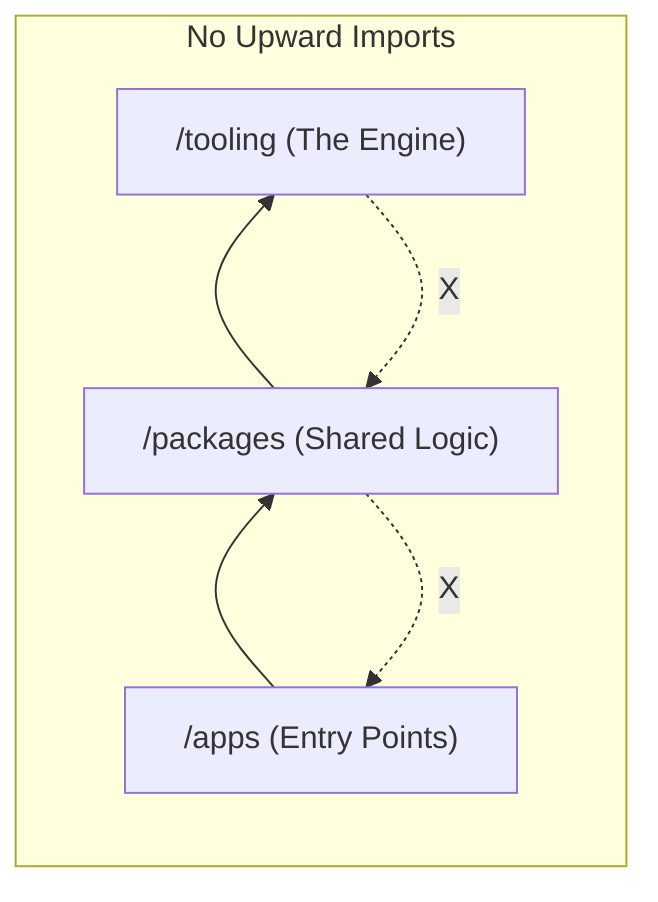

I still remember the exact commit that broke everything.

We had just set up our first **turborepo monorepo setup**. We were proud. We had three Next.js apps. Four shared packages. It felt clean. But we were lazy. Whenever we needed a quick utility function, we threw it into a generic `@repo/utils` package.

Six months later, `@repo/utils` was a junk drawer. It was filled with dead batteries, old takeout menus, and a single mysterious screw. 

Then it happened. Someone added a hook that imported a component. But that component already imported a math helper. 

**Circular dependency.** 

Suddenly, our builds started hanging. The cache stopped working. We couldn't update a button color without re-building the entire company infrastructure. It was a nightmare.

Cleaning up a legacy codebase is exactly like cleaning up my toddler Shree’s playroom: you think you're done, and then you find a massive hidden mess in the corner.

This post is the result of that cleanup. If you are struggling with a **scalable turborepo folder structure** or looking for a **best folder structure for react turborepo**, this is the pragmatic guide you need for a **scalable turborepo architecture**.

> [!IMPORTANT]
> **Scalability is about constraints.**
> A great **turborepo scalable setup** isn't just about where files live; it's about defining strict rules for how code is allowed to flow. If you don't set boundaries, your monorepo becomes a monolith with extra steps.

---

## What is the best Turborepo folder structure?

<AeoAnswer>
**The best Turborepo folder structure** follows a three-layer pattern: `/apps` for deployment entry points (Next.js, Vite), `/packages` for shared domain logic and UI components, and a dedicated configuration layer (often `/tooling` or within `/packages`) for shared TypeScript, ESLint, and Tailwind settings.
</AeoAnswer>

### TL;DR: The Core Rules
- **Keep `/apps` thin:** Only handle routing, composition, and environment variables.
- **Move logic to `/packages`:** 80% of your code should live here, isolated by domain.
- **Centralize configs in `/tooling`:** Extend base TS, ESLint, and Tailwind configs.
- **Enforce strict dependency rules:** No upward imports from packages to apps.

---

## Who Should Use This Structure?
This **turborepo project structure best practices** guide is designed for:
- **Teams with 3+ applications** sharing the same design tokens or business rules.
- **Teams scaling to 10+ engineers** who need to avoid constant merge conflicts.
- **Modern SaaS products** that need high velocity across multiple sub-domains (e.g., Dashboard, Admin, Docs).

---

## Chapter 1: The Three-Layer Architecture (Apps, Packages, Tooling)

In 2026, we’ve moved past the "flat" monorepo. If you have 20 packages in one folder, you have no hierarchy. You need layers.

### Visualizing the One-Way Flow
Visualizing your scalable Turborepo setup is critical for keeping it clean. The biggest rule: **Dependencies only flow downward.**



### Layer Role Comparison: At a Glance

If you're in a hurry, here is the high-level breakdown of the three layers. This is the **scalable turborepo architecture** in its simplest form.

| Layer | Core Role | Folder Content | Key Constraint |
| :--- | :--- | :--- | :--- |
| **Apps** | Deployment Entry Points | Next.js, Vite, Remix | Keep it \"Thin\" |
| **Packages** | Shared Domain Logic | UI, Hooks, API, Auth | Domain-Driven |
| **Tooling** | Infrastructure Engine | ESLint, TS, Tailwind | Centralized Configs |

### The Scalable Directory Blueprint
Here is the high-level layout we use for every **scalable react turborepo**:

```text
.
├── apps/               # Layer 1: Deployment Entry Points (Thin)
│   ├── web/            # Next.js App
│   └── docs/           # Documentation App
├── packages/           # Layer 2: Business Logic & UI (Thick)
│   ├── ui/             # Design System (Tailwind/Radix)
│   ├── logic/          # Shared hooks, validation, API clients
│   └── database/       # Prisma/Drizzle schema and client
└── tooling/            # Layer 3: The Engine (Infrastructure)
    ├── tailwind/       # Baseline Tailwind Config
    ├── typescript/     # Base tsconfigs
    └── eslint/         # Shared linting rules
```

### The Rule of Three: My Opinionated Take
I’ll build authority by saying this plainly: **If your team has fewer than three apps, you probably don’t need Turborepo yet.** 

Monorepos introduce an orchestration tax. You have to manage workspaces, shared configs, and build pipelines. If you only have one Next.js app and a small library, keep it simple. Only pull the mono-repo trigger when the pain of coordinating multiple repos outweighs the cost of the tooling tax.

---

## Real-World Example: Production-Ready Turborepo

Here’s how this structure looks in a real SaaS application. This is a **real turborepo repo structure** that survives high-growth phases:

```text
apps/
  web/          # The main customer-facing dashboard
  admin/        # Internal tools for the support team
packages/
  ui/           # Your shared design system (shadcn/radix)
  auth/         # Centralized Clerk or Kinde logic
  billing/      # Stripe integration and pricing logic
  api-client/   # Type-safe tRPC or Zod-fetch wrappers
tooling/
  eslint/       # Unified code quality rules
  typescript/   # Shared tsconfig.json extensions
  tailwind/     # Your "System of Truth" for styles
```

---

## Chapter 2: Keeping `/apps` "Thin"

The biggest mistake I see in **folder structure for large react apps** is putting too much logic in the `/apps` directory. 

If you write a complex `useCalculateTax` hook directly inside `apps/web`, you've lost. When you build a mobile app in `apps/native`, you’ll be forced to copy-paste.

### The "Thin App" Rule
The code inside your `/apps` directory should only handle:
- **Routing:** Setting up pages and layouts.
- **Dependency Injection:** Passing environment variables to packages.
- **Composition:** Importing components from `@repo/ui` and logic from `@repo/logic`.

*Read the full deep-dive on scaling your entry points: [Micro-Frontends vs Monoliths in Next.js 15: The Brutally Honest Guide](/blog/micro-frontends-vs-monoliths-nextjs-15-guide)*

---

## Chapter 3: The Secret Sauce: Organizing `/packages`

If `/apps` is the skin, `/packages` is the muscle. This is where 80% of your code should live. But "shared" is a dangerous word. 

### Domain-Driven Packages
Instead of one massive `@repo/shared` package, break it down by domain. This is one of the most critical **turborepo best practices**.

1. **`@repo/ui`:** Your Design System. This should be "headless" and styled with Tailwind. It should **not** know about your database.
2. **`@repo/api-client`:** A type-safe wrapper around your API.
3. **`@repo/analytics`:** A central place to handle event tracking. If you switch providers, you only change code in one place.

### Internal vs External Packages
Most of our packages are **Internal Packages**. We use Turborepo's workspace protocol:

```json
// apps/web/package.json
"dependencies": {
  "@repo/ui": "workspace:*",
  "@repo/logic": "workspace:*"
}
```
This is the "Golden Path" for velocity. You change a component, and it’s instantly updated in your app.

---

## Chapter 4: Scaling Configurations (The "Tooling" Layer)

**Inconsistent setups are the root of most bugs.** In a **scalable monorepo structure**, you must centralize your "System of Truth."

### Centralizing Tailwind
Create a package called `@repo/tailwind-config`. 
It exports a base configuration that every app extends. When you change your brand color, the entire company updates in one commit. This is how you manage **turborepo best practices** at scale.

---

## Chapter 5: CI/CD and the "Graph" Advantage

The real power of a scalable Turborepo isn’t the folders, it’s the **math** behind the dependency graph.

Turborepo understands your "Dependency Graph." It knows that if you only changed `apps/docs`, it doesn't need to run tests for `apps/web`.

### Structural Speed: From 18 Minutes to 2 Minutes
Our pipelines didn't just get faster; they became **structurally efficient**. 

Because our packages are isolated and the dependency graph is explicit, Turborepo uses **Deterministic Task Hashing**. It checks the hash of every file in the dependency chain. If you edit a component in `@repo/ui`, Turborepo knows that only the apps importing `ui` need to be re-built. 

The "Leaf Nodes" (like `apps/docs`) remain untouched and are served instantly from the cache. This isolation is what allowed us to cut our CI/CD time by 90%.

### Remote Caching
If you aren't using **Remote Caching**, you are paying a "Time Tax." 

When I run `turbo build`, the results are saved to the cloud. When my teammate pulls my code, her machine downloads the result instantly.

---

## Turborepo vs Nx Folder Structure

It’s the most common debate: **Turborepo vs Nx structure**.

*   **Turborepo:** Prefers a "Bring Your Own Structure" approach. It is lightweight and works with your existing `package.json` workspaces. It’s perfect for teams that want flexibility without a heavy framework weight.
*   **Nx:** Much more opinionated. It provides standardized "generators" that force a specific folder structure (usually `/apps` and `/libs`). It is more powerful for massive enterprise needs but introduces more orchestration complexity.

### Comparison Table: At a Glance

| Feature | Turborepo | Nx |
| :--- | :--- | :--- |
| **Philosophy** | Un-opinionated / Lightweight | Opinionated / Framework-like |
| **Configuration** | Native `package.json` | Project-specific JSON/TS |
| **Generators** | Minimal / BYO | Powerful built-in CLI generators |
| **Learning Curve** | Low (hours) | High (days) |
| **Best For** | Startups & Rapid Velocity | Large Enterprises & Strictness |

For most 2026 startups, **Turborepo** is the superior choice for velocity and simplicity.

---

## Common Pitfalls & Debugging (The Terminal Teardown)

When you mess up your **turborepo monorepo setup**, the terminal isn't shy about telling you. Here are the two most common errors we encountered and how to fix them architecturally.

### Error 1: The Circular Dependency Trap
If you see an error like this, you’ve broken the "Downwards Only" rule:

```text
Error: Circular dependency detected:
@repo/ui -> @repo/utils -> @repo/ui
```

**The Fix:** This almost always happens because of a "God Package" like `@repo/utils`. Stop putting hooks that use UI components into your utils package. Create a dedicated `@repo/hooks` package that imports `@repo/ui`, and ensure `ui` never imports `hooks`.

### Error 2: Missing Workspace Dependency
You import a package in your code, but the build fails with:

```text
Error: Could not resolve "@repo/logic" 
(Check if it is in your package.json dependencies)
```

**The Fix:** Even in a monorepo, you must explicitly declare your dependencies in `package.json`. If `apps/web` needs `@repo/logic`, it must be listed. Turborepo isn't a magic wand; it's a workspace orchestrator.

---

## Common Turborepo Mistakes (That Kill Scalability)

Stop doing these four things if you want a fast, healthy repo:

1.  **The Giant @repo/utils:** Never create a catch-all utility package. It will inevitably lead to circular dependencies.
2.  **Business Logic in /apps:** Your Next.js apps should be UI-heavy and logic-light. Keep the "brains" in `/packages`.
3.  **No Dependency Boundaries:** Allowing any package to import any other package without a hierarchy.
4.  **Copy-Paste Configs:** Hard-coding `tsconfig.json` or `tailwind.config.js` in every app instead of extending a base.

---

## Final Thoughts: Treat Your Repo Like a City

Scaling a monorepo is like scaling a city. You need zones (Apps, Packages, Tooling). You need rules.

- **Apps** are the storefronts.
- **Packages** are the infrastructure.
- **Tooling** is the city planning office.

**A messy monorepo doesn’t fail all at once,it fails one bad dependency at a time.**

If your repo feels messy today, don’t refactor everything. Move just one piece of logic out of `/apps`. That’s where the transformation starts. You’ll feel the difference in build speed and mental clarity immediately.

**Is your team struggling with build times or messy imports?** Architecture is only half the battle. Read our [Modern Frontend Architecture Guide (2026)](/blog/frontend-architecture-guide) to see how we build the components that live inside these folders.

---

> This post is part of our [Frontend Engineering Architecture Hub](/blog/frontend-architecture-guide). Follow along as we build the definitive guide to professional web engineering in 2026.
