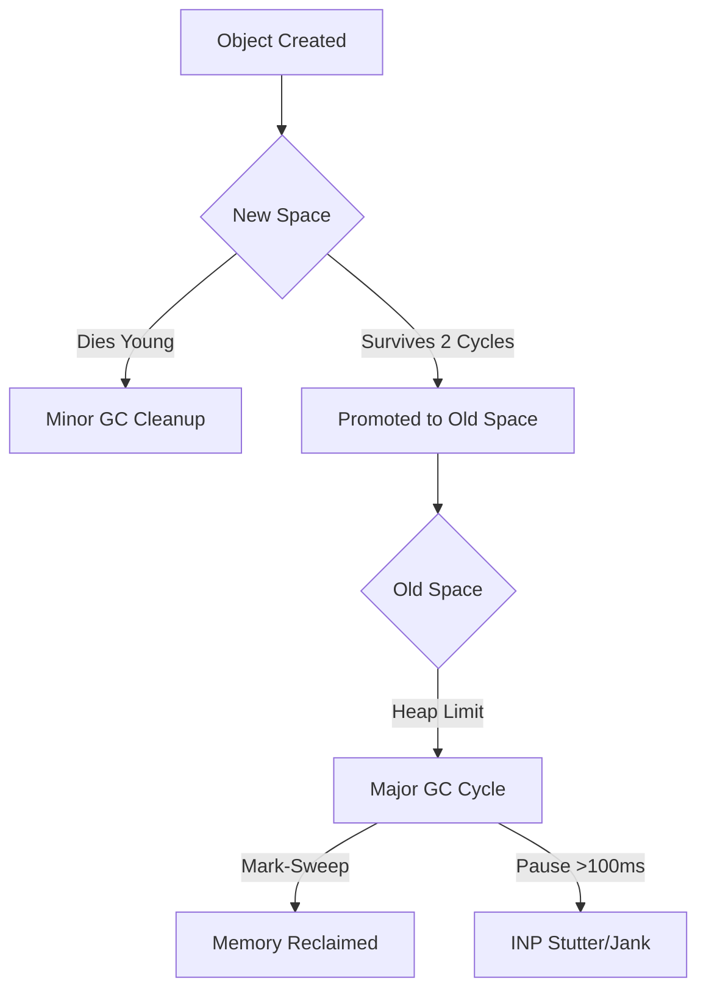

> [!NOTE]
> ### 💡 Key Takeaways: The 60-Second Audit
> - **The Stutter**: Almost always caused by "Major GC" cycles (Mark-Sweep) taking >100ms.
> - **Generational Hypothesis**: Most objects die young. Keep the "New Space" lean to avoid expensive promotions to "Old Space."
> - **The Killers**: Closures in loops, detached DOM nodes, and massive, unmemoized Virtual DOM trees.
> - **The Tool**: Use the Chrome DevTools **Performance** tab with the "Memory" checkbox to find the "Sawtooth" pattern of doom.
> - **The Metric**: In 2026, **Interaction to Next Paint (INP)** is the only performance score that truly defines user satisfaction.

I have spent many late nights profiling React apps that felt "fast enough" at launch but became absolute magnets for jank after ten minutes of real-world use. You know the feeling: you're clicking through a dashboard, and suddenly, the transitions aren't as crisp. There's a micro-delay on every button press. The scroll feels heavy. To the untrained eye, it’s just "the browser being slow." To a senior engineer, it’s the sound of a garbage collector screaming for help.

### What is the V8 Garbage Collector?
**In 2026, the V8 Garbage Collector is an automated memory management system that identifies and deletes objects no longer needed by your application.** It prevents memory leaks by reclaiming "garbage" (unreachable memory) so the browser can maintain a high [Interaction to Next Paint (INP)](/blog/frontend-development-roadmap-2026) score.

In 2026, we call this the "SPA Hangover," and it’s almost always a failure of **memory management**. Specifically, it’s a failure to understand the **V8 Garbage Collector** - the engine that handles your performance behind the scenes.

As I've explored in my [Frontend Development Roadmap 2026](/blog/frontend-development-roadmap-2026), the era of the "thick client" has forced us to reconsider how we treat the browser's memory. To solve **React app stuttering**, we can no longer ignore the "Physics of the Web."

### The Illusion of Infinite Memory in JavaScript

We treat JavaScript like it has infinite memory. We create objects, closures, and massive state trees, and we trust V8 to "clean it up" eventually. And it does. But "cleaning up" isn't free. 

The V8 engine (which powers Chrome, Edge, and Node.js) uses a generational **garbage collection** strategy. It is built on the **Generational Hypothesis**: the idea that most objects die young. If you create a variable inside a function, it usually doesn't need to exist once that function finishes. 

To handle this, V8 divides memory into two main areas:
1.  **New Space (The Young Generation)**: This is a small area (usually 1MB to 8MB) where all new objects are allocated. It is designed for rapid cleaning.
2.  **Old Space (The Old Generation)**: This is where objects go if they survive a few cycles of the New Space. This is where your long-lived status, global stores, and cached data live.

### The Heap Hierarchy: Minor vs. Major GC

To optimize your app, you need to understand which "broom" V8 is using to sweep your memory.

| Feature | Minor GC (Scavenge) | Major GC (Mark-Sweep) |
| :--- | :--- | :--- |
| **Target** | New Space (Young Gen) | Old Space (Old Gen) |
| **Frequency** | Very High | Low |
| **Pause Time** | sub-1ms (Instant) | 50ms - 200ms (Jank) |
| **Algorithm** | Cheney's Copying | Mark-Sweep-Compact |
| **Trigger** | New Space is full | Old Space limit reached |

### The Anatomy of a Stutter: GC Pauses and INP

When the New Space fills up, V8 runs a "Scavenge" cycle (Minor GC). This is usually very fast - sub-millisecond. It’s like a quick dusting of your desk. But when objects move to the Old Space, they enter a much more complex management system. 

When the Old Space fills up, V8 has to run a major GC cycle - usually a "Mark-Sweep" or "Mark-Compact" operation. 

I have seen major **GC pauses** take anywhere from 50ms to 200ms. In the world of 2026, where **Interaction to Next Paint (INP)** is the primary metric for user experience, a 100ms pause is a catastrophic failure. If you click a button while V8 is busy marking three million dead objects for deletion, your app is effectively frozen. To the user, that’s a stutter. That’s the "jank" that kills retention and tanks your SEO.

### Exploring the Orinoco V8 Engine Pipeline

It’s worth noting that the V8 team hasn't been sitting still. Over the last few years, the **Orinoco V8** project has introduced Incremental, Concurrent, and Parallel marking to mitigate these issues.

-   **Parallel Marking**: The main thread and worker threads do GC work at the same time.
-   **Concurrent Marking**: Worker threads do the marking while the main thread keeps running JavaScript.
-   **Incremental Marking**: The main thread does a little bit of GC work intermittently.

This is why modern browsers feel smoother than they did five years ago. However, even with these **JavaScript memory management** optimizations, there is a limit. If your application creates "garbage" faster than Orinoco can sweep it, the main thread will eventually have to stop. This is called a **Stop-the-World** pause.

### Why React is a "Garbage Generator"

I love React, but we have to be honest: React is a machine designed to generate garbage. Think about the reconciliation cycle. Every time your state changes, React creates a new "Virtual DOM" tree (a massive collection of plain JS objects) and then discards it. 

In a complex app with frequent updates, you are creating and discarding thousands of objects every second. If you aren't careful with memoization, you are basically throwing handfuls of paper on the floor and then complaining that the janitor (V8) is taking too long to sweep.

### Case Study: High-Performance Memory Debugging

Last year, I worked with a fintech team that had a massive analytics dashboard. It was a classic React SPA. The users loved the features, but they complained that after ten minutes of use, the search bar would "lag."

We took a **V8 heap snapshot** in Chrome DevTools. At launch, the heap was 40MB. After ten minutes of use, it was 480MB. The culprit? They were fetching real-time price updates every 500ms and storing the history in a local array, triggering a re-render of a massive table.

We fixed it by doing three things:
1.  **Virtualization**: We used `react-window` to only render the visible rows, dropping object creation by 90%.
2.  **Referential Stability**: We used `useMemo` specifically for heavy data transformations.
3.  **TypedArrays**: We moved the raw price history to a `Float32Array`. (See my post on [Memory-Efficient Frontend](/blog/memory-safe-frontend-typedarrays-performance)).

### Advanced Mitigation: Detecting JavaScript Memory Leaks

If you are a senior engineer, "use `useMemo`" is table stakes. To truly master memory in 2026, you need to go further:

#### 1. Avoid Closures in Loops
Every time you define a function inside a loop or a high-frequency render, you are creating a "closure" object. In a tight loop, this creates massive memory pressure.

#### 2. Beware of "Detached" DOM Elements
If you remove a component but a global event listener still holds a reference to one of its DOM nodes, that entire node cannot be garbage collected. This is a classic **JavaScript memory leak**.

#### 3. The Power of Web Workers
If you have to do heavy data processing, move it to a Worker. Workers have their own heap and their own garbage collector, ensuring they don't block the main thread.

### Conclusion: Respect the Engine

I’ve learned that the secret to a smooth UI isn't just about writing "clean" React code; it’s about making V8’s job easier. In 2026, we are no longer just framework experts; we are system architects.

Start caring about your heap size. Start profile-testing your apps for more than thirty seconds. Stop treating memory like it's free. Your users - and the "Physics of the Web" - will thank you for it. 

Mastering these memory fundamentals is also a critical requirement for acing a [Frontend System Design Interview](/blog/frontend-system-design-interview-guide) in 2026.

---

> [!TIP]
> This architectural deep dive is a companion to our [Frontend Development Roadmap 2026](/blog/frontend-development-roadmap-2026). Check out the full guide for a bird's-eye view of the modern frontend ecosystem.
