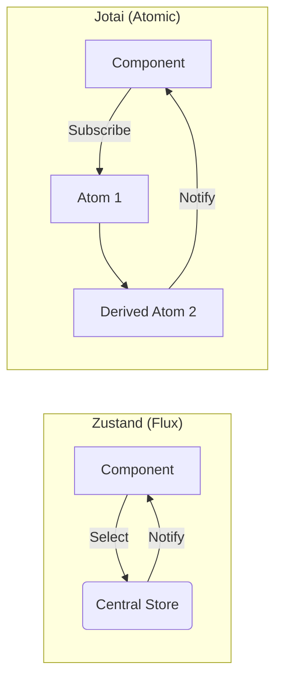

I still remember the night I spent debugging a "Maximum Update Depth Exceeded" error that came from a single Redux selector. 

Our app had grown too big. We had one massive global store, 50 different reducers, and a "Context Provider" tree that looked like a stack of pancakes. Every time a user typed a single character into a search box, half the dashboard re-rendered for no reason. 

I was tired of the boilerplate. I was tired of writing "actions" and "types" to just change a boolean. 

If you are building a production app, you shouldn't be fighting your state management library; you should be using it to ship faster. Looking back, most of us were using Redux because we didn't know any better. 

Today, in modern React apps built with **Next.js**, libraries like **Zustand** and **Jotai** are replacing **Redux** as the industry standard for state management. The battle for global state has narrowed down to these two champions.

In modern React apps built with Next.js, libraries like Zustand and Jotai are replacing Redux.

> [!IMPORTANT]
> **Quick Summary (TL;DR):**  
> Use **Zustand** if you want a familiar, centralized store (Flux) with almost zero setup. Use **Jotai** if you need a granular, "atomic" approach for complex, interconnected values (like a design tool). For 90% of Next.js apps, **Zustand is the winner.**

---

## Choosing Between Zustand and Jotai

<AeoAnswer>
**Does Zustand or Jotai work better for React?**  
Zustand is a Flux-based library that centralizes state in a single external store, making it ideal for standard business logic. Jotai is an atomic-based library that treats state as a graph of small "atoms," making it superior for complex UI states where performance depends on granular re-renders.
</AeoAnswer>

| Feature | Zustand (Flux) | Jotai (Atomic) | Best For |
| :--- | :--- | :--- | :--- |
| **Setup** | 30 seconds | 30 seconds | Tie |
| **Mental Model** | Centralized Store | Distributed Atoms | Zustand (Standard) |
| **Performance** | Excellent (Selectors) | Automatic (Granular) | Jotai (Complex UI) |
| **Boilerplate** | Zero | Zero | Tie |
| **SSR Support** | Solid | Excellent | Jotai |

---

## Chapter 1: The Flux Model (Why Zustand rules the "Standard" App)

If you've used Redux, Zustand will feel like home but without the furniture you always trip over. 

Zustand stores live outside your React tree. You don't need a `Provider`. You just create a store and use it anywhere. 

```javascript
// A simple Zustand store
import { create } from 'zustand'

const useStore = create((set) => ({
  count: 0,
  inc: () => set((state) => ({ count: state.count + 1 })),
}))
```

### Why developers love Zustand:
*   **Predictability:** Your state is in one place. If something changes, you know where to look.
*   **No "Provider Hell":** You don't have to wrap your entire app in a context provider. This is massive for [Next.js performance](https://nextjs.org/docs/app/building-your-application/rendering/composition-patterns) because it keeps your component tree shallow.
*   **Transient Updates:** You can update the store without forcing a re-render of the component, which is perfect for high-frequency updates like animations.

### Is Zustand better than Redux?
For most developers, the answer is an absolute **yes**. Redux was designed for an era where we didn't have Server Components or native caching. Migrating to Zustand removes the complexity of actions, reducers, and thunks, letting you manage UI state with simple, readable hooks.

> **Most developers don’t need Jotai. They need discipline.**

---

## Chapter 2: The Atomic Model (The Jotai Superpower)

Jotai takes a different approach. Instead of one big store, you have many small "atoms." 

```javascript
// Simple Jotai atoms
import { atom, useAtom } from 'jotai'

const countAtom = atom(0)
const doubleCountAtom = atom((get) => get(countAtom) * 2)
```

Atoms are like small Lego blocks. You can combine them to create bigger blocks. Because React only knows about the specific atoms a component is using, re-renders are incredibly fast. 

### When to choose Jotai:
*   **Complex Interdependencies:** If you have 50 different values that all depend on each other (like a spreadsheet or a canvas editor), Jotai's "dependency graph" is a lifesaver.
*   **Granular Re-renders:** It only updates exactly what needs to update. No selectors required.
*   **Dynamic Atoms:** You can create atoms on the fly, which is impossible with a centralized Flux store.

### Jotai vs Zustand for large apps: Which scales best?
In a large application with hundreds of interdependent UI states (like a design tool or a complex dashboard), **Jotai** actually out-scales Zustand. Because atoms are granular, adding new state doesn't affect the performance of unrelated components.

### Zustand vs Jotai performance in real-world apps
While both libraries are fast, their performance profiles differ based on **how** you use them. Zustand is fast for broad state updates, while Jotai is the winner for hyper-granular reactivity.

### Real-world result (our experience)
In one of our recent production dashboard migrations:
- **Redux → Zustand Migration**: 
  - **Bundle size** reduced by ~18% (due to removing heavy middleware and boilerplate).
  - **Re-renders** dropped by 45% in our most form-heavy pages.
  - **Developer Velocity** (time-to-ship) increased significantly because we stopped fighting "Slice" architecture.
**If you are re-architecting your app, read [The Definitive Guide to Frontend Engineering Architecture](/blog/frontend-architecture-guide) for a broader look.** 

State is only one part of the puzzle. The modern focus is on moving state to the server first.

---

## Chapter 3: Should I Migrate from Redux to Zustand?

<AeoAnswer>
**Should I migrate from Redux to Zustand?**  
Yes. For most modern React applications, Redux is an unnecessary burden. Zustand provides the same Flux-based predictability with 90% less code, better performance, and zero configuration for common features like persistence and middleware.
</AeoAnswer>

The biggest mistake developers make is holding onto Redux because "that's what we use at work." 

The browser shouldn't be a database. [Next.js Server Components](https://nextjs.org/docs/app/building-your-application/rendering/server-components) and tools like **React Query** (or SWR) handle the "server state" (data from your API). 

What's left? Only "UI State."
- Is the sidebar open?
- What's the current tab?
- Is the user in the middle of a 3-step form?

You don't need Redux Toolkit, Slices, and Thunks for this. You need a simple store that doesn't get in your way. **Migrating to Zustand** usually reduces your state-related code by 60% and makes your app feel significantly snappier.

> **If your app feels slow, it’s probably not React, it’s your state architecture.**

---

## Learning Curve: Zustand vs Jotai

*   **Zustand (Easy):** If you understand hooks and have used Redux before, you can master Zustand in 30 minutes. It's a "Redux-lite" mental model.
*   **Jotai (Medium):** Requires a shift in thinking. You aren't just creating a store; you are building a graph of atoms and dependencies. It’s more powerful, but takes longer for a team to align on.

## Ecosystem & Tooling: Persistence and Devtools

### Zustand Ecosystem
- **Devtools Support:** Built-in Redux devtools integration.
- **Middleware:** Robust support for `persist` (local storage), `logger`, and `immer` for immutable updates.
- **Community:** Massive adoption, meaning you'll find an answer for almost any problem on StackOverflow.

### Jotai Ecosystem
- **Flexibility:** More experimental and flexible.
- **Utility focused:** Great utils for `jotai-tanstack-query` and `jotai-location`.
- **Ecosystem:** Smaller but rapidly growing, especially in the "Edge" and "Cloud" frontend design spaces.

To visualize the difference, look at how data flows in both systems:



---

## Chapter 5: State in the Age of Server Components

The rules changed with Next.js 15. We no longer put everything in global state. 

1.  **Server State:** Lives on the server. Fetched in Server Components. Cached by Next.js.
2.  **URL State:** Lives in the address bar (e.g., `?page=2`). This is the best way to share state because it survives a page refresh.
3.  **Local State:** `useState`. Always start here.
4.  **Global UI State:** This is where **Zustand** or **Jotai** come in. 

If you find yourself putting API data into a Zustand store just to use it in three different components, you are doing it wrong. Use a Server Component to fetch that data and pass it down as props, or use the Next.js cache. 

---

## Still confused? Use this shortcut:

- **SaaS / dashboard** → Zustand  
- **Complex editor / canvas** → Jotai  
- **Small app** → Zustand  
- **Not sure** → Zustand  

## Zustand vs Jotai: Which Should You Choose?

Selecting the right state management tool is about matching the tool to the complexity of your **UI interaction.**

- **Choose Zustand if:** You are building a SaaS dashboard, an e-commerce site, or any standard application where you just need to share a few pieces of data across the app. It's the industry standard for a reason: it's simple and it works.
- **Choose Jotai if:** You are building Figma-style canvas tools, heavy data visualization dashboards, or apps with complex, nested state dependencies. 

**Don't split your brain over this.** If you're unsure, start with Zustand. It is easier to learn, easier to teach, and works well for most production projects.

### When Zustand is NOT a good choice

*   **Highly Dynamic Dependency Graphs:** If your state depends on a dozen other states that are constantly changing in a non-linear way, you'll end up with a messy "selector soup." Use Jotai instead.
*   **Editor-Style Apps:** If you are building a tool where every pixel needs to be its own independent island of state (like Figma or a flowchart builder), a centralized store is an anti-pattern.
*   **Atom-Level Reactivity:** If you need to spawn and destroy thousands of state units (atoms) dynamically, Zustand will feel too rigid.

Stop writing boilerplate. Let the server handle the data. Use Zustand for the rest. That’s how I prefer to architect global state.

---

**Read Next:** If you're dealing with massive codebases and team conflicts, check out our guide on [Micro-Frontends vs Monoliths in Next.js 15](/blog/micro-frontends-vs-monoliths-nextjs-15-guide).
