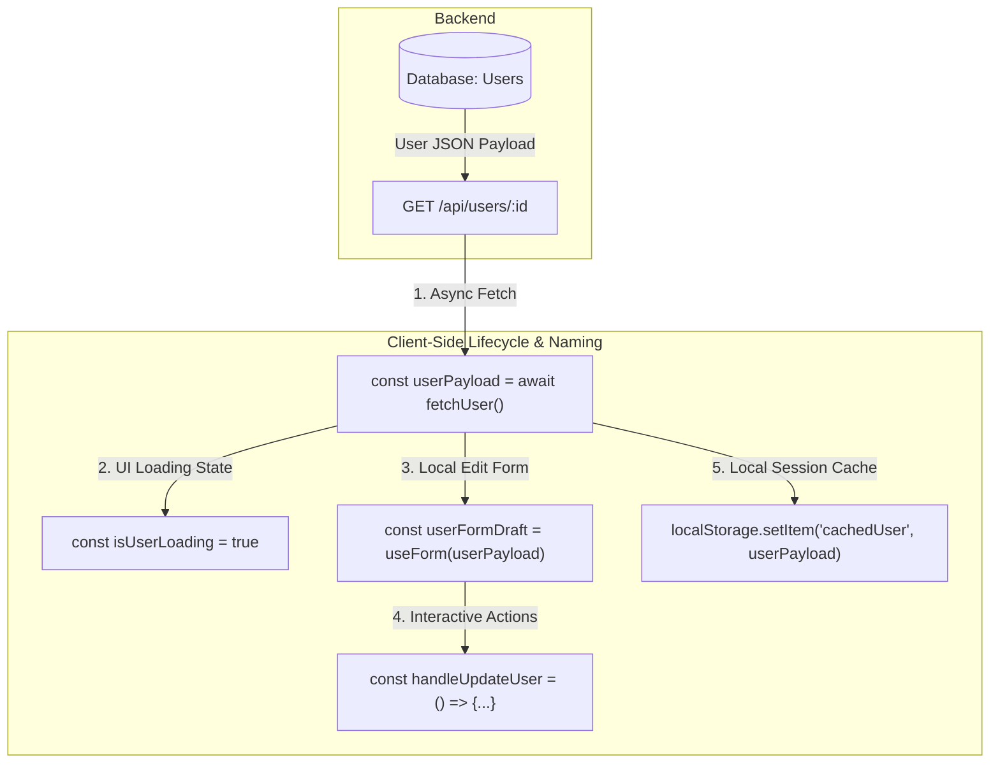

## Intro / TL;DR

Last week I spent 30 minutes debugging a React component. The bug wasn't the logic. It was the names.

Two variables, `show` and `state`, were triggering conflicting visual updates across a complex UI layout. While code logic directs execution paths inside a computer, variable and function names communicate engineering intent directly to other human developers. 

Writing clean code is about readability. Clear variable and function names are crucial for team velocity, but naming client-side code presents unique challenges compared to stable database schemas. In this guide, we'll dive into practical naming conventions for React, explore how to write self-documenting code, and look at techniques to avoid generic boolean naming traps so your team can read and debug components with minimal cognitive load.

> [!IMPORTANT]
> **The Golden Rule of Naming:**
> If you need a comment to explain *what* a variable represents, its name has failed. Code should read like a narrative; the names should explain the *why*, and the syntax should explain the *how*.

---

## The Problem: Cognitive Fatigue and the Simulation Tax

> "Developers spend far more time reading code than writing it. Name for the reader, not the author."

Many codebases contain components that build, compile, and run perfectly but are exhausting to read and maintain. When variables are named generically (such as `data`, `flag`, `show`, `temp`, or `run`), developers who open the file are forced to read every line of code to "simulate" execution in their heads just to understand what a component is representing. This mental tax causes cognitive fatigue, slows down daily debugging, and increases the risk of regressions during code changes.

This post solves the problem of **obfuscated UI logic** by establishing clear, frontend-specific naming conventions that make variables self-explanatory.

### What this article covers:
1. Why frontend naming differs fundamentally from backend schema naming.
2. The boolean trap: how generic flags hide state transitions and user actions.
3. Guidelines to rename variables based on domain intent and visual state.
4. Structuring event handlers to represent the user's mental model.
5. The role of continuous refactoring in reducing code documentation debt.

---

## Main Content: Frontend Naming Conventions

### Why Naming Frontend Code Presents Different Challenges

Many backend engineers would point out that naming database schemas, APIs, domain models, services, events, and distributed systems is incredibly difficult and requires a high level of abstraction. They are absolutely correct. Naming is a hard engineering problem across the entire stack.

However, frontend naming is difficult for different reasons. Rather than representing static, relational records, frontend variables must represent the highly dynamic, ephemeral state of a user interface. In modern user interfaces, a simple `user` data payload could mean multiple things at once depending on the visual context:
*   A logged-in account structure.
*   A temporary profile form draft.
*   A cached reference in a local store.
*   A loading skeleton state.
*   An active session token.

Because the visual state of data shifts constantly based on layout contexts, simple data-type names are rarely sufficient.



Frontend developers must capture not just *what* the data is, but *where* it is in the lifecycle of the interface. This requires appending descriptive prefixes and suffixes that specify the environment, target, and intent of the variable.

### The Boolean Trap: Why Generic Flags Cause Confusion
True or false looks simple, but meaning rarely is. Consider this line:

```javascript
if (!isReady) return;
```

To understand this, your brain has to guess. Ready for what? Has the data loaded? Is the form valid? Is the user session authenticated?
Instead of generic booleans, name flags after the specific state they represent. Good boolean names dramatically improve **code readability** by describing the exact UI conditions.

| Generic Boolean Name | Intent-Based Clean Boolean Name |
| :--- | :--- |
| `isReady` | `isProfileDataLoaded` |
| `show` | `isCheckoutModalOpen` |
| `loading` | `isSubmitInProgress` |
| `valid` | `hasEmailValidationError` |

By avoiding generic terms, you make your logical branches self-documenting. A developer can read the code like a sentence without having to search the file to find where the variable was declared, leading to true **self-documenting code**.

### The Importance of Business Domain Context
A common mistake in client-side coding is naming variables after their technical implementation rather than the business process they represent. For example, naming a function `sendPostRequest` explains *how* the action occurs, but hides the business intent. 

If the user is submitting a refund request, the function should be named `handleSubmitRefundRequest`. If the backend API route changes from a POST request to a WebSockets stream or a server action, the name `sendPostRequest` becomes factually incorrect and misleading. Naming by business intent keeps your code decoupled from implementation changes.

### How to choose names based on intent
1.  **Name for responsibility, not data structure:** Do not call an array `userList`. Call it `activeSubscribers` or `pendingInvitations`. The type is already defined by your code; focus on the business logic.
2.  **Use standard prefixes for booleans:** Always prefix boolean properties with `is`, `has`, `should`, `can`, or `did` (e.g., `hasPaidSubscription`, `shouldRenderHeader`, `canUserEdit`).
3.  **Represent the user's mental model:** If a user clicks a button to "Book a Consultation", the event handler should be named `handleBookConsultation`, not `submitForm` or `buttonClick`.
4.  **Prefix asynchronous handlers:** Prefix async actions with the lifecycle stage (e.g., `fetchUserData`, `updateProfileData`).

### Advanced Examples: Beyond Primitive States
As codebases scale, naming conventions become critical for handling complex state management and API boundaries. Let's look at two advanced scenarios that commonly trip up senior developers.

#### 1. Avoid Generic API Payloads
When fetching data, developers often default to generic naming like `data` or `result`. This loses all business context and forces readers to inspect the network response type.

```typescript
// ❌ Poor: Generic names require type inspection
const data = await fetchPendingInvoices();
const [info, setInfo] = useState([]);

//  Clean: Expressive domain names provide immediate context
const pendingInvoices = await fetchPendingInvoices();
const [activeBillingProfiles, setActiveBillingProfiles] = useState([]);
```

#### 2. Avoid Generic Store Selectors
Using global stores (like Zustand, Redux, or Pinia) with generic state names makes tracking side effects extremely difficult when debugging state changes.

```typescript
// ❌ Poor: Generic store selector hides context
const state = useCheckoutStore((state) => state.workflow);

//  Clean: Specific store selector documents the state surface
const checkoutWorkflowState = useCheckoutStore((state) => state.activeWorkflowStep);
```
Implementing these **React naming conventions** ensures that even in complex state contexts, the code remains legible and easy to reason about.

---

## Example: Code Optimization Before and After

### ❌ Cryptic Naming (Requires mental simulation)
```jsx
export function Component({ data, flag }) {
  const [show, setShow] = useState(false);

  const run = () => {
    if (data && flag) {
      setShow(true);
    }
  };

  return (
    <div>
      <button onClick={run}>Submit</button>
      {show && <div>Success!</div>}
    </div>
  );
}
```

###  Clean Naming (Self-documenting logic)
```jsx
export function UserRegistration({ userProfile, isFormValid }) {
  const [isSuccessModalOpen, setIsSuccessModalOpen] = useState(false);

  const handleRegisterUser = () => {
    if (userProfile && isFormValid) {
      setIsSuccessModalOpen(true);
    }
  };

  return (
    <div>
      <button onClick={handleRegisterUser}>Register Profile</button>
      {isSuccessModalOpen && <div>Profile Registered Successfully!</div>}
    </div>
  );
}
```

---

## Actionable Steps: Your Clean Naming Checklist
*   [ ] **Identify generic variables:** Search your active component files for names like `data`, `info`, `flag`, or `show`.
*   [ ] **Apply boolean prefixes:** Ensure all boolean properties are prefixed with `is`, `has`, `should`, or `can`.
*   [ ] **Align with events:** Name event handlers after the event target and action (e.g., `handleProductClick` instead of `handleClick`).
*   [ ] **Audit comments:** If you had to add a comment to explain *what* a variable holds, rename the variable to make the comment redundant.
*   [ ] **Rename file paths:** Ensure component file names match the primary exported default component to maintain file-search consistency.
*   [ ] **Refactor during reviews:** Dedicate five minutes of code review to renaming variables that caused cognitive confusion during read-throughs.

---

## Case Study: Debugging a Modal Race Condition

In our enterprise billing dashboard application, a complex multi-step checkout modal component kept closing unexpectedly when billing address validation errors occurred. We used Zustand for global store management and Formik for handling checkout form validation. Because the modal's state variables in the Zustand store and the local component states were generically named `show`, `state`, and `active`, the team had a hard time diagnosing the lifecycle.

Three developers spent **2 hours** tracing the flow of updates. They discovered that when the API validation returned an address format error, Formik triggered a schema validation failure. A side-effect cleanup handler intended to clear the form's local input `state` was mistakenly clearing the global store's active layout `state` instead, causing the modal to collapse.

We refactored the component and store, renaming the variables to `isCheckoutModalOpen`, `isSubmitInProgress`, and `hasAddressValidationError`. The naming changes made the bug obvious: the checkout modal was closing because a cleanup handler was listening to the wrong state transition. The race condition was resolved in **5 minutes** after the code became self-explanatory.

---

## Conclusion / Key Takeaways
Clean naming is the difference between writing code and explaining a system. Stop naming variables after their primitive types or local contexts. Focus on intent, state representation, and user perception to make your codebase healthy, readable, and maintainable.

---

## Related Links
*   [Choosing My Blog Tech Stack: Static vs. CMS Comparison](/blog/best-developer-blog-tech-stack)
*   [Developing a Writing Habit: Lessons from a Developer](/blog/what-surprised-me-about-writing-daily-this-week)
*   [React Performance Troubleshooting: Resolving Loops](/blog/a-bug-i-recently-faced-and-how-i-actually-tracked-it-down)

---

## CTA
Are you ready to clear cognitive fatigue from your codebase? Open your most active component, find three generic variable names, rename them according to this blueprint, and feel the immediate improvement in readability.
